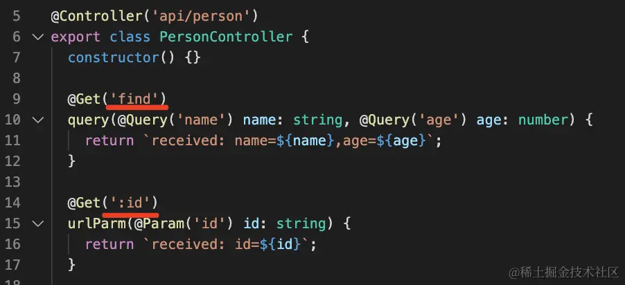

# 5种HTTP数据传输方式
对于前端来说，后端主要是提供 http 接口来传输数据，而这种数据传输的方式主要有 5 种：
- url param
- query
- form-urlencoded
- form-data
- json

其中前两种是 url 中的：
- url param：url 中的参数，Nest 中使用 `@Param` 来取
- query：url 中 ? 后的字符串，Nest 中使用 `@Query` 来取

后三种是 body 中的：
- form urlencoded： 类似 query 字符串，只不过是放在 body 中。Nest 中使用 `@Body` 来取，axios 中需要指定 `content type` 为 `application/x-www-form-urlencoded`，并且对数据用 `qs` 或者 `query-string` 库做 `url encode`
- form data：通过 `-----` 作为 `boundary` 分隔的数据。主要用于传输文件，Nest 中要使用 `FilesInterceptor` 来处理其中的 `binary` 字段，用 `@UseInterceptors` 来启用，其余字段用 `@Body` 来取。axios 中需要指定 `content type` 为 `multipart/form-data`，并且用 `FormData` 对象来封装传输的内容。
- json： json 格式的数据。Nest 中使用 `@Body` 来取，axios 中不需要单独指定 `content type`，axios 内部会处理。

这 5 种 http 的传输数据的方式覆盖了绝大多数开发场景。我们分别来看一下：

## url param
我们可以把参数写在 url 中，比如：`http://guang.zxg/person/1111`，这里的 1111 就是路径中的参数（url param），服务端框架或者单页应用的路由都支持从 url 中取出参数。

url param 是 url 中的参数，Nest 里通过 `:参数名` 的方式来声明（比如下面的 `:id`），然后通过 `@Param(参数名)` 的装饰器取出来注入到 `controller`：

```ts
@Controller('api/person')
export class PersonController {
  @Get(':id')
  urlParam(@Param('id') id: string) {
    return `received: id=${id}`;
  }
}
```

`@Controller('api/person')` 的路由和 `@Get(':id')` 的路由会拼到一起，也就是只有 `/api/person/xxx` 的 `get` 请求才会走到这个方法。

前端代码就是一个 get 方法，参数放在 url 里：

```html
<!DOCTYPE html>
<html lang="en">
<head>
    <script src="https://unpkg.com/axios@0.24.0/dist/axios.min.js"></script>
</head>
<body>
    <script>
        async function urlParam() {
            const res = await axios.get('/api/person/1');
            console.log(res);            
        }
        urlParam();
   </script>
</body>
```

启动服务，在浏览器访问下：


控制台打印了服务端返回的消息，证明服务端拿到了通过 url param 传递的数据。

## query
通过 url 传递数据的方式除了 url param 还有 query，通过 url 中 `?`后面的用 `&` 分隔的字符串传递数据。比如：`http://guang.zxg/person?name=guang&age=20`，这里的 name 和 age 就是 `query` 传递的数据。

其中非英文的字符和一些特殊字符要经过编码，可以使用 `encodeURIComponent` 的 api 来编码：

```ts
const query = "?name=" + encodeURIComponent('名字') + "&age=18"
// ?name=%E5%90%8D%E5%AD%97&age=18
```

或者使用封装了一层的 query-string 库来处理。

```ts
const queryString = require('query-string');

queryString.stringify({
  name: '名字',
  age: 18
});
// ?name=%E5%90%8D%E5%AD%97&age=18
```

在 Nest 里，通过 @Query 装饰器来取：

```ts
@Controller('api/person')
export class PersonController {
  @Get('find')
  query(@Query('name') name: string, @Query('age') age: number) {
    return `received: name=${name},age=${age}`;
  }
}
```

注意，这个 `find` 的路由要放到 `:id` 的路由前面，因为 Nest 是从上往下匹配的，如果放在后面，那就匹配到 `:id` 的路由了。



前端代码同样是通过 axios 发送一个 get 请求：

```html
<!DOCTYPE html>
<html lang="en">
<head>
    <script src="https://unpkg.com/axios@0.24.0/dist/axios.min.js"></script>
</head>
<body>
    <script>
        async function query() {
            const res = await axios.get('/api/person/find', {
                params: {
                    name: '姓名',
                    age: 18
                }
            });
            console.log(res);            
        }
        query();
   </script>
</body>
</html>
```

参数通过 params 指定，axios 会做 url encode，不需要自己做。

## form-urlencoded
直接用 form 表单提交数据就是这种，它和 query 字符串的方式的区别只是放在了 body 里，然后指定下 `content-type` 是 `application/x-www-form-urlencoded`。


因为内容也是 query 字符串，所以也要用 `encodeURIComponent` 的 api 或者 `query-string` 库处理下。

这种格式也很容易理解，get 是把数据拼成 query 字符串放在 url 后面，于是表单的 post 提交方式的时候就直接用相同的方式把数据放在了 body 里。

通过 & 分隔的 `form-urlencoded` 的方式需要对内容做 `url encode`，如果传递大量的数据，比如上传文件的时候就不是很合适了，因为文件 `encode` 一遍的话太慢了，这时候就可以用 `form-data`。

用 Nest 接收的话，使用 `@Body` 装饰器，Nest 会解析请求体，然后注入到 `dto` 中。

`dto` 是 `data transfer object`，就是用于封装传输的数据的对象：

```ts
export class CreatePersonDto {
    name: string;
    age: number;
}
```

```ts
import { CreatePersonDto } from './dto/create-person.dto';

@Controller('api/person')
export class PersonController {
  @Post()
  body(@Body() createPersonDto: CreatePersonDto) {
    return `received: ${JSON.stringify(createPersonDto)}`
  }
}
```

前端代码使用 post 方式请求，指定 `content type` 为 `application/x-www-form-urlencoded`，用 qs 做下 `url encode`：

```html
<!DOCTYPE html>
<html lang="en">
<head>
    <script src="https://unpkg.com/axios@0.24.0/dist/axios.min.js"></script>
    <script src="https://unpkg.com/qs@6.10.2/dist/qs.js"></script>
</head>
<body>
    <script>
        async function formUrlEncoded() {
            const res = await axios.post('/api/person', Qs.stringify({
                name: '姓名',
                age: 18
            }), {
                headers: { 'content-type': 'application/x-www-form-urlencoded' }
            });
            console.log(res);  
        }

        formUrlEncoded();
    </script>
</body>
</html>
```

## form-data
`form data` 不再是通过 & 分隔数据，而是用` --------- + 一串数字`做为 `boundary` 分隔符。因为不是 url 的方式了，自然也不用再做 url encode。


form-data 需要指定 `content type` 为 `multipart/form-data`，然后指定 `boundary` 也就是分割线。

body 里面就是用 `boundary` 分隔符分割的内容。

很明显，这种方式适合传输文件，而且可以传输多个文件。

但是毕竟多了一些只是用来分隔的 boundary，所以请求体会增大。

Nest 解析 `form data` 使用 `FilesInterceptor` 的拦截器，用 `@UseInterceptors` 装饰器启用，然后通过 `@UploadedFiles` 来取。非文件的内容，同样是通过 `@Body` 来取。

```ts
import { AnyFilesInterceptor } from '@nestjs/platform-express';
import { CreatePersonDto } from './dto/create-person.dto';

@Controller('api/person')
export class PersonController {
  @Post('file')
  @UseInterceptors(AnyFilesInterceptor({
      dest: 'uploads/'
  }))
  body2(@Body() createPersonDto: CreatePersonDto, @UploadedFiles() files: Array<Express.Multer.File>) {
    console.log(files);
    return `received: ${JSON.stringify(createPersonDto)}`
  }
}
```

这一步需要 `npm i -D @types/multer` 引入相关类型声明。

前端代码使用 axios 发送 post 请求，指定 `content type` 为 `multipart/form-data`：

```html
<!DOCTYPE html>
<html lang="en">
<head>
    <script src="https://unpkg.com/axios@0.24.0/dist/axios.min.js"></script>
</head>
<body>
    <input id="fileInput" type="file" multiple/>
    <script>
        const fileInput = document.querySelector('#fileInput');

        async function formData() {
            const data = new FormData();
            data.set('name','姓名');
            data.set('age', 18);
            data.set('file1', fileInput.files[0]);
            data.set('file2', fileInput.files[1]);

            const res = await axios.post('/api/person/file', data, {
                headers: { 'content-type': 'multipart/form-data' }
            });
            console.log(res);     
        }

        fileInput.onchange = formData;
    </script>
</body>
</html>
```
`fileInput` 指定 `multiple` 可以选择多个文件。

## json
form-urlencoded 需要对内容做 `url encode`，而 form data 则需要加很长的 `boundary`，两种方式都有一些缺点。如果只是传输 json 数据的话，不需要用这两种。

可以直接指定 `content type` 为 `application/json` 就行：


我们平时传输 json 数据基本用的是这种。

后端代码同样使用 `@Body` 来接收，不需要做啥变动。`form urlencoded` 和 `json` 都是从 `body` 取值，Nest 内部会根据 `content type` 做区分，使用不同的解析方式。

```ts
@Controller('api/person')
export class PersonController {
  @Post()
  body(@Body() createPersonDto: CreatePersonDto) {
    return `received: ${JSON.stringify(createPersonDto)}`
  }
}
```

前端代码使用 axios 发送 post 请求，默认传输 json 就会指定 `content type` 为 `application/json`，不需要手动指定：

```html
<!DOCTYPE html>
<html lang="en">
<head>
    <script src="https://unpkg.com/axios@0.24.0/dist/axios.min.js"></script>
</head>
<body>
    <script>
        async function json() {
            const res = await axios.post('/api/person', {
                name: '名字',
                age: 18
            });
            console.log(res);     
        }
        json();
    </script>
</body>
</html>
```

json 和 form urlencoded 都不适合传递文件，想传输文件要用 form data。