# NestJS 学习

## nest-cli 命令

nest 在 @nestjs/cli 包里提供了 nest 命令，它可以用来做很多事情：
- 生成项目结构和各种代码
- 编译代码
- 监听文件变动自动编译
- 打印项目依赖信息

也就是这些子命令：
- nest new 快速创建项目
- nest generate 快速生成各种代码
- nest build 使用 tsc 或者 webpack 构建代码
- nest start 启动开发服务，支持 watch 和调试
- nest info 打印 node、npm、nest 包的依赖版本

并且，很多选项都可以在 nest-cli.json 里配置，比如 generateOptions、compilerOptions 等。

### nest new 
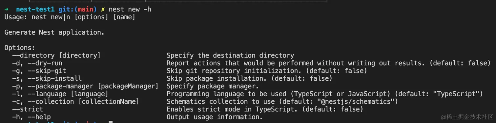
- 创建一个新的 nest 项目
- `--skip-git` 和 `--skip-install` 很容易理解，就是跳过 git 的初始化，跳过 `npm install`
- `--package-manager` 是指定包管理器的，创建项目的时候会让我们选择：
  
  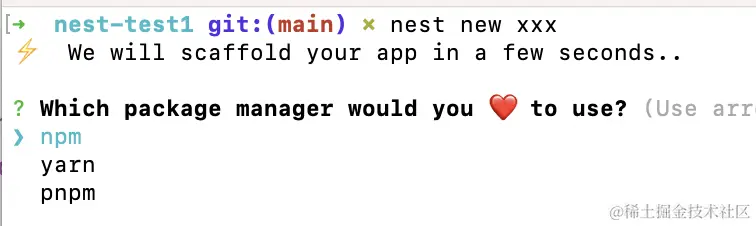

- 指定之后，就跳过包管理器选择这步了：
  
  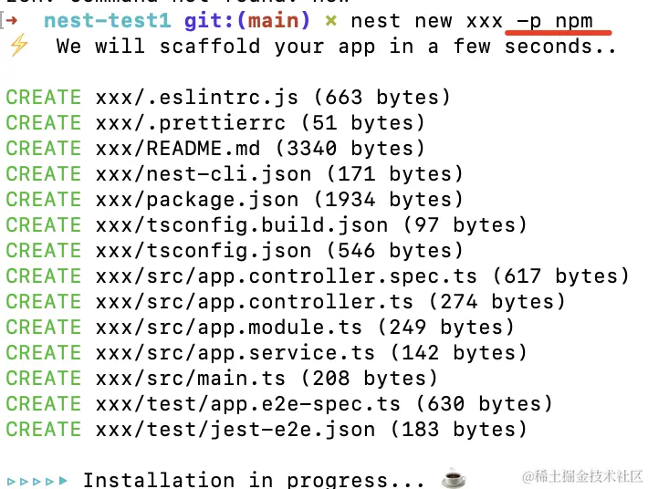

- `--language` 可以指定 typescript 和 javascript，一般我们都选择 ts，用默认的就好
- `--strict` 是指定 ts 的编译选项是否开启严格模式的，也就是这么 5 个选项：
  
  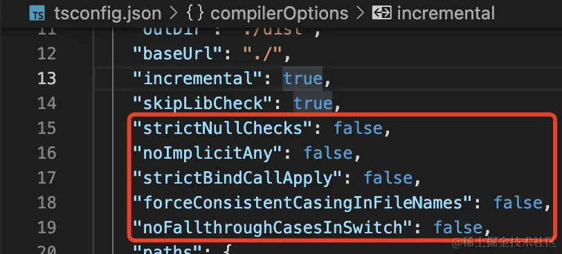

- 默认是 false，根据需要可以指定为 true

### nest g [文件类型] [文件名] [文件目录]

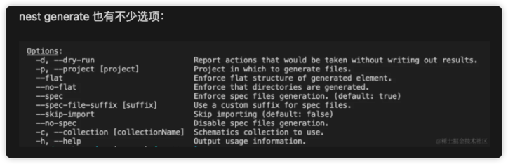

- `--flat` 和 `--no-flat` 是指定是否生成对应目录的
  
  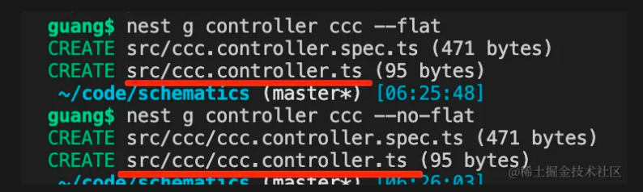

- `--spec` 和 `--no-spec` 是指定是否生成测试文件
  
  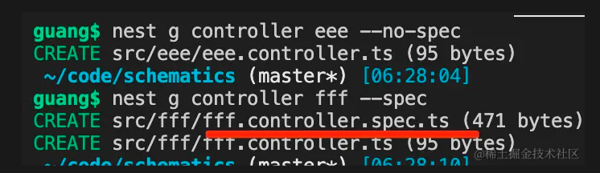

- `--skip-import` 是指定不在 `AppModule` 里引入
  
  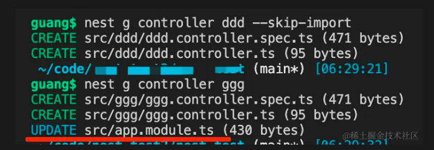

- `--project` 是指定生成代码在哪个子项目的

### 创建模块
- nest g module [name]
  - 创建一个 name 模块，文件目录不写，默认创建和文件名一样的 name 目录，在目录下创建一个 `name.module.ts`
  - 同时在根模块 `app.module.ts` 中引入 `NameModule` 这个模块，也在装饰器的 `imports` 中引入了
  - `g  -->  generate`
- nest generate module [name]

### 创建控制器
- nest g co [name] --no-spec
  - 创建了一个 name 控制器，命名为 `name.controller.ts` 以及一个该控制器的单元测试文件
  - 文件 `name.module.ts` 中会自动引入 `NameController`，并且在 `@Module` 装饰器的 `controllers` 中注入
  - 加 `--no-spec` 表示不创建测试文件
- nest generate controller [name]

### 创建服务类
- nest g service [name] --no-spec
  - 创建 `name.service.ts` 文件，并且在 `name.module.ts` 文件下，`@Module` 装饰器的 `providers` 中注入
  - 加 `--no-spec` 表示不创建测试文件
- nest generate service [name]

### 完整生成一个模块的代码
- nest g resource [name]
- nest generate resource [name]

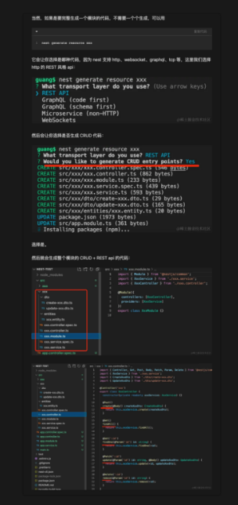

### nest build
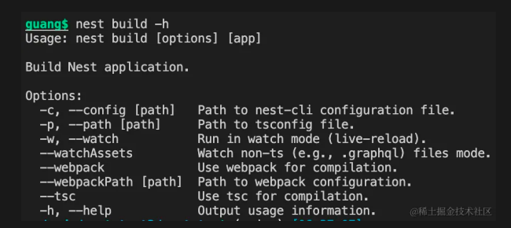

- `--webpack` 和 `--tsc` 是指定用什么编译，默认是 `tsc` 编译
  - `tsc` 不做打包, `webpack` 会做打包
  - `node` 模块本来就不需要打包，但是打包成单模块能提升加载的性能
- `--watch` 是监听文件变动，自动 `build` 的
- `--watch` 默认只是监听 ts、js 文件，加上 `--watchAssets` 会连别的文件一同监听变化，并输出到 `dist` 目录，比如 md、yml 等文件
- `--path` 是指定 tsc 配置文件的路径的
- `--config` 是指定nest cli 的配置文件的路径的

#### 都可以在 nest-cli.json 里配置
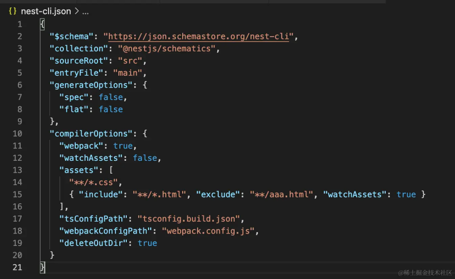
- 比如 `compilerOptions` 里设置 `webpack` 为 `true` 就相当于 `nest build --webpack`
- `webpack` 设置为 `false` 就是用 `tsc` 了
- `deleteOutDir` 设置为 `true`，每次 `build` 都会都清空 `dist` 目录
- `assets` 是指定 `nest build` 的时候，把那些非 js、ts 文件也复制到 dist 目录下
  - 可以通过 `include、exclude` 来精确匹配，并且可以单独指定是否 `watchAssets`
  - 不过只支持 src 下文件的复制，如果是非 src 下的，可以自己写脚本复制
- `generateOptions` 和我们 `nest generate` 时的` --no-spec、--no-flat` 一样的效果
- `sourceRoot` 是指定源码目录
- `entryFile` 是指定入口文件的名字，默认是 `main`
- `$schema` 是指定 `nest-cli.json` 的 `schema`，也就是可以有哪些属性的


### nest start
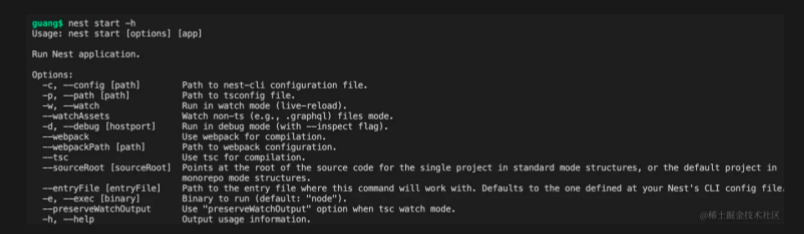

- 每次重新 `build` ，并且用 node 把 `main.js` 跑了起来
- `--watch` 是最常用的选项了，也就是改动文件之后自动重新 `build`
- `--debug` 是启动调试的 `websocket` 服务，用来 `debug`
- `--exec` 可以指定用什么来跑，默认是用 node 跑，你也可以切换别的 runtime

### nest info
- 查看项目信息的，包括系统信息、 node、npm 和依赖版本

### nest-cli提供的创建命令还有很多，比如创建过滤器、拦截器和中间件等


## IoC

后端系统中，会有很多对象：

- Controller 对象：接收 http 请求，调用 Service，返回响应
- Service 对象：实现业务逻辑
- Repository 对象：实现对数据库的增删改查

此外，还有数据库链接对象 DataSource，配置对象 Config 等等。

这些对象有着错综复杂的关系：

Controller 依赖了 Service 实现业务逻辑，Service 依赖了 Repository 来做增删改查，Repository 依赖 DataSource 来建立连接，DataSource 又需要从 Config 对象拿到用户名密码等信息。

这就导致了创建这些对象是很复杂的，你要理清它们之间的依赖关系，哪个先创建哪个后创建。

比如这样：

```ts
const config = new Config({ username: 'xxx', password: 'xxx'});

const dataSource = new DataSource(config);

const repository = new Repository(dataSource);

const service = new Service(repository);

const controller = new Controller(service);
```

要经过一系列的初始化之后才可以使用 Controller 对象。

而且像 config、dataSource、repository、service、controller 等这些对象不需要每次都 new 一个新的，一直用一个就可以，也就是保持单例。

在应用初始化的时候，需要理清依赖的先后关系，创建一大堆对象组合起来，还要保证不要多次 new，是不是很麻烦？

没错，这是一个后端系统都有的痛点问题。

解决这个痛点的方式就是 IoC（Inverse of Control）。

java 的 Spring 就实现了 IoC，Nest 也同样实现了。

### 什么是 IoC

之前我们手动创建和组装对象不是很麻烦么，我能不能在 class 上声明依赖了啥，然后让工具去分析我声明的依赖关系，根据先后顺序自动把对象创建好了并组装起来呢？

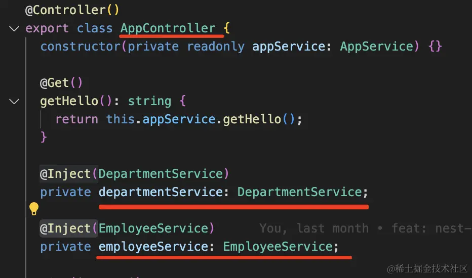

比如这样声明 AppController 依赖了这两个 Service，然后让工具分析依赖自动帮我创建好这三个对象并设置依赖关系。

这就是 IoC 的实现思路。

它有一个放对象的容器，程序初始化的时候会扫描 class 上声明的依赖关系，然后把这些 class 都给 new 一个实例放到容器里。

创建对象的时候，还会把它们依赖的对象注入进去。

这样不就完成了自动的对象创建和组装么？

这种依赖注入的方式叫做 Dependency Injection，简称 DI。

而这种方案为什么叫 IoC 也很容易理解了，本来是手动 new 依赖对象，然后组装起来，现在是声明依赖了啥，等待被注入。

从主动创建依赖到被动等待依赖注入，这就是 Inverse of Control，反转控制。

在 class 上声明依赖的方式，大家都选择了装饰器的方式（在 java 里这种语法叫做注解）。

## Nest 内的装饰器

- `@Module`： 声明 Nest 模块
- `@Controller`：声明模块里的 controller
- `@Injectable`：声明模块里可以注入的 provider
- `@Inject`：通过 token 手动指定注入的 provider，token 可以是 class 或者 string
- `@Optional`：声明注入的 provider 是可选的，可以为空
- `@Global`：声明全局模块
- `@Catch`：声明 exception filter 处理的 exception 类型
- `@UseFilters`：路由级别使用 exception filter
- `@UsePipes`：路由级别使用 pipe
- `@UseInterceptors`：路由级别使用 interceptor
- `@SetMetadata`：在 class 或者 handler 上添加 metadata
- `@Get、@Post、@Put、@Delete、@Patch、@Options、@Head`：声明 get、post、put、delete、patch、options、head 的请求方式
- `@Param`：取出 url 中的参数，比如 /aaa/:id 中的 id
- `@Query`：取出 query 部分的参数，比如 /aaa?name=xx 中的 name
- `@Body`：取出请求 body，通过 dto class 来接收
- `@Headers`：取出某个或全部请求头
- `@Session`：取出 session 对象，需要启用 express-session 中间件
- `@HostParm`： 取出 host 里的参数
- `@Req、@Request`：注入 request 对象
- `@Res、@Response`：注入 response 对象，一旦注入了这个 Nest 就不会把返回值作为响应了，除非指定 passthrough 为true
- `@Next`：注入调用下一个 handler 的 next 方法
- `@HttpCode`： 修改响应的状态码
- `@Header`：修改响应头
- `@Redirect`：指定重定向的 url
- `@Render`：指定渲染用的模版引擎

