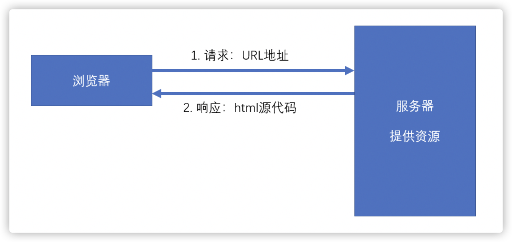

# React
> 官网：[https://react.docschina.org/](https://react.docschina.org/)

## 什么是React？

- React是由**Facebook**研发的、用于**解决UI复杂度**的开源**JavaScript库**，目前由React联合社区维护
- 它不是框架，只是为了解决UI复杂度而诞生的一个库
## React的特点

- 轻量：React的开发版所有源码（包含注释）仅3000多行
- 原生：所有的React的代码都是用原生JS书写而成的，不依赖其他任何库
- 易扩展：React对代码的封装程度较低，也没有过多的使用魔法，所以React中的很多功能都可以扩展
- 不依赖宿主环境：React只依赖原生JS语言，不依赖任何其他东西，包括运行环境。因此，它可以被轻松的移植到浏览器、桌面应用、移动端
- 渐近式：React并非框架，对整个工程没有强制约束力。这对与那些已存在的工程，可以逐步的将其改造为React，而不需要全盘重写
- 单向数据流：所有的数据自顶而下的流动
- 用JS代码声明界面
- 组件化
## 对比Vue
| 对比项 | Vue | React |
| --- | --- | --- |
| 全球使用量 | 
 | ✔ |
| 国内使用量 | ✔ | 
 |
| 性能 | ✔ | ✔ |
| 易上手 | ✔ | 
 |
| 灵活度 | 
 | ✔ |
| 大型企业 | 
 | ✔ |
| 中小型企业 | ✔ | 
 |
| 生态 | 
 | ✔ |

## 学习路径
整体原则：熟悉API --> 深入理解原理

1. React 
   1. 基础：掌握React的基本使用方法，有能力制作各种组件，并理解其基本运作原理
   2. 进阶：掌握React中的一些高级用法，提高代码质量
2. [React-Router](https://react-guide.github.io/react-router-cn/)：相当于vue-router
3. [Redux](http://cn.redux.js.org/)：相当于Vuex
   1. Redux本身
   2. 各种中间件
4. 第三方脚手架：[umi](https://umijs.org/zh-CN/docs)
5. UI库：[Ant Design](https://ant.design/index-cn)，相当于Vue的Element-UI 或 IView
6. 源码部分 
   1. React源码分析
   2. Redux源码分析
## [JSX](https://zh-hans.reactjs.org/docs/introducing-jsx.html)
### 什么是JSX

- Facebook起草的JS扩展语法
- 本质是一个JS对象，会被babel编译，最终会被转换为React.createElement
   - **<**script type="text/babel"**></**script**>   **告诉浏览器交给babel转译
   - 直接书写html格式的表达式`const span = <span>一个span元素</span>`
- 每个JSX表达式，有且仅有一个根节点
   - React.Fragment  空节点 <React.Fragment></React.Fragment> 可以省略为<></>
```jsx
// 创建空的根结点
const h1 = (
    <> // 语法糖，真实的写法是 <React.Fragment></React.Fragment>
        <h1>hellow world</h1>
        <span>hi</span>
    </>
)
```

- 每个JSX元素必须有结束‘/’（XML规范）
- 在 React 中配合使用， 可以很好地描述 UI 应该呈现出它应有交互的本质形式，具有 JavaScript 的全部功能
- **凡是使用JSX的文件，必须导入React**
- JSX中可以嵌入js表达式，加大括号就行
```jsx
const a = 1234, b = 5678;
const div = (
    <>
        <h1>{a} * {b} = {a * b}</h1>
    </>
)
const div = React.createElement('div', {}, `${a} * ${b} = ${a*b}`)
```
### 在JSX中嵌入表达式

- 变量和表达式使用{}包住
- 在JSX中使用注释，使用`{/*注释内容*/}`
- 表达式可以作为内容的一部分
   - null、undefined、false不会显示
   - 普通对象，不可以作为子元素
   - 可以放置React元素对象
   - 可以放置数组，但是数组中不能有普通对象
```jsx
const numbers = new Array(10)
numbers.fill(0)
const lis = numbers.map((item, i) => (<li key={i}>{i}</li>)) // 需要加key
```

- 表达式可以作为元素属性
- 属性使用小驼峰命名法
- 防止注入攻击
   - 自动编码
   - dangerouslySetInnerHTML  // 使用该种方式不安全，代码层面故意比较复杂
```jsx
const content = '<h1>一级标题</h1>'
const div = (<div dangerouslySetInnerHTML={{
    __html: content
}}></div>)
```
### 元素的不可变性

- 虽然JSX元素是一个对象，但是该对象中的所有属性不可更改，也就是JSX元素一旦创建不可修改
- 如果确实需要更改元素的属性，需要重新创建JSX元素
## 使用React脚手架搭建工程
官方：create-react-app  第三方：next.js、umijs

- create-react-app： yarn create react-app '文件name' 
## VSCode插件安装

- ESLint：代码风格检查
- ES7 React/Redux/GraphQL/React-Native snippets：快速代码编写
## Chrome插件安装

- React Developer Tools
## React 的 API
直接在页面上使用React，引用下面的JS
```html
<script crossorigin src="https://unpkg.com/react@16/umd/react.development.js"></script>
<script crossorigin src="https://unpkg.com/react-dom@16/umd/react-dom.development.js"></script>
<script crossorigin src="https://unpkg.com/babel-standalone@6/babel.min.js"></script>
// crossorigin 的作用是报错时精准定位是链接的js的问题
```
### React.createElement
创建一个React元素，称作虚拟DOM，本质上是一个对象

- 参数1：元素类型，如果是字符串，一个普通的HTML元素
- 参数2：元素的属性，一个对象
- 后续参数：元素的子节点
### ReactDOM.render

- 渲染dom
   - 参数1是虚拟元素
   - 参数2是绑定的根结点
- 内部做了优化，每次渲染的虚拟dom对象数据变化都是更改修改的部分，也就是尽可能的不删除重新创建dom
## React中的元素

- React 元素：React 封装好的内部元素 div、span、p、h1 等等
- 组件元素
## 组件和组件属性
组件：包含内容、样式和功能的UI单元
**特别注意：组件的名称首字母必须大写**

- **首字母小写会被当作普通元素**
- **组件的类型是一个函数，type值会变化**
### 函数组件

- 返回一个React元素，返回一个 React.createElement 或JSX 
- 可以返回null，组件结构渲染但不显示内容
### 类组件

- 必须继承React.Component
- 必须提供render函数，用于渲染组件
```jsx
import React from 'react';
export default class myClassComp extends React.Component {
    /**
     * 该方法必须返回React元素
     * */
    render() {
        return <h1>类组件的内容</h1>
    }
}
```
### 组件的属性 props

- 对于函数组件，属性会作为一个对象的属性，传递给函数的参数
```jsx
import React from 'react';
export default function (props) {
    if (props.ui) {
        return (
            <>
                <div>
                    <p>用户传入的属性{props.numbers}</p>
                    {props.ui}
                </div>
            </>
        )
    }
    return <h1>函数组件内容: {props.numbers}</h1>
}
// =============================
<MyTestOne numbers='20' />
<MyTestOne numbers={40} ui={<p>这是我传递的属性</p>} />
```

- 对于类组件，属性会作为一个对象的属性，传递给构造函数的参数
```jsx
import React from 'react';
export default class myClassComp extends React.Component {
    /**
     * 必须提供render方法，该方法必须返回React元素
     * */
    render() {
        return <h1>类组件的内容: {this.props.obj.age}</h1>
    }
}
// =================
<MyClassComp enable={true} obj={{name: 'test', age: 1}} />
```

- 注意：组件的属性，应该使用小驼峰命名法
- **组件无法改变自身的属性**
- 之前学习的React元素，本质上，就是一个组件（内置组件）

**React中的根本哲学：数据属于谁，谁才有权力改动，也就是传入组件内的数据不允许修改，虽然对象内的数据可以修改（React监控不到），但是建议不要这样做，很难维护**
**React中的数据，自顶而下流动，单向数据流，结构十分清晰**
## 组件状态

- 组件状态：就是组件可以自行维护的数据，组件自己的数据
- 组件状态仅在类组件中有效，函数组件也能用，需要钩子，后边学
### 状态（state）
本质上是类组件的一个属性，是一个对象
#### 状态初始化

- 构造函数中进行初始化`this.state= { data: this.props.data }`
#### 状态的变化

- **不能直接改变状态：因为React无法监控到状态发生了变化**
- **必须使用 this.setState({}) 改变状态**
   - **this.setState({}) 会重新设置组件状态，并自动触发重新渲染**
   - **本质上是对组件状态的数据混合，状态中有的数据进行覆盖，没有的进行增加**
      - `this.setState({ data: this.state.data - 1, newData: newData })`
- **一旦调用了 this.setState，就会导致当前组件重新渲染**
## 组件中的数据

- props：该数据是由组件的使用者传递的数据，所有权不属于组件自身，因此组件无法改变该数据
- state：该数组是由组件自身创建的，所有权属于组件自身，因此组件有权改变该数据
## 事件

- 在React中，组件的事件，本质上就是一个属性，组件内通过props拿到后调用
- 按照之前React对组件的约定，**由于事件本质上是一个属性，因此也需要使用小驼峰命名法**
```jsx
const handleClick = (e) => {
    console.log('点击了', e)
}
<button onClick={handleClick}>按钮</button>
// ================
<button onClick={(e) => {
    console.log('点击了', e)
}}>按钮</button>
```

- **如果没有特殊处理，在事件处理函数中，this指向undefined**
   - 使用bind函数，绑定this
```jsx
handleClick(e) {
    console.log('点击了', e)
}
this.handleClick = this.handleClick.bind(this); // 对象上有当前函数，原型上也有当前函数
// or
<button onClick={this.handleClick.bind(this)}>按钮</button>  // 不建议这样做，会有效率问题，因为每次绑定this都是创建新函数的一次过程
```

   - 使用箭头函数，建议使用
```jsx
handleClick = (e) => {  // js next 语法，可以使用，babel会编译，效率更高，只有对象上有当前函数，原型上没有
    console.log('点击了', e)
}
// or
<button onClick={(e) => { // 不建议这样做，会导致 render 中的代码太复杂，不方便阅读维护
    console.log('点击了', e)
}}>按钮</button>
```
## 深入认识setState

- setState，来自于父类，它对状态的改变，**可能**是异步的
   - **如果改变状态的代码处于某个HTML元素的事件中，则其是异步的，否则是同步**
```jsx
state = {
      number: 20
  }
handleClick = () => {
    this.setState({
        number: this.state.number + 1
    }, () => {
      // 回调函数，状态完成改变之后触发，运行在回调之后
      console.log(this.state.number)
    })
    console.log(this.state.number) // 先打印这个
}
// HTML元素事件
render() {
    console.log('重新渲染') // 再打印这个，此时state中的状态还未改变
    return (
        <>
            <span>{this.state.number}</span>
            <button onClick={this.handleClick}>
                按钮
            </button>
        </>
    );
}
```
```jsx
    state = {
        number: 20
    }
    handleClick = () => {
      // 非HTML元素事件
        setInterval(() => {
            this.setState({
                number: this.state.number + 1
            })
            console.log(this.state.number) // 再打印这个，不信你自己试试，🤨，属实🐮
        }, 1000)
    }
    render() {
        console.log('重新渲染') // 此时state中的状态已经改变，先打印这个
        return (
            <>
                <span>{this.state.number}</span>
                <button onClick={this.handleClick}>
                    按钮
                </button>
            </>
        );
    }
```

- 如果遇到某个事件中，需要同步调用多次，需要使用函数的方式得到最新状态
```jsx
this.setState(prev => {
  // 参数 prev 表示当前的状态
  // 该函数的返回结果，会混合（覆盖）掉之前的状态
  // 该函数是异步执行的，放在了一个队列中，执行完一个再执行一个
  return {
    number: prev.number + 1
  }
})
this.setState(prev => {
  return {
    number: prev.number + 1
  }
})
this.setState(prev => {
  return {
    number: prev.number + 1
  }
})
// 以上代码 runder 函数只执行一次
```
### 最佳实践

- 把所有的 setState 当作是异步的
- 永远不要信任 setState 调用之后的状态
- 如果要使用改变之后的状态，需要使用回调函数（setState的第二个参数）
- 如果新的状态要根据之前的状态进行运算，使用函数的方式改变状态（setState的第一个函数）
- React 会对异步的 setState 进行优化，将多次 setState 进行合并（将多次状态改变完成后，再统一对 state 进行改变，然后触发 render）
## 生命周期
生命周期：组件从诞生到销毁会经历一系列的过程，该过程就叫做生命周期。React在组件的生命周期中提供了一系列的钩子函数（类似于事件），可以让开发者在函数中注入代码，这些代码会在适当的时候运行。
**生命周期仅存在于类组件中，函数组件每次调用都是重新运行函数，旧的组件即刻被销毁，生命周期很短。**
### 旧版生命周期
**React < 16.0.0**


1. constructor 构造函数 初始化阶段
   1. 同一个组件对象只会创建一次
   2. 不能在第一次挂载到页面之前，调用setState，为了避免问题，构造函数中严禁使用setState
2. componentWillMount 初始化挂载完成
   1. 正常情况下，和构造函数一样，它只会运行一次
   2. 可以使用setState，但是为了避免bug，不允许使用，因为在某些特殊情况下，该函数可能被调用多次，可能会在没有挂载完的时候被打断重新挂载
3. **render**
   1. 返回一个虚拟DOM，会被挂载到虚拟DOM树中，最终渲染到页面的真实DOM中
   2. render可能不只运行一次，只要需要重新渲染，就会重新运行
   3. 可以使用setState，但是为了避免bug，严禁使用setState，因为可能会导致无限递归渲染
4. **componentDidMount 更新挂载完成，进入更新阶段，超级常用**
   1. 只会执行一次
   2. 可以使用setState
   3. 通常情况下，会将网络请求、启动计时器等一开始需要的操作，书写到该函数中
5. 组件进入活跃状态
6. componentWillReceiveProps
   1. 即将接收新的属性值
   2. 参数为新的属性对象
   3. 该函数可能会导致一些bug，所以不推荐使用
7. **shouldComponentUpdate**
   1. 可以做性能优化，指示React是否要重新渲染该组件，通过返回true和false来指定
   2. 默认情况下，会直接返回true
8. componentWillUpdate
   1. 组件即将被重新渲染，没啥用的感觉
9. componentDidUpdate
   1. 已经完成组件渲染
   2. 往往在该函数中使用dom操作，改变元素
10. **componentWillUnmount 销毁阶段**
   1. 通常在该函数中销毁一些组件依赖的资源，比如计时器
```jsx
constructor(props) { // 初始化阶段
  super(props);
  this.state = {
    n: 0
  };
  console.log("constructor", "一个新的组件诞生了！！！");
}
componentWillMount() { // 即将挂载
  console.log("componentWillMount", "组件即将被挂载");
}
componentDidMount() { // 挂载完成
  console.log("componentDidMount", "挂载完成");
}
componentWillReceiveProps(nextProps) { // 接收到新的属性值
  console.log("componentWillReceiveProps", "接收到新的属性值", this.props, nextProps);
}
shouldComponentUpdate(nextProps, nextState) { // 性能优化，是否重新渲染
  console.log("shouldComponentUpdate", "是否应该重新渲染", this.props, nextProps, this.state, nextState)
  if (this.props.n === nextProps.n && this.state.n === nextState.n) {
    return false;
  }
  return true;
  // return false;
}
componentWillUpdate(nextProps, nextState) { // 即将重新渲染，没啥用的感觉
  console.log("componentWillUpdate", "组件即将被重新渲染");
}
componentDidUpdate(prevProps, prevState) { // 重新渲染完成
  console.log("componentDidUpdate", "组件已完成重新渲染", prevProps, prevState);
}
componentWillUnmount() { // 组件销毁
  console.log("componentWillUnmount", "组件被销毁")
}
render() { // 渲染
  console.log("render", "渲染，返回的React元素会被挂载到虚拟DOM树中");
  return (
    <div>
      <h1>旧版生命周期组件</h1>
      <h2>属性n: {this.props.n}</h2>
      <h2>状态n：{this.state.n}</h2>
      <button onClick={() => {
          this.setState({
            n: this.state.n + 1
          })
        }}>状态n+1</button>
    </div>
  )
}
```
### 新版生命周期
**React >= 16.0.0**

主要变化在挂载阶段和更新阶段

- 挂载阶段变化
   - 移除可能会多次运行的 componentWillMount 函数
   - 增加 getDerivedStateFromProps 函数
- 更新阶段变化
   - 移除容易出问题的 componentWillReceiveProps 函数
      - 反模式行为
         - 子组件状态初始值是父组件传递的属性值
         - 政正常来说子组件状态的值只能在子组件修改
         - 但是父组件中修改属性值后，可以通过 componentWillReceiveProps 函数，在子组件内监控属性值的变化，然后调用 setState 修改状态值
         - 非常容易造成 bug
         - 数据应该和状态或属性保持一致，数据来源必须是单一的，这样与 React 的模式相反
```jsx
componentWillReceiveProps(nextProps) {
  this.setState({
    number: nextProps.number
  })
}
```

   - 增加 getDerivedStateFromProps 函数
   - 属性和状态变化后都是直接运行 getDerivedStateFromProps 函数
   - 移除没啥用的 componentWillUpdate 函数
   - 增加 getSnapshotBeforeUpdate 函数，在 render 之后挂载完成之前运行

React官方认为，某个数据的来源必须是单一的

1. getDerivedStateFromProps 获取更新的属性和状态
   1. 两个参数，第一个是属性 props，第二个是状态 state
   2. 通过参数可以获取新的属性和状态
   3. 该函数是静态的，修改了 this 指向，指向 constructor 构造函数
   4. 该函数的必须得有返回值，且返回值会覆盖掉组件状态
   5. 该函数几乎没有什么用
2. getSnapshotBeforeUpdate 获取挂载更新前的快照（属性和状态）
   1. 真实的DOM构建完成，但还未实际渲染到页面中
   2. 在该函数中，通常用于实现一些附加的dom操作，比如添加一些动画或者控制什么的
   3. 该函数必须得有返回值，且返回值会作为 componentDidUpdate 的第三个参数
   4. 一般与 componentDidUpdate 函数联合使用
```jsx
getDerivedStateFromProps(props, state) => { // 获取更新的属性和状态
	console.log("getDerivedStateFromProps", props, state);
  return state;
} 
getSnapshotBeforeUpdate = (prevProps, prevState) => { // 获取即将挂载的dom的属性和状态
   console.log("getSnapshotBeforeUpdate", prevProps, prevState);
   return 132;
 }

 componentDidUpdate(prevProps, prevState, snap) {
   console.log("componentDidUpdate", prevProps, prevState, snap);
 }
```
## 传递元素内容
内置组件：React定义好的组件，如：div、h1、p `<div>这是一个内置组件</div>`

- 如果给自定义组件传递元素内容，可以当作属性传递
- 也可以放在标签内，React会将元素内容作为children属性传递过去，会忽略空白字符，如果只是空格或换行，没有其它内容，会被忽略，不会生成children属性
```jsx
<App html={<p>一段内容</p>}></App> // 当作属性传递
// ==================
<App> <p> 一段内容 </p> </App> // 在标签内传递
// 内容在组件内 props.children 属性里
```
## 表单
### 受控组件和非受控组件

- 受控组件：组件的使用者，有权力完全控制该组件的行为和内容
   - 通常情况下，受控组件往往没有自身的状态，其内容完全收到属性的控制，比如函数组件
- 非受控组件：组件的使用者，没有能力控制该组件的行为和内容，组件的行为和内容完全自行控制
   - 比如完全受状态控制的类组件。

**表单组件，默认情况下是非受控组件，一旦设置了表单组件的 value 属性，则其变为受控组件(单选和多选框需要设置checked)**

- 通过 onChange 事件进行数据控制
```jsx
class NumberInput extends Component { // 只可以输入数字
    state = {
        val: ''
    }
    checkChangeValue = (e) => {
        let val = e.target.value;
        val = val.replace(/\D/g, '');
        this.setState({val: val});
    }
    render() {
        return (
            <>
                <input type="text"
                    value={this.state.val}
                    onChange={this.checkChangeValue}
                />
            </>
        );
    }
}
```
## 属性默认值和类型检查
### 属性默认值
通过一个静态属性 **defaultProps** 告知 React 属性默认值
```jsx
const FuncDefault = (props) => {
    return (
        <div>
            a: {props.a}, b: {props.b}, c: {props.c}
        </div>
    );
};
FuncDefault.defaultProps = { // 如果传递属性值会进行混合 Object.assign
    a: 1,
    b: 2,
    c: 3
}
export default FuncDefault
```
```jsx
class ClassDefault extends Component {
    constructor(props) { // 在此阶段之前就会完成对默认属性的混合
        super(props);
        console.log(props)
    }
    render() {
        return (
            <div>
                a: {this.props.a}, b: {this.props.b}, c: {this.props.c}
            </div>
        );
    }
}
ClassDefault.defaultProps = {
    a: 1,
    b: 2,
    c: 3
}
export default ClassDefault;
```
### 属性类型检查
使用库：prop-types    React 官方出品的库
对组件使用静态属性 propTypes 告知 React 如何检查属性
```jsx
PropTypes.any：// 任意类型，常用来设置必填 PropTypes.any.isRequired
PropTypes.array：// 数组类型
PropTypes.bool：// 布尔类型
PropTypes.func：// 函数类型
PropTypes.number：// 数字类型
PropTypes.object：// 对象类型
PropTypes.string：// 字符串类型
PropTypes.symbol：// 符号类型

PropTypes.node：// 任何可以被渲染的内容，字符串、数字、React元素
PropTypes.element：// react元素
PropTypes.elementType：// react元素类型，可以用来传递组件，但是传递过来的组件需要先用一个变量接收，然后再使用，如：const comp = this.props.comp, <comp />
PropTypes.instanceOf(指定构造函数)：// 必须是指定构造函数的实例
PropTypes.oneOf([xxx, xxx])：// 枚举，传递的参数值必须的枚举值中的某一个
PropTypes.oneOfType([xxx, xxx]);  // 属性类型必须是数组中的其中一个
PropTypes.arrayOf(PropTypes.XXX)：// 必须是某一类型数据组成的数组
PropTypes.objectOf(PropTypes.XXX)：// 对象由某一类型的值组成
PropTypes.shape(对象): // 属性必须是对象，并且满足指定的对象要求，针对对象中的每一个属性进行检查，且在对象中可以嵌套使用
PropTypes.exact({...})：// 对象必须精确匹配传递的数据，完全精确匹配，属性不能多

// 自定义属性检查，如果有错误，返回错误对象即可
属性: function(props, propName, componentName) {
   //...
}
```
```jsx
import React, {Component} from 'react';
import PropTypes from 'prop-types'
class ValidationComp extends Component {
    static propTypes = { // 类组件用法
        a: PropTypes.number.isRequired, // a属性必须是一个数字类型且必填
    }
    render() {
        return (
            <div>
                {this.props.a}
            </div>
        );
    }
}
export default ValidationComp;
```
```jsx
import React from 'react';
import PropTypes from 'prop-types'
const FuncDefault = (props) => {
    return (
        <div>
            a: {props.a}, b: {props.b}, c: {props.c}
        </div>
    );
};
FuncDefault.propTypes = { // 函数组件用法
    a: PropTypes.number,
    b: PropTypes.number,
    c: PropTypes.string,
}
export default FuncDefault
```
## HOC 高阶组件

- HOF：Higher-Order Function，高阶函数，
   - 狭义上：以函数作为参数，并返回一个函数
- HOC: Higher-Order Component，高阶组件
   - 本质上就是高阶函数，以组件作为参数，并返回一个组件

**通常，可以利用HOC实现横切关注点**
举例：

   - 20个组件，每个组件在创建组件和销毁组件时，需要作日志记录
   - 20个组件，它们需要显示一些内容，得到的数据结构完全一致
```jsx
import React from 'react';
const WithLog = (Comp) => {
    return class LogWrapper extends React.Component{
        componentDidMount() {
            console.log('日志组件创建')
        }
        render() {
            return (
                <>
                    <Comp {...this.props}/>
                </>
            )
        }
    };
};
export default WithLog;
// ========== 使用
import Comp from "./component/Comp";
import withLog from "./HOC/withLog";
let VComp = withLog(Comp);
VComp = withLog(VComp); // 你甚至可以重复使用或者使用其他的高阶组件，但请不要无意义的重复使用，在此仅作为演示
 <VComp />
```
**注意**

- 命名通常以 with 开头`withTest.jsx`
- 不要在render中使用高阶组件，会销毁重建，浪费效率
- 不要在高阶组件内部更改传入的组件，容易出现问题并不方便维护
## ref
### reference: 引用
和vue中的ref类似

- 场景：希望直接使用dom元素中的某个方法，或者希望直接使用自定义组件中的某个方法
   - ref作用于内置的html组件，得到的将是真实的dom对象
   - ref作用于类组件，得到的将是类的实例，作用于函数组件，将报错
   - ref不能作用于函数组件，函数组件里可以使用ref，但只能在组件内部用
- ref不再推荐使用字符串赋值，字符串赋值的方式将来可能会被移出
- 目前，ref推荐使用对象或者是函数赋值
   - 使用对象
      - 通过 React.createRef 函数创建，一般会在构造函数中先创建好，创建出来的对象是`{ current: null }`，可以直接将该对象赋值给ref，起作用，真实的 dom 会保存到 current 上
         - `this.txtRef = React.createRef()  <input ref = {this.txtRef} type = 'text' />`
         - 调用方法：`this.txt.current.focus()`使用内置的 current 属性调用
   - 使用函数
      - 创建方法：`<input ref = {el => { this.txt = el }} type = 'text' />`
      - 使用方法：`this.txt.focus()`
      - ref 函数的调用时间：
         - componentDidMount 的时候会调用该函数
            - 在 componentDidMount 事件中可以使用 ref
         - 如果 ref 的值发生了变动（旧的函数被新的函数替代），分别调用旧的函数以及新的函数，时间点出现在 componentDidUpdate 之前
            - 旧的函数被调用时，传递 null，移除之前函数绑定的 dom
            - 新的函数被调用时，传递对象，创建新的 dom 绑定
         - 如果ref所在的组件被卸载，会调用函数，传递 null
- ref 是一个 React 关键字，不是属性
### 谨慎使用ref
能够使用属性和状态进行控制，就不要使用 ref，ref 实际上是反模式

- 调用真实的 DOM 对象中的方法
- 某个时候需要调用类组件的方法
## Ref转发
### forwardRef方法

- 可以认为是一个高阶组件
- 参数
   - 一个函数组件，不能是类组件
   - 函数组件需要有第二个参数来得到ref
- 返回值，返回一个新的组件
#### 用法

- 给函数组件绑定 ref
```jsx
import React from 'react';
const FuncDefault = (props, ref) => {
    return (
        <div ref={ref}>
            a: {props.a}, b: {props.b}, c: {props.c}
        </div>
    );
};
export default React.forwardRef(FuncDefault)
```

- 在高阶组件中做 ref 转发
```jsx
import React from 'react';
const WithLog = (Comp) => {
    class LogWrapper extends React.Component{
        componentDidMount() {
            console.log('日志组件创建')
        }
        render() {
            const { forwardRef, ...rest } = this.props;
            return (
                <>
                    <Comp ref={forwardRef} {...rest}/>
                </>
            )
        }
    }
    return React.forwardRef((props, ref) => {
        return <LogWrapper {...props} forwardRef={ref} />
    }) 
};
export default WithLog;
```
## Context
**上下文：Context，表示做某一些事情的环境**
### React中的上下文特点

- 当某个组件创建了上下文后，上下文中的数据，会被所有后代组件共享
- 如果某个组件依赖了上下文，会导致该组件不再纯粹（外部数据仅来源于属性props）
- 一般情况下，用于第三方组件（通用组件）
### 旧的API  版本 < 16.0
#### 创建上下文
只有类组件才可以创建上下文

- 给类组件书写静态属性 childContextTypes，使用该属性对上下文中的数据类型进行约束
- 添加实例方法 getChildContext，该方法返回的对象，即为上下文中的数据，该数据必须满足类型约束
   - 该方法会在每次render之后运行。
```jsx
   static childContextTypes = { // 静态属性，约束上下文的数据类型
        a: PropTypes.number,
        b: PropTypes.string,
    }
    getChildContext() { // 实例方法，得到上下文的数据
        return {
            a: 1,
            b: '2'
        }
    }
```
#### 使用上下文中的数据
要求：如果要使用上下文中的数据，组件必须有一个静态属性 contextTypes，该属性描述了需要获取的上下文中的数据类型

- 可以在组件的构造函数中，通过第二个参数，获取上下文数据
- **从组件的context属性中获取**
- 在函数组件中，通过第二个参数，获取上下文数据
- 类似与作用域链，采取就近原则，上下文属性名相近取最近的值
#### 上下文的数据变化

- 上下文中的数据不可以直接变化，最终都是通过状态改变
- 在上下文中加入一个处理函数，可以用于后代组件更改上下文的数据
   - 后代组件调用上下文中的函数更改上下文中的数据，也是修改父组件的状态来改变的
```jsx
import React, {Component} from 'react';
import PropTypes from 'prop-types';

const GetFuncOldContext = (props, context) => {
    return (
        <div>
            <p>
                GetFuncOldContext 获取的上下文数据
                a: {context.a} {/* a: 1 */}
                c: {context.c} {/* c: 2 */}
            </p>
        </div>
    );
}
GetFuncOldContext.contextTypes = { // 函数组件调用 contextTypes 的方法
    a: PropTypes.number,
    c: PropTypes.number,
}

class GetOldClassContext extends Component {
    static contextTypes = { // 约束要获取的上下文的数据类型，约束谁能获取谁，防止滥用
        a: PropTypes.number,
    }
    static childContextTypes = { // 静态属性，约束上下文的数据类型
        a: PropTypes.number, // 可以重写，但类型一定要一样，且在当前上下文中获取的父级的a仍然是父级的
        c: PropTypes.number,
    }
    state = {
        a: 123,
        c: 2,
    }
    getChildContext() { // 实例方法，得到上下文的数据
        return {
            c: this.state.c,
        }
    }
    // constructor(props, context) {
    //     super(props);
    //     console.log(context) // { a: 1 }
    // }
    // constructor(props, context) { // 可以不写
    //     super(props, context);
    //     console.log(this.context) // { a: 1 }
    // }

    render() {
        return (
            <div>
                <p>
                    GetOldClassContext获取的上下文数据
                    a: {this.context.a} {/* a: 1 */}
                </p>
                <GetFuncOldContext />
            </div>
        );
    }
}

class OldContext extends Component {

    static contextTypes = { // 约束要获取的上下文的数据类型，约束谁能获取谁，防止滥用
        c: PropTypes.number,
    }
    static childContextTypes = { // 静态属性，约束上下文的数据类型
        a: PropTypes.number,
        b: PropTypes.string,
    }
    state = {
        a: 1,
        b: '2'
    }
    getChildContext() { // 实例方法，得到上下文的数据
        return {
            a: this.state.a,
            b: this.state.b
        }
    }
    render() {
        return (
            <div>
                <p>
                    OldContext获取的上下文数据
                    c: {this.context.c}  {/* 获取不到 c，父不能获取子的上下文数据 */}
                </p>
                <GetOldClassContext />
            </div>
        );
    }
}
export default OldContext;

```
### 新版API  版本 > 16.0
旧版API存在严重的效率问题，并且容易导致滥用
#### 创建上下文
上下文是一个独立于组件的对象，该对象**通过 React.createContext(默认值) 创建**，返回的是一个包含两个属性的对象

- Provider属性：上下文生产者
   - 一个组件，该组件会创建一个上下文，该组件有一个value属性，通过该属性，可以为其数据赋值
      - 可以为 value 赋值为 state 中的一个对象引用，不修改对象引用地址时，可以在上下文数据改变的时候进入  shouldComponentUpdate 来做优化
   - 同一个Provider，不要用到多个组件中，如果需要在其他组件中使用该数据，应该考虑将数据提升到更高的层次，或者使用 **React.createContext() **重新创建一个上下文
- Consumer属性：上下文的消费者
   - 一个组件，用来获取上下文
#### 使用上下文中的数据

- 在类组件中，直接使用 this.context 获取上下文数据，也可以使用 Consumer 来获取
   - 要求：必须拥有静态属性 contextType , 应赋值为创建的上下文对象
- 在函数组件中，需要使用 Consumer 来获取上下文数据
   - Consumer是一个组件
   - 它的子节点，是一个函数（它的props.children需要传递一个函数）
```jsx
import React, {Component} from 'react';
const ctx = React.createContext();
const FuncNewContext = (props) => {
    return (
        <div>
            FuncNewContext
            来自上下文的数据
            <p>
                <ctx.Consumer> // 获取上下文中的数据，子节点需要传一个函数，参数就是上下文的数据对象
                    {value => <>a: {value.a}, b: {value.b}</>}
                </ctx.Consumer>
            </p>
            <ClassNewContext />
        </div>
    );
};

class ClassNewContext extends Component {
    static contextType = ctx; // 获取上下文的数据，放如 this.context 里
    render() {
        return (
            <div>
                ClassNewContext
                来自上下文的数据：a: {this.context.a}, b: {this.context.b}
                <ctx.Consumer>// 获取上下文中的数据，子节点需要传一个函数，参数就是上下文的数据对象
                    {value => <>a: {value.a}, b: {value.b}</>}
                </ctx.Consumer>
            </div>
        );
    }
}

class NewContext extends Component {
    state = {
        a: 1,
        b: '2',
        c: { d: 'f' }
    }
    render() {
        return (
            <ctx.Provider value={this.state}> // 进行上下文的赋值，如果赋值为 state 中的对象引用(比如 this.state.c)，不修改c时，可以避免强制渲染
                <div>
                    <FuncNewContext />
                </div>
            </ctx.Provider>
        );
    }
}
export default NewContext;
```
#### 注意
如果，上下文提供者（Context.Provider）中的value属性发生变化(Object.is比较)，会导致该上下文提供的所有后代元素全部重新渲染（强制渲染），无论该子元素是否有优化（无论 shouldComponentUpdate 函数返回什么结果）
### 上下文的应用场景
一般在我们自己开发编写一套组件（有多个组件），这些组件之间需要相互配合才能最终完成功能，才会用到上下文，用别人的组件的时候一般用不到，比如，我们要开发一套表单组件，使用方式如下：
```jsx
render(){
    return (
        <Form onSubmit={datas=>{
            console.log(datas); //获取表单中的所有数据（对象）
            /*
                {
                    loginId:xxxx,
                    loginPwd:xxxx
                }
            */
        }}>
            <div>
               账号： <Form.Input name="loginId" />
            </div>
            <div>
               密码： <Form.Input name="loginPwd" type="password" />
            </div>
            <div>
                <Form.Button>提交</Form.Button>
            </div>
        </Form>
    );
}
```
## PureComponent 纯组件

- 纯组件，只在需要重新渲染的时候重新渲染，用于避免不必要的渲染（运行 render 函数），从而提高效率
- 优化：如果一个组件的属性和状态都没有发生变化，重新渲染该组件是没有必要的
```jsx
shouldComponentUpdate(nextProps, nextState, nextContext) {
  return !(ObjectEqual(this.props, nextProps) && ObjectEqual(this.state, nextState));
}
// ================
export function ObjectEqual(obj1, obj2) {
    for (let prop in obj1) {
        if (!Object.is(obj1[prop], obj2[prop])) return false;
    }
    return true;
}
```

- PureComponent 是一个组件，如果某个组件继承自该组件，则该组件的 shouldComponentUpdate 会进行优化，对属性和状态进行浅比较，如果相等，则不会重新渲染
```jsx
import React, {PureComponent} from 'react';

class ClassDefault extends PureComponent { // 继承 PureComponent 就行
    render() {
        return (
            <div>
           
            </div>
        );
    }
}
export default ClassDefault;
```
### 注意

- 为了效率，能用 PureComponent 尽量用
- PureComponent 进行的是浅比较
   - 要求不要改动之前的状态，永远是使用新的状态覆盖之前的状态，保证每次都是更新的状态（Immutable，不可变对象）
      - 对象可以这样赋值 `this.setState({ obj: { ...this.state.obj, b: 50 } }`
      - 这样 obj 内的 b 属性就会被重新赋值，其他属性不变 
      - 或者使用`Object.assign({}, this.state.obj, { b: 50 })`
      - Immutable.js ：一个第三方 js 库，专门用于制作不可变对象
## React.memo(组件)  内置高阶函数

- 函数组件优化使用该函数处理一下就好了，返回的是一个类组件，可以认为是高阶组件
```jsx
import React from 'react';
const FuncDefault = (props, ref) => {
    return (
        <div>
          
        </div>
    );
};
export default React.memo(FuncDefault) // 处理一下就好
// =======
function memo(FuncComp) { // memo 模拟
    return class Memo extends PureComponent {
        render() {
            return <FuncComp {...this.props} />
            // or return <> {FuncComp(this.props)} </>
        }
    }
}
```
## render props 重复代码优化
有时候，某些组件的各种功能及其处理逻辑几乎完全相同，只是显示的界面不一样，建议下面的方式认选其一来解决重复代码的问题（横切关注点）

- render props
   - 某个组件，需要某个属性
   - 该属性是一个函数，函数的返回值用于渲染
   - 函数的参数会传递为需要的数据
   - 注意纯组件的属性（尽量避免每次传递的render props的地址不一致）
   - 通常该属性的名字叫做render
- HOC 高阶组件
   - 更加具有通用性
## Portals 插槽

- 插槽：将一个React元素渲染到指定的DOM容器中
   - 也就是可以不渲染到默认的 #root div 中，你指定哪个就渲染到哪个里
   - 但是会有事件冒泡问题，需要注意
- ReactDOM.createPortal(React元素, 真实的DOM容器)，该函数返回一个React元素
### 注意事件冒泡

- React中的事件是包装过的
- 它的事件冒泡是根据虚拟DOM树来冒泡的，与真实的DOM树无关
## 错误边界
默认情况下，若一个组件在**渲染期间**（render）发生错误，会导致整个组件树全部被卸载
### 错误边界 需要自己写
是一个组件，**该组件会捕获到渲染期间（render）子组件发生的错误**，**并有能力阻止错误继续传播**
### 让某个组件捕获错误

- 编写生命周期函数 getDerivedStateFromError
   - 静态函数
   - 运行时间点：渲染子组件的过程中，发生错误之后，在更新页面之前
   - **注意：只有子组件发生错误，才会运行该函数**
   - 该函数返回一个对象，React会使用该对象的属性覆盖掉当前组件的state
   - 参数：错误对象
   - 通常，该函数用于改变状态
- 编写生命周期函数 componentDidCatch
   - 实例方法
   - 运行时间点：渲染子组件的过程中，发生错误，更新页面之后，由于其运行时间点比较靠后，因此不太会在该函数中改变状态
   - 通常，该函数用于记录错误消息
```jsx
import React, {PureComponent} from 'react';
class ErrorBound extends PureComponent {
    state = {
        hasError: false
    }
    static getDerivedStateFromError(error) { // 捕获错误信息
        return {
            hasError: true, // 覆盖 state
        }
    }
    componentDidCatch(error, errorInfo) { // 捕获错误信息
        console.log('记录错误信息', error, errorInfo)
    }

    render() {
        if (this.state.hasError) {
            return <h1>发生错误了</h1>
        }
        return this.props.children; // 穿过来的 children 内如果出现错误，会执行上边的代码
    }
}
export default ErrorBound;
```
### 注意
某些错误，错误边界组件无法捕获

- 自身的错误
- 异步的错误
- 事件中的错误
- 以上错误自行使用 `try{} cacth(e)`处理

总结：仅处理渲染子组件期间的同步错误
## React中的事件
这里的事件：React 内置的 DOM 组件中的事件

- 给 document 注册事件
- 几乎所有的元素的事件处理，均在 document 的事件中处理
   - 一些不冒泡的事件，是直接在元素上监听
   - 一些 document 上面没有的事件，直接在元素上监听
- 在 document 的事件处理，React 会根据虚拟 DOM 树的完成事件函数的调用
- React 的事件参数，并非真实的 DOM 事件参数，是 React 合成的一个对象，该对象类似于真实 DOM的事件参数
   - stopPropagation，阻止事件在虚拟DOM树中冒泡
   - nativeEvent，可以得到真实的DOM事件对象
   - 为了提高执行效率，React使用事件对象池来处理事件对象
### 注意事项

- 如果给真实的 DOM 注册事件，阻止了事件冒泡，则会导致 react 的相应事件无法触发
- 如果给真实的 DOM 注册事件，事件会先于React事件运行
- 通过 React 的事件中阻止事件冒泡，无法阻止真实的 DOM 事件冒泡
- 可以通过 nativeEvent.stopImmediatePropagation()，阻止 document 上剩余事件的执行
- 在事件处理程序中，不要异步的使用事件对象，如果一定要使用，需要调用 persist 函数持久保留函数
```jsx
import React from 'react';
const StopPropagation = () => {
    return (
        <div onClick={() => {
            console.log('react：div被点击了') // 冒泡被阻止
        }}>
            <button onClick={(e) => {
                console.log('react: 按钮被点击了')
                console.log(e.nativeEvent)
                console.log(e.isPropagationStopped()) // 阻止冒泡的判断函数
                e.stopPropagation(); // 阻止冒泡
                // e.nativeEvent.stopImmediatePropagation() // 阻止 document 上剩余事件的执行
                console.log(e.isPropagationStopped())
            }}>按钮</button>
        </div>
    );
};
document.querySelector('#root').onclick = (e) => { // 不能被阻止
    console.log('真实的dom事件被：id 为 root 的 div 被点击了')
    e.stopImmediatePropagation(); // 阻止 document 上剩余事件的执行，且导致 react 的相应事件无法触发
}
document.addEventListener('click', (e) => {
    console.log('document被点击了')
})
export default StopPropagation;
```
## 渲染原理（超级重要‼️）
渲染：生成用于显示的对象，以及将这些对象形成真实的DOM对象

- React元素：React Element，通过 React.createElement 创建（语法糖：JSX），例如：
   - <div><h1>标题</h1></div>
   - <App />
- React 节点：专门用于渲染到 UI 界面的对象，React 会通过 React 元素，创建 React 节点，ReactDOM 一定是通过 React 节点来进行渲染的
- 节点类型：
   - React DOM 节点：创建该节点的 React 元素类型是一个字符串
   - React 组件节点：创建该节点的 React 元素类型是一个函数或是一个类
   - React 文本节点：由字符串、数字创建的，文本内容
   - React 空节点：由 null、undefined、false、true
   - React 数组节点：该节点由一个数组创建
- 真实 DOM：通过 document.createElement 创建的 dom 元素


### 首次渲染(新节点渲染)  render(虚拟元素, 绑定的根结点)

1. 通过参数的值创建节点
2. 根据不同的节点，做不同的事情
   - 文本节点：通过 document.createTextNode 创建真实的文本节点
   - 空节点：什么都不做
   - 数组节点：遍历数组，将数组每一项递归创建节点（回到第1步进行反复操作，直到遍历结束）
   - DOM 节点：通过 document.createElement 创建真实的DOM对象，然后立即设置该真实DOM元素的各种属性，然后遍历对应 React 元素的 children 属性，递归操作（回到第1步进行反复操作，直到遍历结束）
   - 组件节点
      - 函数组件：调用函数(该函数必须返回一个可以生成节点的内容)，将该函数的返回结果递归生成节点（回到第1步进行反复操作，直到遍历结束）
      - 类组件：
         1. 创建该类的实例
         2. 立即调用对象的生命周期方法：static getDerivedStateFromProps
         3. 运行该对象的 render 方法，拿到节点对象（将该节点递归操作，回到第1步进行反复操作）
         4. 将该组件的 componentDidMount 加入到执行队列（先进先出，先进先执行），当整个虚拟 DOM树 全部构建完毕，并且将真实的DOM对象加入到容器中后，执行该队列
3. 生成出虚拟 DOM 树之后，将该树保存起来，以便后续使用
4. 将之前生成的真实的 DOM 对象，加入到容器中
```jsx
const app = <div className="assaf">
    <h1>
        标题
        {["abc", null, <p>段落</p>]}
    </h1>
    <p>
        {undefined}
    </p>
</div>;
ReactDOM.render(app, document.getElementById('root'));
```
以上代码生成的虚拟 DOM 树：

```jsx
function Comp1(props) {
    return <h1>Comp1 {props.n}</h1>
}

function App(props) {
    return (
        <div>
            <Comp1 n={5} />
        </div>
    )
}

const app = <App />;
ReactDOM.render(app, document.getElementById('root'));
```
以上代码生成的虚拟 DOM 树：

```jsx
class Comp1 extends React.Component {
    render() {
        return (
            <h1>Comp1</h1>
        )
    }
}

class App extends React.Component {
    render() {
        return (
            <div>
                <Comp1 />
            </div>
        )
    }
}

const app = <App />;
ReactDOM.render(app, document.getElementById('root'));
```
以上代码生成的虚拟 DOM 树：

### 更新节点
#### 更新的场景

- 重新调用 ReactDOM.render
   - 触发根节点更新
- 在类组件的实例对象中调用 setState
   - 会导致该实例所在的节点更新
#### 节点的更新

- 如果调用的是 ReactDOM.render，进入根节点的**对比（diff）更新**
- 如果调用的是 setState
   1. 运行生命周期函数，static getDerivedStateFromProps
   2. 运行 shouldComponentUpdate，如果该函数返回false，终止当前流程
   3. 运行 render，得到一个新的节点，进入该新的节点的**对比更新**
   4. 将生命周期函数 getSnapshotBeforeUpdate 加入执行队列，以待将来执行
   5. 将生命周期函数 componentDidUpdate 加入执行队列，以待将来执行
#### 后续步骤

1. 更新虚拟 DOM 树
2. 完成真实的DOM更新
3. 依次调用执行队列中的 componentDidMount
4. 依次调用执行队列中的 getSnapshotBeforeUpdate
5. 依次调用执行队列中的 componentDidUpdate
6. 依次调用执行队列中的 componentWillUnmount
### 对比更新
将新产生的节点，对比之前虚拟 DOM 中的节点，发现差异，完成更新
#### 对比之前 DOM 树中哪个节点

- React 为了提高对比效率，做出以下假设
   - 假设节点不会出现层次的移动（对比时，直接找到旧树中对应位置的节点进行对比）
   - 不同的节点类型会生成不同的结构
      - 相同的节点类型：节点本身类型相同，如果是由React元素生成，type值还必须一致
      - 其他的，都属于不相同的节点类型
   - 多个兄弟通过唯一标识（key）来确定对比的新节点
      - **key 值的作用：用于通过旧节点，寻找对应的新节点，如果某个旧节点有 key 值，则其更新时，会寻找相同层级中的相同 key 值的节点，进行对比，就是用来确定对比目标的**
      - **key 值应该在一个范围内唯一（兄弟节点中），并且应该保持稳定**
      - **key 值可以绑定到任何 React 元素和组件上**
```jsx
render() {
  if (this.state.isVisible) {
    return <div>
      <h1>标题</h1>
      <Comp key='comp' />
      <button onClick={() => {
          this.state.isVisible = !this.state.isVisible;
        }}>显示/隐藏</button>
    </div>
  }
    return (
      <div>
        <Comp key='comp' />
        <button onClick={() => {
            this.state.isVisible = !this.state.isVisible;
          }}>显示/隐藏</button>
      </div>
    )
}
```
#### 找到了对比的目标
判断**节点类型**是否一致

- **一致**
   - 根据不同的节点类型，做不同的事情
   - 空节点：不做任何事情
   - DOM 节点
      1. 直接重用之前的真实 DOM 对象
      2. 将其属性的变化记录下来，以待将来统一完成更新（现在不会真正的变化）
      3. 遍历该新的 React 元素的子元素，递归对比更新
   - 文本节点
      1. 直接重用之前的真实 DOM 对象
      2. 将新的文本变化记录下来，将来统一完成更新
   - 组件节点
      - 函数组件
         1. 直接重新调用函数，得到一个节点对象，进入递归对比更新
      - 类组件
         1. 直接重用之前的实例
         2. 调用生命周期方法 getDerivedStateFromProps
         3. 调用生命周期方法 shouldComponentUpdate，若该方法返回 false，终止
         4. 运行 render，得到新的节点对象，进入递归对比更新
         5. 将该对象的 getSnapshotBeforeUpdate 加入队列
         6. 将该对象的 componentDidUpdate 加入队列
   - 数组节点
      1. 遍历数组进行递归对比更新
- **不一致**

整体上，卸载旧的节点，全新创建新的节点

   - **先创建新节点**
      - 进入新节点的挂载流程
   - **再卸载旧节点**
      - **文本节点、DOM 节点、数组节点、空节点、函数组件节点**
         1. 直接放弃该节点，如果节点有子节点，递归卸载节点
      - **类组件节点**
         1. 直接放弃该节点
         2. 调用该节点的 componentWillUnMount 函数
         3. 递归卸载子节点
#### 没有找到对比的目标
新的 DOM 树中有节点被删除或者新的 DOM 树中有节点添加

- 创建新加入的节点
- 卸载多余的旧节点
## 工具
### 严格模式
#### StrictMode `React.StrictMode`
本质是一个组件，该组件不进行UI渲染（像空标签：React.Fragment <> </>），它的作用是，在渲染内部组件时，发现不合适的代码。

- 识别不安全的生命周期
- 关于使用过时字符串 ref API 的警告
- 关于使用废弃的 findDOMNode 方法的警告
- 检测意外的副作用
   - React要求，副作用代码仅能出现在以下生命周期函数中
      - ComponentDidMount
      - ComponentDidUpdate
      - ComponentWillUnMount

**副作用：**一个函数中，做了一些会影响函数外部数据的事情，例如：

   - 异步处理
   - 改变参数值
   - 改变状态，setState
   - 本地存储
   - 改变函数外部的变量，闭包等

**相反的，如果一个函数没有副作用，则可以认为该函数是一个纯函数**
在严格模式下，虽然不能监控到具体的副作用代码，但它会将不能具有副作用的函数调用两遍，以便发现问题（这种情况，仅在开发模式下有效）

- 检测过时的 context API
### Profiler
性能分析工具，浏览器插件
分析某一次或多次提交（更新），涉及到的组件的渲染时间

- 火焰图：得到某一次提交，每个组件总的渲染时间以及自身的渲染时间
- 排序图：得到某一次提交，每个组件自身渲染时间的排序
- 组件图：某一个组件，在多次提交中，自身渲染花费的时间

点击录制进行录制，然后进行操作，操作完再结束录制，查看效率

## HOOK
HOOK是React16.8.0之后出现
组件：无状态组件（函数组件）、类组件
类组件中的麻烦：

- this指向问题
- 繁琐的生命周期
- 其他问题

HOOK专门用于增强函数组件的功能（HOOK在类组件中是不能使用的），使之理论上可以成为类组件的替代品
**官方强调：**没有必要更改已经完成的类组件，官方目前没有计划取消类组件，只是鼓励使用函数组件
**HOOK（钩子）本质上是一个函数(命名上总是以use开头)，该函数可以挂载任何功能，会在适当的时候执行这些功能**
HOOK种类：

- useState
- useEffect
- 其他...
### State Hook
State Hook 是一个在函数组件中使用的函数（useState），用于在函数组件中使用状态
#### useState

- 函数有一个参数，这个参数的值表示状态的默认值
- **函数的返回值是一个数组，该数组一定包含两项**
   - **第一项：当前状态的值**
   - **第二项：改变状态的函数，参数是改变的值**

**一个函数组件中可以有多个状态，这种做法非常有利于横向切分关注点**

- 每个组件都有一个状态数组，该状态数组是跟节点绑定的
- 每次调用 useState 都会检查状态数组中该状态是否存在，如调用 N 次
- 不存在
   - 使用默认值创建一个状态
   - 将该状态加入到默认状态数组中，下标为 N
- 存在
   - 忽略掉默认值
   - 直接得到状态值
```jsx
import React, { useState } from 'react';
const TestOneHook = () => {
    // const arr = useState(0); // 使用一个状态，该状态的默认值是0
    // const n = arr[0]; // 得到状态的值
    // const setN = arr[1]; // 得到一个函数，该函数用于改变状态
    const [n, setN] = useState(0); // 使用一个状态，该默认值是0
    const [visible, setVisible] = useState(true); // 使用一个状态，该默认值是true
    return (
        <div>
            <p style={{ display: visible ? 'block' : 'none' }}>
                <button onClick={() => {
                    setN(n - 1);
                }}>-</button>
                <span> {n} </span>
                <button onClick={() => {
                    setN(n + 1)
                }}>+</button>
            </p>
            <button onClick={() => {
                setVisible(!visible)
            }}>显示/隐藏</button>
        </div>
    );
};
export default TestOneHook;
```
#### 注意

- useState 最好写到函数的起始位置，便于阅读
- useState 严禁出现在代码块（判断、循环）中
- useState 返回的函数（数组的第二项），引用不变（节约内存空间）
- 使用函数改变数据，若数据和之前的数据完全相等（使用 Object.is 比较），不会导致重新渲染，以达到优化效率的目的
- 使用函数改变数据，传入的值不会和原来的数据进行合并，而是直接替换
- 如果要实现强制刷新组件
   - 类组件：使用 forceUpdate 函数
      - `this.forceUpdate() // 强制重新渲染`
   - 函数组件：使用一个状态为空对象的 useState
      - `const [, setN] = useState({})  // setN({}) 每次调用都是对象地址引用的修改，会导致重新渲染`
- **如果某些状态之间没有必然的联系，应该分化为不同的状态，而不要合并成一个对象**
- 和类组件的状态一样，函数组件中改变状态可能是异步的（在 DOM 事件中），多个状态变化会合并以提高效率，此时，不能信任之前的状态，而应该使用回调函数的方式改变状态。如果状态变化要使用到之前的状态，尽量传递函数。
```jsx
<button onClick={() => {
    // setN(n + 1) // 不会立即改变，事件运行之后一起改变
    // setN(n + 1) // 此时， n的值仍然是0
    setN(prevN => prevN + 1) // 传入的函数，在事件完成之后统一运行
    setN(prevN => prevN + 1)
  }}>+</button>
```
### Effect Hook

- Effect Hook：用于在函数组件中处理副作用

副作用：

   - ajax请求
   - 计时器
   - 其他异步操作
   - 更改真实DOM对象
   - 本地存储
   - 其他会对外部产生影响的操作
- 函数：useEffect，该函数接收一个函数作为参数，接收的函数就是需要进行副作用操作的函数
#### 注意

- 副作用函数的运行时间点，是在页面完成真实的UI渲染之后。因此它的执行是异步的，并且不会阻塞浏览器
   - 与类组件中 componentDidMount 和 componentDidUpdate 的区别
      - componentDidMount 和 componentDidUpdate，更改了真实DOM后马上运行，但是用户还没有看到 UI 更新，同步的
   - useEffect 中的副作用函数，更改了真实 DOM，并且用户已经看到了 UI 更新后才执行，异步的
- 每个函数组件中，可以多次使用useEffect，但不要放入判断或循环等代码块中
   - 原理参看 useState
- useEffect 中的副作用函数，可以有返回值，返回值必须是一个函数，该函数叫做清理函数
   - 该清理函数运行时间点，在每次运行副作用函数之前
   - 首次渲染组件不会运行
   - 组件被销毁时一定会运行
- useEffect 函数，可以传递第二个参数
   - 第二个参数是一个数组
   - 数组中记录该副作用的依赖数据
   - 当组件重新渲染后，只有依赖数据与上一次不一样时，才会执行副作用
   - 所以，当传递了依赖数据之后，如果数据没有发生变化
      - 副作用函数仅在第一次渲染后运行
      - 清理函数仅在卸载组件后运行
- 副作用函数中，如果使用了函数上下文中的变量，则由于闭包的影响，会导致副作用函数中变量不会实时变化
- 副作用函数在每次注册时，会覆盖掉之前的副作用函数，因此，尽量保持副作用函数稳定，否则控制起来会比较复杂
### 自定义Hook
自定义 Hook：将一些常用的、跨越多个组件的 Hook 功能，抽离出去形成一个函数，该函数就是自定义 Hook，自定义 Hook，由于其内部需要使用 Hook 功能，所以它本身也需要按照 Hook 的规则实现：

- 函数名必须以 use 开头
- 调用自定义 Hook 函数时，应该放到顶层

例如：

   - 很多组件都需要在第一次加载完成后，获取所有学生数据
   - 很多组件都需要在第一次加载完成后，启动一个计时器，然后在组件销毁时卸载

**使用 Hook 的时候，如果没有严格按照 Hook 的规则进行，eslint 的一个插件（eslint-plugin-react-hooks）会报出警告**
```jsx
import { useState, useEffect } from "react";
import { getAllStudents } from '@/api'
/**
 * 当组件加载完成后，按页获取所有学生数据
 * @param page 页数
 * @param limit 每页数据长度
 * @constructor
 */
const UseStudentHook = (page = 1, limit = 10) => {
    const [ students, setStudents ] = useState([]);
    useEffect(() => {
        (() => {
            getAllStudents(page, limit).then((res => {
                setStudents(res)
            }))
        })();
    }, [page, limit])
    return students;
};
export default UseStudentHook;
```
### Reducer Hook
#### Flux：Facebook 出品的一个数据流框架

- 规定了数据是单向流动的
- 数据存储在数据仓库中（目前，可以认为 state 就是一个存储数据的仓库）
- action 是改变数据的唯一原因（本质上就是一个对象，action 有两个属性）
   - type：字符串，动作的类型，描述干什么
   - payload：任意类型，动作发生后的附加信息
      - 例如，如果是添加一个学生，action 可以描述为：
         - { type:"addStudent", payload: {学生对象的各种信息} }
      - 例如，如果要删除一个学生，action 可以描述为：
         - { type:"deleteStudent", payload: 学生id }
- 具体改变数据的是一个函数，该函数叫做 reducer
   - 该函数接收两个参数
      - state：表示当前数据仓库中的数据
      - action：描述了如何去改变数据，以及改变数据的一些附加信息
   - 该函数必须有一个返回结果，用于表示数据仓库变化之后的数据
      - Flux 要求，对象是不可变的，如果返回对象，必须创建新的对象
   - reducer 必须是纯函数，不能有任何副作用
   - 如果要触发 reducer，不可以直接调用，而是应该调用一个辅助函数 dispatch
      - 该函数仅接收一个参数：action
      - 该函数会间接去调用 reducer，以达到改变数据的目的
- React提供了 useReducer，直接引用即可`import { useReducer } from 'react';`
```jsx
import { useState } from 'react';
/**
 * 通用的useReducer函数
 * @param {function} reducer reducer函数，标准格式
 * @param {any} initialState 初始状态
 * @param {function} initFunc 用于计算初始值的函数
 * @returns {[state,dispatch]}
 */
const useReducer = (reducer, initialState, initFunc) => {
    const [state, setState] = useState(initFunc ? initFunc(initialState) : initialState);
    const dispatch = (action) => {
        const newState = reducer(state, action);
        setState(newState);
    }
    return [state, dispatch];
};
export default useReducer;
// ====================
const reducer = (state, action) => {
    switch (action.type) {
        case 'increase':
            return state + 1;
        case 'decrease':
            if (state === 0) return 0;
            return state - 1;
        default:
            return state;
    }
}
const [state, dispath] = useReducer(reducer, 10)
dispatch({type: 'increase'})

```
### Context Hook
用于获取上下文数据
```jsx
import React, { useContext } from 'react';
const ctx = React.createContext();
// 以前的获取上下文的方法
// const Test = () => {
//     return <ctx.Consumer>
//         { value => <h1>Test，上下文的值：{value}</h1> }
//     </ctx.Consumer>
// }
// 使用 useContext 获取上下文
const Test = () => {
  const value = useContext(ctx);
  return <h1>Test，上下文的值：{ value }</h1>
}
const UseContextTest = () => {
  return (
    <div>
      <ctx.Provider value='abc'>
        <Test />
      </ctx.Provider>
    </div>
  );
};
export default UseContextTest;
```
### Callback Hook
函数名：useCallback

- 用于得到一个固定引用值的函数，通常用它进行性能优化
- 该函数有两个参数：
   1. 函数，useCallback会固定该函数的引用，只要依赖项没有发生变化，则始终返回之前函数的地址
   2. 数组，记录依赖项
- 该函数返回：引用相对固定的函数地址
```jsx
import React, { useState, useCallback } from 'react'
class Test extends React.PureComponent {
  render() {
    console.log("Test Render")
    return <div>
      <h1>{this.props.text}</h1>
      <button onClick={this.props.onClick}>改变文本</button>
    </div>
  }
}
function Parent() {
  console.log("Parent Render")
  const [txt, setTxt] = useState(1)
  const [n, setN] = useState(0)
  const handleClick = useCallback(() => {
    setTxt(txt + 1)
  }, [txt])
  const handleClickN = (e) => {
    setN(e.target.value)
  }
  return (
    <div>
      {/* 函数的地址每次渲染都发生了变化，导致了子组件跟着重新渲染，若子组件是经过优化的组件，则可能导致优化失效 */}
      <Test text={txt} onClick={handleClick} />
      <input type="number"
        value={n}
        onChange={handleClickN}
        />
    </div>
  )
}
export default function App() {
  return (
    <div>
      <Parent />
    </div>
  )
}
```
### Memo Hook
用于保持一些比较稳定的数据，通常用于性能优化
**如果React元素本身的引用没有发生变化，一定不会重新渲染**
```jsx
import React, { useState, useMemo } from 'react'
function Item(props) {
  return <li>{props.value}</li>
}
export default function App() {
  const [range,] = useState({ min: 1, max: 10000 })
  const [n, setN] = useState(0)
  const list = useMemo(() => { // 保持 list 稳定
    const list = [];
    for (let i = range.min; i <= range.max; i++) {
      list.push(<Item key={i} value={i}></Item>)
    }
    return list;
  }, [range.min, range.max])
  // const list = [];
  // for (let i = range.min; i <= range.max; i++) {
  //     list.push(<Item key={i} value={i}></Item>)
  // }
  return (
    <div>
      <ul>
        {list}
      </ul>
      <input type="number"
        value={n}
        onChange={e => {
          setN(parseInt(e.target.value))
        }}
        />
    </div>
  )
}
```
### Ref Hook
useRef函数：

- 一个参数：默认值
- 返回一个固定的对象，{current: 值}
```jsx
import React, { useState, useRef } from 'react'
const RefHookTest = () => {
  const inpRef = useRef();
  const [n, setN] = useState(0)
  return (
    <div>
      <input ref={inpRef} type="text" />
      <button onClick={() => {
          console.log(inpRef.current.value)
        }}>得到input的值</button>
      <input type="number"
        value={n}
        onChange={e => {
          setN(e.target.value)
        }} />
    </div>
  )
};
export default RefHookTest;
```

- 该函数不止可以用于获得 dom，其生成的稳定对象可用于做其他事情
```jsx
import React, { useState, useRef, useEffect } from 'react'
const RefHookTest = () => {
  const [n, setN] = useState(10)
  const timerRef = useRef() // 生成一个唯一且稳定的计时器容器
  useEffect(() => {
    if (n === 0) {
      return;
    }
    timerRef.current = setTimeout(() => {
      console.log(n)
      setN(n - 1)
    }, 1000)
    return () => {
      clearTimeout(timerRef.current);
    }
  }, [n])
  return (
    <div>
      <h1>{n}</h1>
    </div>
  )
};
export default RefHookTest;
```
另一种方法：
```jsx
import React, { useState, useRef, useEffect } from 'react'
const RefHookTest = () => {
  const [n, setN] = useState(10)
  const nRef = useRef(n); // {current:10}
  useEffect(() => {
    const timer = setInterval(() => {
      nRef.current--;
      setN(nRef.current);
      if(nRef.current === 0){
        clearInterval(timer);
      }
    }, 1000)
    return () => {
      clearInterval(timer);
    }
  }, [])
  return (
    <div>
      <h1>{n}</h1>
    </div>
  )
};
export default RefHookTest;
```
### ImperativeHandle Hook

- 函数：useImperativeHandleHook
- 三个参数
   - 第一个是传值的 ref
   - 第二个是一个函数，返回值为传递的内容
   - 第三个是依赖项，可以不传
      - 如果有值，则第一次调用后，会进行缓存，只有依赖项发生变化时才会重新调用函数
- 函数通过 ref 传递方法或其他值
```jsx
import React, { useRef, useImperativeHandle } from 'react'
function Test(props, ref) {
  useImperativeHandle(ref, () => {
    // 如果不给依赖项，则每次运行函数组件都会调用该方法
    // 如果使用了依赖项，则第一次调用后，会进行缓存，只有依赖项发生变化时才会重新调用函数
    // 相当于给 ref.current = 1
    return {
      method(){
        console.log("Test Component Called")
      }
    }
  }, [])
  return <h1>Test Component</h1>
}
const TestWrapper = React.forwardRef(Test)
function UseImperativeHandleHookTest(props) {
  const testRef = useRef();
  return (
    <div>
      <TestWrapper ref={testRef} />
      <button onClick={() => {
          testRef.current.method();
          // console.log(testRef)
          // forceUpdate({})
        }}>点击调用Test组件的method方法</button>
    </div>
  )
}
export default UseImperativeHandleHookTest;
```
### LayoutEffect Hook

- useEffect：浏览器渲染完成后，用户看到新的渲染结果之后运行
- useLayoutEffectHook：完成了DOM改动，但还没有呈现给用户的时候运行
- 应该尽量使用 useEffect，因为它不会导致渲染阻塞，如果出现了问题，再考虑使用 useLayoutEffectHook
```jsx
import React, { useState, useEffect, useLayoutEffect, useRef } from 'react'
function UseLayoutEffectHookTest(props) {
  const [n, setN] = useState(0)
  const h1Ref = useRef();
  // useEffect(() => { // 会闪烁一下
  //     h1Ref.current.innerText = Math.random().toFixed(2);
  // })
  useLayoutEffect(() => { // 很流畅
    h1Ref.current.innerText = Math.random().toFixed(2);
  })
  return (
    <div>
      <h1 ref={h1Ref}>{n}</h1>
      <button onClick={() => {
          setN(n + 1)
        }}>+</button>
    </div>
  )
}
export default UseLayoutEffectHookTest;
```
### DebugValue Hook

- useDebugValue：用于将自定义 Hook 的关联数据显示到调试栏
- 如果创建的自定义 Hook 通用性比较高，可以选择使用 useDebugValue 方便调试
```jsx
import React, { useState, useEffect, useDebugValue } from 'react'
function useTest(){
  const [students, ] = useState([])
  useDebugValue("学生集合")
  return students;
}
export default function App() {
  useState(0)
  useState("abc")
  useEffect(() => {
    console.log("effect")
  }, [])
  useTest();
  return (
    <div>
    </div>
  )
}
```

# React动画
React第三方动画库：[react-transition-group](https://reactcommunity.org/react-transition-group/)，使用的时候读文档
```jsx
import React, { useState } from "react";
import { Transition } from 'react-transition-group';
import "./App.css"
const duration = 2000;
export default function App() {
  const [inProp, setInProp] = useState(true);
  return (
    <div>
      <Transition in={inProp} timeout={duration}
        addEndListener={(node, done) => {
          node.addEventListener("transitionend", () => {
            console.log("过渡结束了")
          }, { once: true })
        }}
        >
        {state => {
          console.log(state);
          return <div className={state}>
            I'm a fade Transition!
          </div>
        }}
      </Transition>
      <button onClick={() => setInProp(!inProp)}>
        Click to Toggle
      </button>
    </div>
  );
}
// ==========
div{
    transition: 2000ms;
}
.exited, .exiting{
    opacity: 0;
}
.entered,.entering{
    opacity: 1;
}
```
## CSSTransition
**当进入时，发生：**

1. 为CSSTransition内部的DOM根元素（后续统一称之为DOM元素）添加样式enter
2. 在一下帧(enter样式已经完全应用到了元素)，立即为该元素添加样式enter-active
3. 当timeout结束后，去掉之前的样式，添加样式enter-done

**当退出时，发生：**

1. 为CSSTransition内部的DOM根元素（后续统一称之为DOM元素）添加样式exit
2. 在一下帧(exit样式已经完全应用到了元素)，立即为该元素添加样式exit-active
3. 当timeout结束后，去掉之前的样式，添加样式exit-done

**设置classNames属性，可以指定类样式的名称**

1. 字符串：为类样式添加前缀
2. 对象：为每个类样式指定具体的名称（非前缀）

关于首次渲染时的类样式，appear、apear-active、apear-done，它和enter的唯一区别在于完成时，会同时加入apear-done和enter-done
**还可以与 **[**Animate.css**](https://animate.style/)** 联用**
## SwitchTransition
用于有秩序的切换内部组件
**默认情况下：out-in**

1. 当key值改变时，会将之前的DOM根元素添加退出样式（exit,exit-active)
2. 退出完成后，将该DOM元素移除
3. 重新渲染内部DOM元素
4. 为新渲染的DOM根元素添加进入样式(enter, enter-active, enter-done)

**in-out:**

1. 重新渲染内部DOM元素，保留之前的元素
2. 为新渲染的DOM根元素添加进入样式(enter, enter-active, enter-done)
3. 将之前的DOM根元素添加退出样式（exit,exit-active)
4. 退出完成后，将该DOM元素移除

**该库寻找dom元素的方式，是使用已经过时的API：findDomNode，该方法可以找到某个组件下的DOM根元素**
## TransitionGroup
该组件的children，接收多个Transition或CSSTransition组件，该组件用于根据这些子组件的key值，控制他们的进入和退出状态
## 应用
### 淡入淡出组件
```jsx
import React from 'react'
import { CSSTransition } from "react-transition-group"
import "./index.css"
FadeTransition.defaultProps = {
  timeout: 500
}
export default function FadeTransition(props) {
  function addTransition(node) {
    node.style.transition = `opacity ${props.timeout}ms`;
  }
  function removeTransition(node) {
    node.style.transition = "";
  }
  return (
    <CSSTransition {...props} classNames="fade"
      onEnter={addTransition}
      onEntered={(node, isAppear) => {
        removeTransition(node);
        props.onEntered && props.onEntered(node, isAppear);
      }}
      onExit={addTransition}
      onExited={node => {
        removeTransition(node);
        props.onExited && props.onExited(node);
      }}
      />
  )
}
// =============
.fade-exit-done, .fade-enter, .fade-exit-active, .fade-appear{
    opacity: 0;
}
.fade-enter-active, .fade-appear-active{
    opacity: 1;
}
```
```jsx
import React, { Component } from 'react'
import FadeTransition from "./FadeTransition"
import { TransitionGroup } from "react-transition-group"
import { v4 as uuidv4 } from 'uuid';
export default class App extends Component {
  state = {
    tasks: [
      { id: uuidv4(), name: "任务1" },
      { id: uuidv4(), name: "任务2" },
      { id: uuidv4(), name: "任务3" }
    ]
  }
  render() {
    return <div>
      <TransitionGroup component="ul">
        {this.state.tasks.map(t => (
          <FadeTransition appear timeout={500} key={t.id}>
            <li>{t.name}
              <button onClick={() => {
                  this.setState({
                    tasks: this.state.tasks.filter(it => it.id !== t.id)
                  })
                }}>删除</button>
            </li>
          </FadeTransition>
        ))}
      </TransitionGroup>
      <button onClick={() => {
          var name = window.prompt("请输入任务名称");
          this.setState({
            tasks: [...this.state.tasks, { id: uuidv4(), name }]
          })
        }}>添加</button>
    </div>
  }
}
```
# React Router
## 路由

- 无论是使用Vue，还是React，开发的单页应用程序，可能只是某个站点（域名）的一部分（某一个功能块）
- 一个单页应用里，可能会划分为多个页面（几乎完全不同的页面效果）（组件）


- 如果要在单页应用中完成组件的切换，需要实现下面两个功能：
   - 根据不同的页面地址，展示不同的组件（核心）
   - 完成无刷新的地址切换

**我们把实现了以上两个功能的插件，称之为路由**
## [React Router](https://react-guide.github.io/react-router-cn/)

- react-router：路由核心库，包含诸多和路由功能相关的核心代码
- react-router-dom：利用路由核心库，结合实际的页面，实现跟页面路由密切相关的功能
   - 学习的是 v5.0.1 版本，后期学习V6版本
   - 如果是在页面中实现路由，需要安装react-router-dom库
## 路由的两种模式

- 路由：根据不同的页面地址，展示不同的组件
- url地址组成

例：[https://www.react.com:443/news/1-2-1.html?a=1&b=2#abcdefg](https://gitee.com/link?target=https%3A%2F%2Fwww.react.com%3A443%2Fnews%2F1-2-1.html%3Fa%3D1%26b%3D2%23abcdefg)

   - 协议名(schema)：https
   - 主机名(host)：www.react.com
      - ip地址
      - 预设值：localhost
      - 域名
      - 局域网中电脑名称
   - 端口号(port)：443
      - 如果协议是http，端口号是80，则可以省略端口号
      - 如果协议是https，端口号是443，则可以省略端口号
   - 访问路径(path)：/news/1-2-1.html
   - 地址参数(search/query)：?a=1&b=2
      - 附带的数据
      - 格式：属性名=属性值&属性名=属性值....
   - 哈希(hash/锚点)
      - 附带的数据
      - '#': sharp 符号，叫 sharp，C#：C sharp
### Hash Router 哈希路由

- 根据url地址中的哈希值来确定显示的组件
   - hash的变化，不会导致页面刷新
   - 这种模式的兼容性最好，很早的浏览器都能支持（九几年的都能支持）
### Borswer History Router 浏览器历史记录路由

- HTML5出现后，新增了History Api，从此以后，浏览器拥有了改变路径而不刷新页面的方式
   - 无刷新的改变当前地址，一般用于锚链接
   - History表示浏览器的历史记录，它使用栈的方式存储
   - 指针指向当前访问的路径，通过指针移动访问不同的路径


- history.length：获取栈中数据量
- history.pushState：向当前历史记录栈中加入一条新的记录
   1. 参数1：附加的数据，自定义的数据，可以是任何类型
   2. 参数2：页面标题，目前大部分浏览器不支持
   3. 参数3：新的地址
- history.replaceState：将当前指针指向的历史记录，替换为某个记录
   1. 参数1：附加的数据，自定义的数据，可以是任何类型
   2. 参数2：页面标题，目前大部分浏览器不支持
   3. 参数3：新的地址

**根据页面的路径决定渲染哪个组件**
## 路由组件
React-Router 为我们提供了两个重要组件
## Router组件
它本身不做任何展示，仅提供路由模式配置，另外，该组件会产生一个上下文，上下文中会提供一些实用的对象和方法，供其他相关组件使用

- HashRouter：该组件，使用hash模式匹配
- BrowserRouter：该组件，使用BrowserHistory模式匹配
- 一般使用 Router 作为别名
```jsx
import { BrowserRouter as Router, Route, Routes } from 'react-router-dom'
```
**通常情况下，Router组件只有一个，将该组件包裹整个页面**
### Route组件
根据不同的地址，展示不同的组件
重要属性：

- path：匹配的路径
   - 默认情况下，不区分大小写，可以设置 sensitive 属性为 true，来区分大小写
   - 默认情况下，只匹配初始目录，如果要精确匹配，配置 exact 属性为 true
   - 如果不写path，则会匹配任意路径
   - 可以是数组`path = ['/news', '/news/a']`
- component：匹配成功后要显示的组件，属性值为花括号包裹的组件 {Home}（react-router-dom v6版本换了名字并更新了功能，叫 element，且属性值要写成 JSX组件的形式，<Home/>）
- render：`render = { (values) => { return 一个React元素  } }`
- 

```javascript
import React from 'react'
import { Route, Redirect } from "react-router-dom"
import loginInfo from "./loginInfo"
export default function ProtectedRoute({ component: Component, children, render, ...rest }) {
    return <Route {...rest}
                  render={values => {
                      if (loginInfo.isLogin) {
                          //可以正常展示页面
                          return <Component />
                      }
                      else {
                          // return <Redirect to={{
                          //     pathname: "/login",
                          //     search: "?returnurl=" + values.location.pathname
                          // }} />
                          //  返回重定向组件 Redirect
                          return <Redirect to={{
                              pathname: "/login",
                              state: values.location.pathname
                          }} />
                      }
                  }}
    />
}
```
Route组件可以写子元素，children：

- 传递React元素，无论是否匹配，一定会显示 children，并且会忽略 component 属性
- 传递一个函数，该函数有多个参数，这些参数来自于上下文，该函数返回 react 元素，则一定会显示返回的元素，并且忽略 component 属性
- 如果使用了Switch组件，且没有匹配上，就不会显示子元素
```javascript
<Route exact sensitive path="/a" component={A}>
  <h1>必定会看到的内容</h1>
</Route>
```
**Route组件可以写到任意的地方，只要保证它是Router组件的后代元素**
**v6版本中Route组件必须包裹在Routes内**
### Switch组件（react-router-dom v6版本换了名字并更新了功能，叫Routes）

- 写到Switch组件中的Route组件，当匹配到第一个Route后，会立即停止匹配
- 由于Switch组件会循环所有子元素，然后让每个子元素去完成匹配，若匹配到，则渲染对应的组件，然后停止循环
   - 因此，不能在Switch的子元素中使用除Route外的其他组件
```jsx
import React from 'react'
import { BrowserRouter as Router, Route, Switch} from 'react-router-dom'
function A() {
  return <h1>组件A</h1>
}
function B() {
  return (<>
      <h1>组件B</h1>
    </>)
}
function C() {
  return (<>
      <h1>组件C</h1>
      <Route path="/abc" component={D} />
    </>)
}
function D() {
  return <span>组件D</span>
}
function App() {
  return (
    <Router>
      {/*加了Switch匹配不上路径就不会渲染子元素了*/}
      <Switch>
        <Route exact sensitive path="/a" component={A}>
          <h1>必定会看到的内容</h1>
        </Route>
        <Route path="/a/b" component={B} />
        <Route component={C} />
      </Switch>
    </Router>
  );
}
export default App;
```
## 路由信息

- Route组件会创建一个上下文，并且，向上下文中注入一些信息，上下文中有三个对象：history、location、match
- 该上下文对开发者是隐藏的，Route组件若匹配到了地址，则会将这些上下文中的信息作为属性传入对应的组件
```javascript
import React from 'react'
import { BrowserRouter as Router, Route, Switch } from "react-router-dom"
function A(props) {
    return <div>
        <p>组件A</p>
        <button onClick={() => {
            props.history.push("/b", "状态数据");
        }}>跳转到/b</button>
    </div>
}
function B(props) {
    return <div>
        <p>组件B</p>
        <p>
            获取状态数据：{props.history.location.state}
        </p>
        <button onClick={() => {
            props.history.push("/a");
        }}>跳转到/a</button>
    </div>
}
function NotFound() {
    return <h1>找不到页面</h1>
}
export default function App() {
    return (
        <Router>
            <Switch>
                <Route path="/a" component={A} />
                <Route path="/b" component={B} />
                <Route component={NotFound} />
            </Switch>
        </Router>
    )
}
```
### history
它并不是window.history对象，通常利用该对象无刷新跳转地址

- **为什么没有直接使用 **window.history **对象？**
   - React-Router中有两种模式：Hash、History，如果直接使用window.history，只能支持一种模式
   - 当使用windows.history.pushState方法时，没有办法收到任何通知，将导致React无法知晓地址发生了变化，结果导致无法重新渲染组件
- push：将某个新的地址入栈（历史记录栈）
   - 参数1：新的地址
      - 只能写相对路径，本站的地址，不能写绝对路径
   - 参数2：可选，附带的状态数据，不是很常用
- replace：将某个新的地址替换掉当前栈中的地址，与push参数一样
- go: 与window.history一致
- forward: 与window.history一致
- back: 与window.history一致
### location

- 与history.location完全一致，是同一个对象，但是，与window.location不同
- location对象中记录了当前地址的相关信息
- 我们通常使用第三方库`query-string`，用于解析地址栏中的数据（参数、hash等），解析出来是一个对象
   - `import qs from 'query-string'`
   - `qs.parse(props.location.search)`
- pathname：路径地址
- search：地址栏参数
- hash
- state：附带的状态数据
### match
该对象中保存了，路由规则匹配的相关信息

- isExact：事实上，当前的路径和路由配置的路径是否是精确匹配的
- params：获取路径规则中对应的数据
- path：使用的路径规则
- url：真正的路径
```javascript
import React from 'react'
import { BrowserRouter as Router, Route, Switch } from "react-router-dom"
import qs from "query-string";
function A(props) {
    console.log(props.location)
    const query = qs.parse(props.location.search);
    const hash = qs.parse(props.location.hash);
    return <div>
        <p>组件A</p>
        <p>
            访问地址：{props.location.pathname}
        </p>
        <p>
            地址参数：a:{query.a}, b:{query.b}, c:{query.c}
        </p>
        <p>
            hash: d:{hash.d}, f:{hash.f}
        </p>
    </div>
}
function NotFound() {
    return <h1>找不到页面</h1>
}
export default function App() {
    return (
        <Router>
            <Switch>
                <Route path="/a" exact component={A} />
                <Route component={NotFound} />
            </Switch>
        </Router>
    )
}
// http://localhost:3000/a?a=12&b=32&c=90#d=12&f=123
// 访问地址：/a
// 地址参数：a:12, b:32, c:90
// hash: d:12, f:123
```
实际上，在书写Route组件的path属性时，可以书写一个`string pattern`（字符串正则，类似正则但不是正则）
**react-router使用了第三方库处理params的数据：Path-to-RegExp，该库的作用是，将一个字符串正则转换成一个真正的正则表达式**

- 向某个页面传递数据的方式
   - 使用state：在push页面时，加入state，不常见
   - **利用search：把数据填写到地址栏中的 ? 后，常见**
   - 利用hash：把数据填写到hash后，不常见
   - **params：把数据填写到路径中，最常见**
      - **用法配合 **[**Path-to-RegExp**](https://www.npmjs.com/package/path-to-regexp)** 文档**
```javascript
import React from 'react'
import { BrowserRouter as Router, Route, Switch } from "react-router-dom"
function News(props) {
  console.log(props)
  return <div>
    <p>显示{props.match.params.year}年{props.match.params.month}月{props.match.params.day}日的新闻</p>
  </div>
}
function NotFound() {
  return <h1>找不到页面</h1>
}
export default function App() {
  return (
    <Router>
    <Switch>
      <Route path="/news/:year(\d+)/:month(\d+)/:day(\d+)/*" exact component={News} />
      <Route component={NotFound} />
     </Switch>
  </Router>
  )
}
// http://localhost:3000/news/2012/2/12/a
// props: {
//     history: {
//         length: 5,
//         action: "POP",
//         location: {
//             pathname: "/news/2012/2/12/a",
//             search: "",
//             hash: ""
//         }
//     },
//     location: {
//         pathname: "/news/2012/2/12/a",
//         search: "",
//         hash: "",
//         state: undefined
//     },
//     match: {
//         path: "/news/:year(\\d+)/:month(\\d+)/:day(\\d+)/*",
//         url: "/news/2012/2/12/a",
//         isExact: true,
//         params: {
//             0: "a",
//             year: "2012",
//             month: "2",
//             day: "12"
//         }
//     },
//		 staticContext: undefined
// }
```
### 非路由组件获取路由信息
某些组件，并没有直接放到Route中，而是嵌套在其他普通组件中，因此，它的props中没有路由信息，如果这些组件需要获取到路由信息，可以使用下面两种方式：

1. 将路由信息从父组件一层一层传递到子组件
2. 使用react-router提供的高阶组件withRouter，包装要使用的组件，该高阶组件会返回一个新组件，新组件会注入路由信息
```javascript
import React from 'react'
import { BrowserRouter as Router, Route, Switch, withRouter } from "react-router-dom"
const AWrapper = withRouter(A);
// function withRouter(Comp) {
//     return function routerWrapper(props) {
//         //获取上下文中的信息
//         return <Comp {...props} history={上下文中的history} />
//     }
// }
function News(props) {
  return <div>
        <h1>新闻列表</h1>
      	<AWrapper />
    </div>
}
function A(props) {
  console.log(props)
  return <button onClick={() => {
    props.history.push("/");
  }}>点击返回</button>
}
function Index() {
  return <h1>首页</h1>
}
function NotFound() {
  return <h1>找不到页面</h1>
}
export default function App() {
  return (
    <Router>
      <Switch>
          <Route path="/news" component={News} />
          <Route path="/" exact component={Index} />
          <Route component={NotFound} />
       </Switch>
    </Router>
    )
}
```
## 其他组件
### Link
生成一个无刷新跳转的a元素

- to
   - 字符串：跳转的目标地址
   - 对象：
      - pathname：url路径
      - search
      - hash
      - state：附加的状态信息
- replace：bool，表示是否是替换当前地址，默认是false
- innerRef：可以将内部的a元素的ref附着在传递的对象或函数参数上
   - 函数
   - ref对象
```javascript
import React from 'react';
import { withRouter } from "react-router-dom";
// 手写 Link 组件，其实就是使用了 router 中 history
function TestLink(props) {
    return (
        <a href='javascript:' onClick={(e) => {
            e.preventDefault();
            props.history.push(props.to)
        }} >{props.children}</a>
    );
}
export default withRouter(TestLink);
```
```javascript
import React from 'react';
// import TestLink from './testLink'
import { BrowserRouter as Router, Route, Link} from 'react-router-dom'
function PageA() {
    return <h1>A页</h1>
}
function PageB() {
    return <h1>B页</h1>
}
function NavBar() {
    return <div>
        {/*<TestLink to='/a' >去A页</TestLink>*/}
        {/*<TestLink to='/b' >去B页</TestLink>*/}
        <Link to='/a' >去A页</Link>
        <Link to={{
            pathname: '/b',
            hash: "#abc",
            search: "?a=1&b=2"
        }} >去B页</Link>
    </div>
}
function App(props) {
    return (
        <Router>
            <NavBar />
            <Route path='/a' component={PageA} />
            <Route path='/b' component={PageB} />
        </Router>
    );
}
export default App;
```
### NavLink
是一种特殊的Link，Link组件具备的功能，它都有
它具备的额外功能是：根据当前地址和链接地址，来决定该链接的样式

- activeClassName: 匹配时使用的类名
- activeStyle: 匹配时使用的内联样式
- exact: 是否精确匹配
- sensitive：匹配时是否区分大小写
- strict：是否严格匹配最后一个斜杠
### Redirect（react-router-dom v6版本换了名字并更新了功能，叫useNavigate）
重定向组件，当加载到该组件时，会自动跳转（无刷新）到另外一个地址

- to：跳转的地址
   - 字符串
   - 对象
- push: 默认为false，表示跳转使用替换的方式，设置为true后，则使用push的方式跳转
- from：当匹配到from地址规则时才进行跳转
- exact: 是否精确匹配from
- sensitive：from匹配时是否区分大小写
- strict：from是否严格匹配最后一个斜杠
## 导航守卫
导航守卫：当离开一个页面，进入另一个页面时，触发的事件
### history对象

- listen: 添加一个监听器，监听地址的变化，当地址发生变化时，会调用传递的函数
   - 参数：函数，运行时间点：发生在即将跳转到新页面时
      - 参数1：location对象，记录当前的地址信息
      - 参数2：action，一个字符串，表示进入该地址的方式
         - POP：出栈
            - 通过点击浏览器后退、前进
            - 调用history.go
            - 调用history.goBack
            - 调用history.goForward
         - PUSH：入栈
            - history.push
         - REPLACE：替换
            - history.replace
   - 返回结果：函数，可以调用该函数取消监听
- block：设置一个阻塞，并同时设置阻塞消息，当页面发生跳转时，会进入阻塞，并将阻塞消息传递到路由根组件的getUserConfirmation方法。
   - 参数：一个必须有返回值的函数，函数有两个参数，分别是要跳转路由信息和跳转方式，函数内必须有返回值
   - 调用block返回一个回调函数，用于取消阻塞器
### 路由根组件堵塞跳转属性

- getUserConfirmation
   - 参数：函数
      - 参数1：阻塞消息
         - 字符串消息
         - 函数，函数的返回结果是一个字符串，用于表示阻塞消息
            - 参数1：location对象
            - 参数2：action值
      - 参数2：回调函数，调用该函数并传递true，则表示进入到新页面，否则，不做任何操作
```javascript
// 内部实现
getUserConfirmation = {(msg, callback) => callback(window.confirm(ms))}
```
## 常见应用

- 嵌套路由路径
   - 使用 match 动态的获取父组件依赖的路径
   - 单独设置配置对象，放置路由规则和路径
- 滚动条复位
   - 高阶组件
   - 使用useEffect
   - 使用自定义的导航守卫
- 阻止跳转，页面鉴权保护
   - 比如判断是否登录，为登录先跳转到登录页面，登录后再跳转回来
```javascript
import React from 'react'
import { Route, Redirect } from "react-router-dom"
import loginInfo from "./loginInfo"
export default function ProtectedRoute({ component: Component, children, render, ...rest }) {
    return <Route {...rest}
                  render={values => { // values 为路由信息
                      if (loginInfo.isLogin) {
                          //可以正常展示页面
                          return <Component />
                      }
                      else {
                          // return <Redirect to={{
                          //     pathname: "/login",
                          //     search: "?returnurl=" + values.location.pathname
                          // }} />
                          //  返回重定向组件 Redirect
                          return <Redirect to={{
                              pathname: "/login",
                              state: values.location.pathname
                          }} />
                      }
                  }}
    />
}
```
```javascript
import React from 'react'
import { BrowserRouter as Router, Route, NavLink } from "react-router-dom"
import "./index.css"
import Page1 from "./Page1"
import Page2 from "./Page2"

const RouterStop = () => {
    return (
        <Router getUserConfirmation={(msg, callback) => {
            callback(window.confirm(msg)); // 手写默认getUserConfirmation
        }}>
            <div className="nav">
                <NavLink to="/page1">页面1</NavLink>
                <NavLink to="/page2">页面2</NavLink>
            </div>
            <div className="container">
                <Route path="/page1" component={Page1} />
                <Route path="/page2" component={Page2} />
            </div>
        </Router>
    )
};

export default RouterStop;


// page1
import React from 'react'

export default function Page1() {
    return (
        <h1>
            Page1
        </h1>
    )
}


// page2
import React, { Component } from 'react'
// import { Prompt } from "react-router-dom"
import Prompt from "./Prompt"


export default class Page2 extends Component {
    state = {
        val: ""
    }

    render() {
        return (
            <div>
                <Prompt when={this.state.val !== ""}
                        message="别乱来，会导致数据丢失，真的要跳转吗？"
                />
                <textarea value={this.state.val}
                          onChange={e => {
                              this.setState({
                                  val: e.target.value
                              })
                          }}
                ></textarea>
            </div>
        )
    }
}


// 手写Prompt
import { Component } from 'react'
import { withRouter } from "react-router-dom"

class Prompt extends Component {

    static defaultProps = {
        when: false, //当when为true的时候，添加阻塞
        message: "" //当阻塞时，跳转页面的提示消息
    }

    componentDidMount() {
        this.handleBlock();
    }

    componentDidUpdate(prevProps, prevState) {
        this.handleBlock();
    }


    handleBlock() {
        if (this.props.when) {
            //添加阻塞
            this.unBlock = this.props.history.block(this.props.message);
        }
        else {
            if (this.unBlock) {
                this.unBlock();
            }
        }
    }

    componentWillUnmount() {
        if (this.unBlock) {
            this.unBlock();
        }
    }

    render() {
        return null;
    }
}

export default withRouter(Prompt)
```
### 路由切换动画
第三方动画库：react-transition-group
CSSTransition：用于为内部的DOM元素添加类样式，通过in属性决定内部的DOM处于退出还是进入阶段。
# Router源码学习
## path-to-regexp
**创建一个match对象，**第三方库：path-to-regexp，用于将一个字符串正则（路径正则，path regexp）
## history对象
该对象提供了一些方法，用于控制或监听地址的变化。
该对象**不是**window.history，而是一个抽离的对象，它提供统一的API接口，封装了具体的实现

- createBrowserHistory 产生的控制浏览器真实地址的history对象
- createHashHistory 产生的控制浏览器hash的history对象
- createMemoryHistory 产生的控制内存中地址数组的history对象

history对象共同的特点：维护了一个地址栈
第三方库：history
**以下三个函数，虽然名称和参数不同，但返回的对象结构(history)完全一致**
### history对象

- action：当前地址栈，最后一次操作的类型
   - 如果是通过createXXXHistory函数新创建的history对象，action固定为POP
   - 如果调用了history的push方法，action变为PUSH
   - 如果调用了history的replace方法，action变为REPLACE
- push：向当前地址栈指针位置，入栈一个地址
- replace：替换指针指向的地址
- go：控制当前地址栈指针偏移，如果是0，地址不变；如果是负数，则后退指定的步数；如果是正数，则前进指定的步数；
- length：当前栈中的地址数量
- goBack：相当于go(-1)
- goForward：相当于go(1)
- location：表达当前地址中的信息
- listen：函数，用于监听地址栈指针的变化
   - 该函数接收一个函数作为参数，该参数表示地址变化后要做的事情
      - 参数函数接收两个参数
      - location：记录了新的地址
      - action：进入新地址的方式
         - POP：指针移动，调用go、goBack、goForward、用户点击浏览器后退按钮
         - PUSH：调用history.push
         - REPLACE：调用history.replace
   - 该函数有一个返回值，返回的是一个函数，用于取消监听
- block：用于设置一个阻塞，当页面发生跳转时，会将指定的消息传递到getUserConfirmation，并调用getUserConfirmation函数
   - 该函数接收一个字符串作为参数，表示消息内容，也可以接收一个函数作为参数，函数的返回值是消息内容
   - 该函数返回一个取消函数，调用取消函数可以解除阻塞
- createHref：basename+url
### createBrowserHistory
创建一个使用浏览器History Api的history对象
配置对象：

- basename：设置根路径
- forceRefresh：地址改变时是否强制刷新页面
- keyLength：location对象使用的key值长度
   - 地址栈中记录的并非字符串，而是一个location对象
- getUserConfirmation：一个函数，该函数当调用history对象block函数后，发生页面跳转时运行
### createHashHistory
创建一个使用浏览器hash的history对象
配置对象：

- hashType：#号后给定的路径格式
   - hashbang：被chrome弃用，#!路径
   - noslash：#a/b/c
   - slash：#/a/b/c
### createMemoryHistory
创建一个使用内存中的地址栈的history对象，一般用于没有地址栏的环境
配置对象：详见memoryHistory.js
## 手写createBrowserHistory
### 创建location
state处理：
`**const** historyState = window.history.state;`

- 如果historyState没有值，则state为undefined
- 如果historyState有值
   - 如果值的类型不是对象
   - 是对象
      - 该对象中有key属性，将key属性作为location的key属性值，并且将historyState对象中的state属性作为state属性值
      - 如果没有key属性，则直接将historyState赋值给state
## 手写Router
## 手写Route
## 手写Switch

- Switch：匹配Route子元素，渲染第一个匹配到的Route
- 实现Switch：循环Switch组件的children，依次匹配每一个Route组件，当匹配到时，直接渲染，停止循环
## 手写withRouter
HOC高阶组件，用于将路由上下文中的数据，作为属性注入到组件中
## 手写Link
# [Redux](http://cn.redux.js.org/)
action reducer store
## MVC
它是一个UI的解决方案，用于降低UI，以及UI关联的数据的复杂度。
**传统的服务器端的MVC**

环境：

- 服务端需要响应一个完整的HTML
- 该HTML中包含页面需要的数据
- 浏览器仅承担渲染页面的作用

以上的这种方式叫做**服务端渲染**，即服务器端将完整的页面组装好之后，一起发送给客户端。
服务器端需要处理UI中要用到的数据，并且要将数据嵌入到页面中，最终生成一个完整的HTML页面响应。
为了降低处理这个过程的复杂度，出现了MVC模式。


- **Controller**: 处理请求，组装这次请求需要的数据
- **Model**：需要用于UI渲染的数据模型
- **View**：视图，用于将模型组装到界面中

**前端MVC模式的困难**
React解决了 数据 -> 视图 的问题

1. 前端的controller要比服务器复杂很多，因为前端中的controller处理的是用户的操作，而用户的操作场景是复杂的。
2. 对于那些组件化的框架（比如vue、react），它们使用的是单向数据流。若需要共享数据，则必须将数据提升到顶层组件，然后数据再一层一层传递，极其繁琐。 虽然可以使用上下文来提供共享数据，但对数据的操作难以监控，容易导致调试错误的困难，以及数据还原的困难。并且，若开发一个大中型项目，共享的数据很多，会导致上下文中的数据变得非常复杂。

比如，上下文中有如下格式的数据：
```jsx
value = {
    users:[{},{},{}],
    addUser: function(u){},
    deleteUser: function(u){},
    updateUser: function(u){}
}
```
## 前端需要一个独立的数据解决方案
### Flux
Facebook提出的数据解决方案，它的最大历史意义，在于它引入了action的概念

- action是一个普通的对象，用于描述要干什么。**action是触发数据变化的唯一原因**
- store表示数据仓库，用于存储共享数据。还可以根据不同的action更改仓库中的数据

示例：
```jsx
const loginAction = {
    type: "login",
    payload: {
        loginId:"admin",
        loginPwd:"123123"
    }
}

const deleteAction = {
    type: "delete",
    payload: 1  // 用户id为1
}
```
### Redux
在Flux基础上，引入了reducer的概念
reducer：处理器，用于根据action来处理数据，处理后的数据会被仓库重新保存

## Action

- action是一个plain-object（平面对象）
   - 它的__proto__指向Object.prototype
- 通常，使用payload属性表示附加数据（没有强制要求）
- action中必须有type属性，该属性用于描述操作的类型
   - 但是，没有对type的类型做出要求
- 在大型项目，由于操作类型非常多，为了避免硬编码（hard code），会将action的类型存放到一个或一些单独的文件中(样板代码)。
- 为了方面传递action，通常会使用action创建函数(action creator)来创建action
   - action创建函数应为无副作用的纯函数
      - 不能以任何形式改动参数
      - 不可以有异步
      - 不可以对外部环境中的数据造成影响
- 为了方便利用action创建函数来分发（触发）action，redux提供了一个函数bindActionCreators，该函数用于增强action创建函数的功能，使它不仅可以创建action，并且创建后会自动完成分发。
## Reducer
Reducer是用于改变数据的函数

- 一个数据仓库，有且仅有一个reducer，并且通常情况下，一个工程只有一个仓库，因此，一个系统，只有一个reducer
- 为了方便管理，通常会将reducer放到单独的文件中。
- reducer被调用的时机
   - 通过store.dispatch，分发了一个action，此时，会调用reducer
   - 当创建一个store的时候，会调用一次reducer
      - 可以利用这一点，用reducer初始化状态
      - 创建仓库时，不传递任何默认状态
      - 将reducer的参数state设置一个默认值
- reducer内部通常使用switch来判断type值
- **reducer必须是一个没有副作用的纯函数**
   - 为什么需要纯函数
      - 纯函数有利于测试和调式
      - 有利于还原数据
      - 有利于将来和react结合时的优化
   - 具体要求
      - 不能改变参数，因此若要让状态变化，必须得到一个新的状态
      - 不能有异步
      - 不能对外部环境造成影响
- 由于在大中型项目中，操作比较复杂，数据结构也比较复杂，因此，需要对reducer进行细分。
   - redux提供了方法，可以帮助我们更加方便的合并reducer
   - combineReducers: 合并reducer，得到一个新的reducer，该新的reducer管理一个对象，该对象中的每一个属性交给对应的reducer管理。
## Store
Store：用于保存数据
通过createStore方法创建的对象。
该对象的成员：

- dispatch：分发一个action
- getState：得到仓库中当前的状态
- replaceReducer：替换掉当前的reducer
- subscribe：注册一个监听器，监听器是一个无参函数，该分发一个action之后，会运行注册的监听器。该函数会返回一个函数，用于取消监听
## 手写createStore
返回一个对象：

- dispatch：分发一个action
- getState：得到仓库中当前的状态
- subscribe：注册一个监听器，监听器是一个无参函数，该分发一个action之后，会运行注册的监听器。该函数会返回一个函数，用于取消监听
## 手写bindActionCreators
## 手写combineReducers
组装reducers，返回一个reducer，数据使用一个对象表示，对象的属性名与传递的参数对象保持一致
## Redux中间件（Middleware）
中间件：类似于插件，可以在不影响原本功能、并且不改动原本代码的基础上，对其功能进行增强。在Redux中，中间件主要用于增强dispatch函数。
实现Redux中间件的基本原理，是更改仓库中的dispatch函数。
Redux中间件书写：

- 中间件本身是一个函数，该函数接收一个store参数，表示创建的仓库，该仓库并非一个完整的仓库对象，仅包含getState，dispatch。该函数运行的时间，是在仓库创建之后运行。
   - 由于创建仓库后需要自动运行设置的中间件函数，因此，需要在创建仓库时，告诉仓库有哪些中间件
   - 需要调用applyMiddleware函数，将函数的返回结果作为createStore的第二或第三个参数。
- 中间件函数必须返回一个dispatch创建函数
- applyMiddleware函数，用于记录有哪些中间件，它会返回一个函数
   - 该函数用于记录创建仓库的方法，然后又返回一个函数
## 手写applyMiddleware
middleware的本质，是一个调用后可以得到dispatch创建函数的函数
compose：函数组合，将一个数组中的函数进行组合，形成一个新的函数，该函数调用时，实际上是反向调用之前组合的函数
## 利用中间件进行副作用处理

- redux-thunk

thunk允许action是一个带有副作用的函数，当action是一个函数被分发时，thunk会阻止action继续向后移交。
thunk会向函数中传递三个参数：

- dispatch：来自于store.dispatch
- getState：来自于store.getState
- extra：来自于用户设置的额外参数
- redux-promise
- redux-saga
## 用 Reudx + thunk 管理学生数据
需求：根据关键字、性别、分页信息查询学生
**查询条件**

- 关键字：字符串，可为空字符串
- 性别：1、0、-1，分别表示查询女、男、不限
- 当前页码
- 页容量

**查询结果**

- 学生数组
- 学生总数
- 查询状态：是否正在查询中
## redux-promise
如果action是一个promise，则会等待promise完成，将完成的结果作为action触发，如果action不是一个promise，则判断其payload是否是一个promise，如果是，等待promise完成，然后将得到的结果作为payload的值触发。
## 迭代器和可迭代协议

- 解决副作用的 redux 中间件
   - redux-thunk：需要改动action，可接收action是一个函数
   - redux-promise：需要改动action，可接收action，是一个promise对象；或action的payload，是一个promise对象
- 以上两个中间件，会导致action或action创建函数不再纯净
- redux-saga将解决这样的问题，它不仅可以保持action、action创建函数、reducer的纯净，而且可以用模块化的方式解决副作用，并且功能非常强大
- redux-saga是建立在ES6的生成器基础上的，要熟练的使用saga，必须理解生成器， 要理解生成器，必须先理解迭代器和可迭代协议。
### 迭代
类似于遍历
遍历：有多个数据组成的集合数据结构（map、set、array等其他类数组），需要从该结构中依次取出数据进行某种处理。
迭代：按照某种逻辑，依次取出下一个数据进行处理
### 迭代器 iterator
JS语言规定，如果一个对象具有next方法，并且next方法满足一定的约束，则该对象是一个迭代器（iterator）。
next方法的约束：该方法必须返回一个对象，该对象至少具有两个属性：

- value：any类型，下一个数据的值，如果done属性为true，通常，会将value设置为undefined
- done：bool类型，是否已经迭代完成

通过迭代器的next方法，可以依次取出数据，并可以根据返回的done属性，判定是否迭代结束。
#### 迭代器创建函数 iterator creator
它是指一个函数，调用该函数后，返回一个迭代器，则该函数称之为迭代器创建函数，可以简称位迭代器函数。
### 可迭代协议
ES6中出现了for-of循环，该循环就是用于迭代某个对象的，因此，for-of循环要求对象必须是可迭代的（对象必须满足可迭代协议）
可迭代协议是用于约束一个对象的，如果一个对象满足下面的规范，则该对象满足可迭代协议，也称之为该对象是可以被迭代的。
可迭代协议的约束如下：

1. 对象必须有一个知名符号属性（Symbol.iterator）
2. 该属性必须是一个无参的迭代器创建函数
### for-of循环的原理
调用对象的[Symbol.iterator]方法，得到一个迭代器。不断调用next方法，只有返回的done为false，则将返回的value传递给变量，然后进入循环体执行一次。
## 生成器 generator
### generator
生成器：由构造函数Generator创建的对象，该对象既是一个迭代器，同时，又是一个可迭代对象（满足可迭代协议的对象）
```javascript
//伪代码
var generator = new Generator();
generator.next(); // 它具有next方法
var iterator = generator[Symbol.iterator]; // 它也是一个可迭代对象
for(const item of generator){
    // 由于它是一个可迭代对象，因此也可以使用for of循环
}
```
**注意：Generator构造函数，不提供给开发者使用，仅作为JS引擎内部使用**
### generator function
生成器函数（生成器创建函数）：该函数用于创建一个生成器。
ES6新增了一个特殊的函数，叫做生成器函数，只要在函数名与function关键字之间加上一个*号，则该函数会自动返回一个生成器
生成器函数的特点：

- 调用生成器函数，会返回一个生成器，而不是执行函数体（因为，生成器函数的函数体执行，收到生成器控制）
- 每当调用了生成器的next方法，生成器的函数体会从上一次yield的位置（或开始位置）运行到下一个yield
   - yield关键字只能在生成器内部使用，不可以在普通函数内部使用
   - 它表示暂停，并返回一个当前迭代的数据
   - 如果没有下一个yield，到了函数结束，则生成器的next方法得到的结果中的done为true
- yield关键字后面的表达式返回的数据，会作为当前迭代的数据
- 生成器函数的返回值，会作为迭代结束时的value
   - 但是，如果在结束过后，仍然反复调用next，则value为undefined
- 生成器调用next的时候，可以传递参数，该参数会作为生成器函数体上一次yield表达式的值。
   - 生成器第一次调用next函数时，传递参数没有任何意义
- 生成器带有一个throw方法，该方法与next的效果相同，唯一的区别在于：
   - next方法传递的参数会被返回成一个正常值
   - throw方法传递的参数是一个错误对象，会导致生成器函数内部发生一个错误。
- 生成器带有一个return方法，该方法会直接结束生成器函数
- 若需要在生成器内部调用其他生成器，注意：如果直接调用，得到的是一个生成器，如果加入*号调用，则进入其生成器内部执行。如果是yield* 函数()调用生成器函数，则该函数的返回结果，为该表达式的结果
## redux-saga
中文文档地址：[https://redux-saga-in-chinese.js.org/](https://gitee.com/link?target=https%3A%2F%2Fredux-saga-in-chinese.js.org%2F)

- 纯净
- 强大
- 灵活


在saga任务中，如果yield了一个普通数据，saga不作任何处理，仅仅将数据传递给yield表达式（把得到的数据放到next的参数中），因此，在saga中，yield一个普通数据没什么意义。
saga需要你在yield后面放上一些合适的saga指令（saga effects），如果放的是指令，saga中间件会根据不同的指令进行特殊处理，以控制整个任务的流程。
每个指令本质上就是一个函数，该函数调用后，会返回一个指令对象，saga会接收到该指令对象，进行各种处理。
**一旦saga任务完成（生成器函数运行完成），则saga中间件一定结束**

- take指令：【阻塞】监听某个action，如果action发生了，则会进行下一步处理，take指令仅监听一次。yield得到的是完整的action对象
- all指令：【阻塞】该函数传入一个数组，数组中放入生成器，saga会等待所有的生成器全部完成后才会进一步处理
- takeEvery指令：不断的监听某个action，当某个action到达之后，运行一个函数。takeEvery永远不会结束当前的生成器
- delay指令：【阻塞】阻塞指定的毫秒数
- put指令：用于重新触发action，相当于dispatch一个action
- call指令：【可能阻塞】用于副作用（通常是异步）函数调用
- apply指令：【可能阻塞】用于副作用（通常是异步）函数调用
- select指令：用于得到当前仓库中的数据
- cps指令：【可能阻塞】用于调用那些传统的回调方式的异步函数
- fork：用于开启一个新的任务，该任务不会阻塞，该函数需要传递一个生成器函数，fork返回了一个对象，类型为Task
- cancel：用于取消一个或多个任务，实际上，取消的实现原理，是利用generator.return。cancel可以不传递参数，如果不传递参数，则取消当前任务线。
- takeLastest：功能和takeEvery一致，只不过，会自动取消掉之前开启的任务
- cancelled：判断当前任务线是否被取消掉了
- race：【阻塞】竞赛，可以传递多个指令，当其中任何一个指令结束后，会直接结束，与Promise.race类似。返回的结果，是最先完成的指令结果。并且，该函数会自动取消其他的任务
### 手写saga
saga中间件的原理：

1. 首先启动一个任务
2. 当action触发时，直接将action分发到下一个中间件

源码分析：

1. runSaga：一个函数，用于启动一个任务，一个任务的本质是一个generator function，runSaga在内部得到该函数的generator，并控制生成器的每一次迭代。

## react-redux

- React: 组件化的UI界面处理方案
- React-Router: 根据地址匹配路由，最终渲染不同的组件
- Redux：处理数据以及数据变化的方案（主要用于处理共享数据）

如果一个组件，仅用于渲染一个UI界面，而没有状态（通常是一个函数组件），该组件叫做**展示组件** 如果一个组件，仅用于提供数据，没有任何属于自己的UI界面，则该组件叫做**容器组件**，容器组件纯粹是为了给其他组件提供数据。
react-redux库：链接redux和react

- Provider组件：没有任何UI界面，该组件的作用，是将redux的仓库放到一个上下文中。
- connect：高阶组件，用于链接仓库和组件的
   - 细节一：如果对返回的容器组件加上额外的属性，则这些属性会直接传递到展示组件
   - 第一个参数：mapStateToProps:
      - 参数1：整个仓库的状态
      - 参数2：使用者传递的属性对象
   - 第二个参数：
      - 情况1：传递一个函数 mapDispatchToProps
         - 参数1：dispatch函数
         - 参数2：使用者传递的属性对象
         - 函数返回的对象会作为属性传递到展示组件中（作为事件处理函数存在）
      - 情况2：传递一个对象，对象的每个属性是一个action创建函数，当事件触发时，会自动的dispatch函数返回的action
   - 细节二：如果不传递第二个参数，通过connect连接的组件，会自动得到一个属性：dispatch，使得组件有能力自行触发action，但是，不推荐这样做。
### react-redux 其他api
详情参考：[https://react-redux.js.org/api](https://gitee.com/link?target=https%3A%2F%2Freact-redux.js.org%2Fapi)
#### connect

- mergeProps: 一个函数
   - 参数1：stateProps，该参数的值来自于mapStateToProps返回的值
   - 参数2：dispatchProps，该参数的值来自于mapDispatchToProps返回的值
   - 参数3：ownProps，来自于组件使用者传递的属性
   - 返回值：一个对象，该对象的属性最终会被传递到包装的组件中。
- options：配置对象
#### connectAdvanced
该函数和connect一样，也是用于连接React组件和Redux仓库的，只不过它的配置比connect少一些
该函数需要传递两个参数：

- selectorFactory
   - 参数1：dispatch
   - 参数2：factoryOptions，配置
   - 返回：函数
      - 参数1：state
      - 参数2：ownProps
      - 返回的是一个对象：该对象的属性最终，会成为包装的组件的属性
- connectOptions
#### createProvider
createProvider(字符串key)：通过一个唯一的key值创建一个Provider组件。
`**var** Provider1 = createProvider("p1"); **var** Provider2 = createProvider("p2");`
## redux-actions
该库用于简化action-types、action-creator以及reducer 官网文档：[https://redux-actions.js.org/](https://gitee.com/link?target=https%3A%2F%2Fredux-actions.js.org%2F)
### createAction(s)
#### createAction
该函数用于帮助你创建一个action创建函数（action creator）
#### createActions
该函数用于帮助你创建多个action创建函数
### handleAction(s)
#### handleAction
简化针对单个action类型的reducer处理，当它匹配到对应的action类型后，会执行对应的函数
#### handleActions
简化针对多个action类型的reducre处理
### combineActions
配合createActions和handleActions两个函数，用于处理多个action-type对应同一个reducer处理函数。
# redux和router的结合（connected-react-router）

1. chrome插件：redux-devtools
2. 使用npm安装第三方库：redux-devtools-extension

用于将redux和react-router进行结合
本质上，router中的某些数据可能会跟数据仓库中的数据进行联动
该组件会将下面的路由数据和仓库保持同步

1. action：它不是redux的action，它表示当前路由跳转的方式（PUSH、POP、REPLACE）
2. location：它记录了当前的地址信息

该库中的内容：
## connectRouter
这是一个函数，调用它，会返回一个用于管理仓库中路由信息的reducer，该函数需要传递一个参数，参数是一个history对象。该对象，可以使用第三方库history得到。
## routerMiddleware
该函数会返回一个redux中间件，用于拦截一些特殊的action
## ConnectedRouter
这是一个组件，用于向上下文提供一个history对象和其他的路由信息（与react-router提供的信息一致）
之所以需要新制作一个组件，是因为该库必须保证整个过程使用的是同一个history对象
## 一些action创建函数

- push
- replace
## 手写connected-react-router

- connectRouter：函数，返回一个reducer
- routerMiddleware：函数，返回一个中间件
- ConnectedRouter：组件，提供路由信息上下文，类似于BrowserRouter、HashRouter。。。
- 一些action-creators:
   - push
   - replace
# dva
官方网站：[https://dvajs.com](https://gitee.com/link?target=https%3A%2F%2Fdvajs.com)
dva不仅仅是一个第三方库，更是一个框架，它主要整合了redux的相关内容，让我们处理数据更加容易，实际上，dva有很多依赖：react、react-router、redux、redux-saga、react-redux、connected-react-router等。

## dva的使用

- dva默认导出一个函数，通过调用该函数，可以得到一个dva对象
- dva对象.router：路由方法，传入一个函数，该函数返回一个React节点，将来，应用程序启动后，会自动渲染该节点。
- dva对象.start: 该方法用于启动dva应用程序，可以认为启动的就是react程序，该函数传入一个选择器，用于选中页面中的某个dom元素，react会将内容渲染到该元素内部。
- dva对象.model: 该方法用于定义一个模型，该模型可以理解为redux的action、reducer、redux-saga副作用处理的整合，整合成一个对象，将该对象传入model方法即可。
   - namespace：命名空间，该属性是一个字符串，字符串的值，会被作为仓库中的属性保存
   - state：该模型的默认状态
   - reducers: 该属性配置为一个对象，对象中的每个方法就是一个reducer，dva约定，方法的名字，就是匹配的action类型
   - effects: 处理副作用，底层是使用redux-saga实现的，该属性配置为一个对象，对象中的每隔方法均处理一个副作用，方法的名字，就是匹配的action类型。
      - 函数的参数1：action
      - 参数2：封装好的saga/effects对象
   - subscriptions：配置为一个对象，该对象中可以写任意数量任意名称的属性，每个属性是一个函数，这些函数会在模型加入到仓库中后立即运行。
- 在dva中同步路由到仓库
   - 在调用dva函数时，配置history对象
   - 使用ConnectedRouter提供路由上下文
- 配置：
   - history：同步到仓库的history对象
   - initialState：创建redux仓库时，使用的默认状态
   - onError: 当仓库的运行发生错误的时候，运行的函数
   - onAction: 可以配置redux中间件
      - 传入一个中间件对象
      - 传入一个中间件数组
   - onStateChange: 当仓库中的状态发生变化时运行的函数
   - onReducer：对模型中的reducer的进一步封装
   - onEffect：类似于对模型中的effect的进一步封装
   - extraReducers：用于配置额外的reducer，它是一个对象，对象的每一个属性是一个方法，每个方法就是一个需要合并的reducer，方法名即属性名。
   - extraEnhancers: 它是用于封装createStore函数的，dva会将原来的仓库创建函数作为参数传递，返回一个新的用于创建仓库的函数。函数必须放置到数组中。
## dva插件
通过dva对象.use(插件)，来使用插件，插件本质上就是一个对象，该对象与配置对象相同，dva会在启动时，将传递的插件对象混合到配置中。
### dva-loading
该插件会在仓库中加入一个状态，名称为loading，它是一个对象，其中有以下属性

- global：全局是否正在处理副作用（加载），只要有任何一个模型在处理副作用，则该属性为true
- models：一个对象，对象中的属性名以及属性的值，表示哪个对应的模型是否在处理副作用中（加载中）
- effects：一个对象，对象中的属性名以及属性的值，表示是哪个action触发了副作用
# umijs 简介
官网：[https://umijs.org/](https://gitee.com/link?target=https%3A%2F%2Fumijs.org%2F)

- 插件化
- 开箱即用
- 约定式路由
## 全局安装umi
提供了一个命令行工具：umi，通过该命令可以对umi工程进行操作
umi还可以使用对应的脚手架

- dev: 使用开发模式启动工程
## 约定式路由
umi对路由的处理，主要通过两种方式：

1. **约定式**：使用约定好的文件夹和文件，来代表页面，umi会根据开发者书写的页面，生成路由配置。
2. 配置式：直接书写路由配置文件
### 路由匹配

- umi约定，工程中的pages文件夹中存放的是页面。如果工程包含src目录，则src/pages是页面文件夹。
- umi约定，页面的文件名，以及页面的文件路径，是该页面匹配的路由
- umi约定，如果页面的文件名是index，则可以省略文件名（首页）(注意避免文件名和当前目录中的文件夹名称相同)
- umi约定，如果src/layout目录存在，则该目录中的index.js表示的是全局的通用布局，布局中的children则会添加具体的页面。
- umi约定，如果pages文件夹中包含_layout.js，则layout.js所在的目录以及其所有的子目录中的页面，共用该布局。
- 404约定，umi约定，pages/404.js，表示404页面，如果路由无匹配，则会渲染该页面。该约定在开发模式中无效，只有部署后生效。
- 使用$名称，会产生动态路由
### 路由跳转

- 跳转链接： 导入umi/link，umi/navlink
- 代码跳转： 导入umi/router

导入模块时，@表示src目录
### 路由信息的获取
所有的页面、布局组件，都会通过属性，收到下面的属性

- match：等同于react-router的match
- history：等同于react-router的history（history.location.query被封装成了一个对象，使用的是query-string库进行的封装）
- location：等同于react-router的location（location.query被封装成了一个对象，使用的是query-string库进行的封装）
- route：对应的是路由配置

如果需要在普通组件中获取路由信息，则需要使用withRouter封装，可以通过umi/withRouter导入
## 配置式路由
当使用了路由配置后，约定式路由全部失效。
两种方式书写umi配置：

1. 使用根目录下的文件.umirc.js
2. 使用根目录下的文件config/config.js

进行路由配置时，每个配置就是一个匹配规则，并且，每个配置是一个对象，对象中的某些属性，会直接形成Route组件的属性
注意：

- component配置项，需要填写页面组件的路径，路径相对于pages文件夹
- 如果配置项没有exact，则会自动添加exact为true
- 每一个路由配置，可以添加任何属性
- Routes属性是一个数组，数组的每一项是一个组件路径，路径相对于项目根目录，当匹配到路由后，会转而渲染该属性指定的组件，并会将component组件作为children放到匹配的组件中

路由配置中的信息，同样可以放到约定式路由中，方式是，为约定式路由添加第一个文档注释（注释的格式的YAML），需要将注释放到最开始的位置
YAML格式

- 键值对，冒号后需要加上空格
- 如果某个属性有多个键或多个值，需要进行缩进（空格）
## 使用dva
官方插件集 umi-plugin-react 文档：[https://umijs.org/zh/plugin/umi-plugin-react.html](https://gitee.com/link?target=https%3A%2F%2Fumijs.org%2Fzh%2Fplugin%2Fumi-plugin-react.html)
dva插件和umi整合后，将模型分为两种：

1. 全局模型：所有页面通用，工程一开始启动后，模型就会挂载到仓库
2. 局部模型：只能被某些页面使用，访问具体的页面时才会挂载到仓库
### 定义全局模型
在src/models目录下定义的js文件都会被看作是全局模型，默认情况下，模型的命名空间和文件名一致。
### 定义局部模型
局部模型定义在pages文件夹或其子文件夹中，在哪个文件夹定义的模型，会被该文件夹中的所有页面以及子页面、以及该文件夹的祖先文件夹中的页面所共享。
局部模型的定义和全局模型的约定类似，需要创建一个models文件夹
## 使用样式
解决两个问题：

1. 保证类样式名称的唯一性：css-module
2. 样式代码的重复：less 或 sass
### 局部样式和全局样式
底层使用了webpack的加载器：css-loader（内部包含了css-module的功能）
css文件 -> css-module -> 对象

1. 某个组件特有的样式，不与其他组件共享，通常，将该样式文件与组件放置在同一个目录(非强制性)(要保证类样式名称唯一)
2. 如果某些样式可能被某些组件共享，这样的样式，通常放到assets/css文件夹中。(要保证类样式名称唯一)
3. 全局样式，名称一定唯一，不需要css-module处理。umijs约定，src/global.css样式，是全局样式，不会交给css-module处理。
### less
less代码 -> less-loader -> css代码 -> css-module -> 对象
## 代理和数据模拟
### 代理
代理用于解决跨域问题
配置.umirc.js中的proxy，配置方式和devServer中的proxy配置相同
### 数据模拟
用于解决前后端协同开发的问题
数据模拟可以让前端开发者在开发时，无视后端接口是否真正完成，因为使用的是模拟的数据
umijs约定：

1. mock文件夹中的文件
2. src/pages文件夹中的_mock.js文件

以上两种JS文件，均会被umijs读取，并作为数据模拟的配置
可以自行发挥，添加模拟数据，通常，我们会和mockjs配合
## 配置
### 额外的约定文件

- src/pages/document.ejs: 页面模板文件
- src/global.js：在umi最开始启动时运行的js文件
- src/app.js：作运行时配置的代码
   - patchRoutes: 函数，该函数会在umi读取完所有静态路由配置后执行
   - dva
      - config： 相当于new dva(配置)
      - plugins： 相当于dva.use(插件)
- .env: 配置环境变量，这些变量会在umi编译期间发挥作用
   - UMI_ENV：umi的环境变量值，可以是任意值，该值会影响到.umirc.js
   - PORT
   - MOCK
### umirc配置
#### umi配置
书写在.umirc.js文件中的配置

- plugins：配置umijs的插件
- routes：配置路由（会导致约定式路由失效）
- history：history对象模式（默认是browser）
- outputPath：使用umi build后，打包的目录名称，默认./dist
- base: 相当于之前BrowserRouter中的basename
- publicPath: 指定静态资源所在的目录
- exportStatic: 开启该配置后，会打包成多个静态页面，每个页面对应一个路由，开启多静态页面应用的前提条件是：没有动态路由
#### webpack配置
## umi脚手架
create-umi
# Ant Design
官网地址：[https://ant.design](https://gitee.com/link?target=https%3A%2F%2Fant.design) 对于前端开发者：antd实际上就是一个UI库
网站 = 前台 + 后台 前台：给用户访问的页面，通常需要设计师参与制作 后台：给管理员（通常是公司内部员工）使用，通常设计师不参与后台页面。
## Form

- Form组件：仅提供样式和事件
- form对象：处理数据验证、生成、获取
   - 获取form对象：通过Form.create(配置)得到一个高阶组件，该高阶组件会将form对象作为属性，注入到传递的组件中
   - 使用form对象
      - getFieldDecorator：该方法用于产生一个表单元素，通过该方法产生的表单元素会被form对象控制
