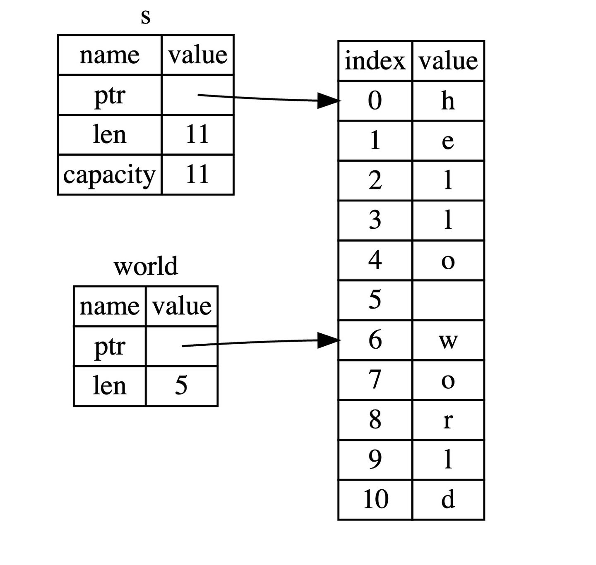
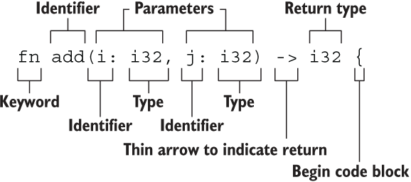

# 这就是Rust
## 基础
1. Rust 项目主要分为两个类型：bin 和 lib，前者是一个可运行的项目，后者是一个依赖库项目
   - cargo new world_hello 创建一个新项目
   - 有两种方式可以运行项目
     - cargo run 首先对项目进行编译，然后再运行，因此它实际上等同于运行了两个指令
     - cargo build 手动编译和运行项目
       - ./target/debug/world_hello
         - 运行的是 debug 模式，在这种模式下，代码的编译速度会非常快，可是福兮祸所伏，运行速度就慢了。 原因是，在 debug 模式下，Rust 编译器不会做任何的优化，只为了尽快的编译完成，让你的开发流程更加顺畅。
     - cargo run --release 高性能运行代码
     - cargo build --release
       - ./target/release/world_hello

2. 检查项目 cargo check
   - cargo check 是我们在代码开发过程中最常用的命令，它的作用很简单：快速的检查一下代码能否编译通过。因此该命令速度会非常快，能节省大量的编译时间。
   - Rust 虽然编译速度还行，但是还是不能与 Go 语言相提并论，因为 Rust 需要做很多复杂的编译优化和语言特性解析，甚至连如何优化编译速度都成了一门学问: 优化编译速度。

3. Cargo.toml 和 Cargo.lock
   - Cargo.toml 和 Cargo.lock 是 cargo 的核心文件，它的所有活动均基于此二者。
   - Cargo.toml 是 cargo 特有的项目数据描述文件。它存储了项目的所有元配置信息，如果 Rust 开发者希望 Rust 项目能够按照期望的方式进行构建、测试和运行，那么，必须按照合理的方式构建 Cargo.toml。
    ```bash
    [package]
    name = "world_hello"  # 项目名称
    version = "0.1.0"  # 当前版本，新项目默认是 0.1.0
    edition = "2021" # 定义了我们使用的 Rust 大版本
    ```
   - Cargo.lock 文件是 cargo 工具根据同一项目的 toml 文件生成的项目依赖详细清单，因此我们一般不用修改它，只需要对着 Cargo.toml 文件撸就行了。
   - 当你的项目是一个可运行的程序时，就上传 Cargo.lock，如果是一个依赖库项目，那么请把它添加到 .gitignore 中。

4. 定义项目依赖
   - 使用 cargo 工具的最大优势就在于，能够对该项目的各种依赖项进行方便、统一和灵活的管理。
   - 在 Cargo.toml 中，主要通过各种依赖段落来描述该项目的各种依赖项：
    ```bash
    [dependencies]
    rand = "0.3"
    hammer = { version = "0.5.0"} # 基于 Rust 官方仓库 crates.io，通过版本说明来描述
    color = { git = "https://github.com/bjz/color-rs" } # 基于项目源代码的 git 仓库地址，通过 URL 来描述
    geometry = { path = "crates/geometry" } # 基于本地项目的绝对路径或者相对路径，通过类 Unix 模式的路径来描述
    ```

5. 覆盖默认镜像地址
    直接使用新注册服务来替代默认的 `crates.i`，在 `$HOME/.cargo/config.toml` 添加以下内容，没有这个文件手动创建下：
    ```bash
    [source.crates-io]
    replace-with = 'ustc'

    [source.ustc]
    registry = "git://mirrors.ustc.edu.cn/crates.io-index"
    ```
    首先，创建一个新的镜像源 `[source.ustc]`，然后将默认的 `crates-io` 替换成新的镜像源: `replace-with = 'ustc'`。


## Rust 语言初印象
Rust 这门语言对于 Haskell 和 Java 开发者来说，可能会觉得很熟悉，因为它们在高阶表达方面都很优秀。简而言之，就是可以很简洁的写出原本需要一大堆代码才能表达的含义。但是，Rust 又有所不同：它的性能是底层语言级别的性能，可以跟 C/C++ 相媲美。

### 语法
```rust
// fn 声明一个函数
fn main() { 
    // 声明一个变量
    let southern_germany = "Grüß Gott!";
    let chinese = "世界，你好";
    let english = "World, hello";
    // 函数声明、调用、数组的使用，和其它语言没什么区别
    let regions = [southern_germany, chinese, english];
    // Rust 的集合类型不能直接进行循环，需要变成迭代器（这里是通过 .iter() 方法），才能用于迭代循环
    // 这段代码可以简写，在 2021 edition 及以后，支持直接写 for region in regions，是因为 for 隐式地将 regions 转换成迭代器
    for region in regions.iter() {
        // println 后面的 ! 是 宏 操作符，可以认为宏是一种特殊类型函数
        // {} 是输出占位符，Rust 在底层帮我们做了大量工作，会自动识别输出数据的类型，例如当前例子，会识别为 String 类型
        println!("{}", &region);
    }
}
```
 - Rust 语言是静态类型语言，这意味着所有的变量都必须在编译时指定其类型。
 - 变量类型必须明确且一致，否则编译器会报错。
 - 变量类型一旦指定，就不能更改。
 - Rust 原生支持 UTF-8 编码的字符串，这意味着可以很容易的使用世界各国文字作为字符串内容。
```rust
fn main() {
    let penguin_data = "\
    common name,length (cm)
    Little penguin,33
    Yellow-eyed penguin,65
    Fiordland penguin,60
    Invalid,data
    ";

    let records = penguin_data.lines();

    for (i, record) in records.enumerate() {
        if i == 0 || record.trim().len() == 0 {
            continue;
        }

        // 声明一个 fields 变量，类型是 Vec
        // Vec 是 vector 的缩写，是一个可伸缩的集合类型，可以认为是一个动态数组
        // <_>表示 Vec 中的元素类型由编译器自行推断，在很多场景下，都会帮我们省却不少功夫
        let fields: Vec<_> = record.split(',').map(|field| field.trim()).collect();
        if cfg!(debug_assertions) {
            // 输出到标准错误输出
            eprintln!("debug: {:?} -> {:?}", record, fields);
        }

        let name = fields[0];
        // 1. 尝试把 fields[1] 的值转换为 f32 类型的浮点数，如果成功，则把 f32 值赋给 length 变量
        //
        // 2. if let 是一个匹配表达式，用来从=右边的结果中，匹配出 length 的值：
        //   1）当=右边的表达式执行成功，则会返回一个 Ok(f32) 的类型，若失败，则会返回一个 Err(e) 类型，if let 的作用就是仅匹配 Ok 也就是成功的情况，如果是错误，就直接忽略
        //   2）同时 if let 还会做一次解构匹配，通过 Ok(length) 去匹配右边的 Ok(f32)，最终把相应的 f32 值赋给 length
        //
        // 3. 当然你也可以忽略成功的情况，用 if let Err(e) = fields[1].parse::<f32>() {...}匹配出错误，然后打印出来，但是没啥卵用
        if let Ok(length) = fields[1].parse::<f32>() {
            // 输出到标准输出
            println!("{}, {}cm", name, length);
        }
    }
}
```
- 控制流：for 和 continue 连在一起使用，实现循环控制。
- 方法语法：由于 Rust 没有继承，因此 Rust 不是传统意义上的面向对象语言，但是它却从 OO 语言那里偷师了方法的使用 `record.trim()，record.split(',')` 等。
- 高阶函数编程：函数可以作为参数也能作为返回值，例如 .map(|field| field.trim())，这里 map 方法中使用闭包函数作为参数，也可以称呼为 匿名函数、lambda 函数。
- 类型标注：`if let Ok(length) = fields[1].parse::<f32>()`，通过 `::<f32>` 的使用，告诉编译器 length 是一个 f32 类型的浮点数。这种类型标注不是很常用，但是在编译器无法推断出你的数据类型时，就很有用了。
- 条件编译：`if cfg!(debug_assertions)`，说明紧跟其后的输出（打印）只在 debug 模式下生效。
- 隐式返回：Rust 提供了 return 关键字用于函数返回，但是在很多时候，我们可以省略它。因为 Rust 是 基于表达式的语言。
```rust
// Rust 程序入口函数，跟其它语言一样，都是 main，该函数目前无返回值
fn main() {
    // 使用let来声明变量，进行绑定，a是不可变的
    // 此处没有指定a的类型，编译器会默认根据a的值为a推断类型：i32，有符号32位整数
    // 语句的末尾必须以分号结尾
    let a = 10;
    // 主动指定b的类型为i32
    let b: i32 = 20;
    // 这里有两点值得注意：
    // 1. 可以在数值中带上类型:30i32表示数值是30，类型是i32
    // 2. c是可变的，mut是mutable的缩写
    let mut c = 30i32;
    // 还能在数值和类型中间添加一个下划线，让可读性更好
    let d = 30_i32;
    // 跟其它语言一样，可以使用一个函数的返回值来作为另一个函数的参数
    let e = add(add(a, b), add(c, d));

    // println!是宏调用，看起来像是函数但是它返回的是宏定义的代码块
    // 该函数将指定的格式化字符串输出到标准输出中(控制台)
    // {}是占位符，在具体执行过程中，会把e的值代入进来
    println!("( a + b ) + ( c + d ) = {}", e);
}

// 定义一个函数，输入两个i32类型的32位有符号整数，返回它们的和
fn add(i: i32, j: i32) -> i32 {
    // 返回相加值，这里可以省略return
    // 不要为 i+j 添加 ;，这会改变语法导致函数返回 () 而不是 i32
    i + j 
}
```

- 字符串使用双引号 "" 而不是单引号 ''，Rust 中单引号是留给单个字符类型（char）使用的
- Rust 使用 {} 来作为格式化输出占位符，其它语言可能使用的是 %s，%d，%p 等，由于 println! 会自动推导出具体的类型，因此无需手动指定

#### 变量绑定
在其它语言中，我们用`var a = "hello world"` 的方式给 `a` 赋值，也就是把等式右边的 `"hello world"` 字符串赋值给变量 `a`，而在 Rust 中，我们这样写： `let a = "hello world"` ，同时给这个过程起了另一个名字：变量绑定。为何不用赋值而用绑定呢（其实你也可以称之为赋值，但是绑定的含义更清晰准确）？这里就涉及 Rust 最核心的原则——所有权，简单来讲，任何内存对象都是有主人的，而且一般情况下完全属于它的主人，绑定就是把这个对象绑定给一个变量，让这个变量成为它的主人。

#### 变量可变性
Rust 中的变量默认是不可变的，这是 Rust 团队为我们精心设计的语言特性之一，让我们编写的代码更安全，性能也更好。当然你可以通过 mut 关键字让变量变为可变的，让设计更灵活。

```rust
fn main() {
    let x = 5;
    println!("The value of x is: {}", x);
    // 使用 cargo run 运行到此处就会报错
    // 具体的错误原因是 cannot assign twice to immutable variable x（无法对不可变的变量进行重复赋值），因为我们想为不可变的 x 变量再次赋值
    x = 6;
    println!("The value of x is: {}", x);
}
```
- 这种错误是为了避免无法预期的错误发生在我们的变量上：一个变量往往被多处代码所使用，其中一部分代码假定该变量的值永远不会改变，而另外一部分代码却无情的改变了这个值，在实际开发过程中，这个错误是很难被发现的，特别是在多线程编程中。
- 这种规则让我们的代码变得非常清晰，只有你想让你的变量改变时，它才能改变，这样就不会造成心智上的负担，也给别人阅读代码带来便利。
- 但是可变性也非常重要，否则我们就要像 ClojureScript 那样，每次要改变，就要重新生成一个对象，在拥有大量对象的场景，性能会变得非常低下，内存拷贝的成本异常的高。
- 在 Rust 中，可变性很简单，只要在变量名前加一个 `mut` 即可, 而且这种显式的声明方式还会给后来人传达这样的信息：嗯，这个变量在后面代码部分会发生改变。

```rust
fn main() {
    // 此时 x 变量就是可变的了
    let mut x = 5;
    println!("The value of x is: {}", x);
    x = 6;
    println!("The value of x is: {}", x);
}
```
- 选择可变还是不可变，更多的还是取决于你的使用场景，例如不可变可以带来安全性，但是丧失了灵活性和性能（如果你要改变，就要重新创建一个新的变量，这里涉及到内存对象的再分配）。而可变变量最大的好处就是使用上的灵活性和性能上的提升。
  - 例如，在使用大型数据结构或者热点代码路径（被大量频繁调用）的情形下，在同一内存位置更新实例可能比复制并返回新分配的实例要更快。使用较小的数据结构时，通常创建新的实例并以更具函数式的风格来编写程序，可能会更容易理解，所以值得以较低的性能开销来确保代码清晰。

#### 使用下划线开头忽略未使用的变量
如果你创建了一个变量却不在任何地方使用它，Rust 通常会给你一个警告，因为这可能会是个 BUG。但是有时创建一个不会被使用的变量是有用的，比如你正在设计原型或刚刚开始一个项目。这时你希望告诉 Rust 不要警告未使用的变量，为此可以用下划线作为变量名的开头：

```rust
fn main() {
    let _x = 5;
    // 运行到此处会报警告：help: 如果 y 故意不被使用，请添加一个下划线前缀: `_y`
    //  Rust 的编译器非常强大，这里的提示只是小意思
    let y = 10;
}
```


#### 变量解构
`let` 表达式不仅仅用于变量的绑定，还能进行复杂变量的解构：从一个相对复杂的变量中，匹配出该变量的一部分内容：

```rust
fn main() {
    let (a, mut b): (bool,bool) = (true, false);
    // a = true,不可变; b = false，可变
    println!("a = {:?}, b = {:?}", a, b);

    b = true;
    assert_eq!(a, b);
}
```


#### 解构式赋值
在 `Rust 1.59` 版本后，我们可以在赋值语句的左式中使用元组、切片和结构体模式。

```rust
struct Struct {
    e: i32
}

fn main() {
    let (a, b, c, d, e);

    (a, b) = (1, 2);
    // _ 代表匹配一个值，但是我们不关心具体的值是什么，因此没有使用一个变量名而是使用了 _
    [c, .., d, _] = [1, 2, 3, 4, 5];
    Struct { e, .. } = Struct { e: 5 };

    assert_eq!([1, 2, 1, 4, 5], [a, b, c, d, e]);
}
```
- 这种使用方式跟之前的 let 保持了一致性，但是 let 会重新绑定，而这里仅仅是对之前绑定的变量进行再赋值。
- 使用 += 的赋值语句还不支持解构式赋值。


#### 变量和常量之间的差异
变量的值不能更改可能让你想起其他另一个很多语言都有的编程概念：常量(constant)。与不可变变量一样，常量也是绑定到一个常量名且不允许更改的值，但是常量和变量之间存在一些差异：
- 常量不允许使用 mut。常量不仅仅默认不可变，而且自始至终不可变，因为常量在编译完成后，已经确定它的值。
- 常量使用 const 关键字而不是 let 关键字来声明，并且值的类型必须标注。
- 下面是一个常量声明的例子，其常量名为 MAX_POINTS，值设置为 100,000。（Rust 常量的命名约定是全部字母都使用大写，并使用下划线分隔单词，另外对数字字面量可插入下划线以提高可读性）：

```rust
const MAX_POINTS: u32 = 100_000;
```
- 常量可以在任意作用域内声明，包括全局作用域，在声明的作用域内，常量在程序运行的整个过程中都有效。对于需要在多处代码共享一个不可变的值时非常有用，例如游戏中允许玩家赚取的最大点数或光速。
- 在实际使用中，最好将程序中用到的硬编码值都声明为常量，对于代码后续的维护有莫大的帮助。如果将来需要更改硬编码的值，你也只需要在代码中更改一处即可。


#### 变量遮蔽(shadowing)
Rust 允许声明相同的变量名，在后面声明的变量会遮蔽掉前面声明的，如下所示：

```rust
fn main() {
    // 将数值 5 绑定到 x
    let x = 5;
    // 在main函数的作用域内对之前的x进行遮蔽
    // 通过重复使用 let x = 来遮蔽之前的 x，并取原来的值加上 1，所以 x 的值变成了 6
    let x = x + 1;

    {
        // 在当前的花括号作用域内，对之前的x进行遮蔽
        // 第三个 let 语句同样遮蔽前面的 x，取之前的值并乘上 2，得到的 x 最终值为 12
        let x = x * 2;
        println!("The value of x in the inner scope is: {}", x); // 12
    }

    println!("The value of x is: {}", x); // 6
}
```
- 这和 `mut` 变量的使用是不同的，第二个 `let` 生成了完全不同的新变量，两个变量只是恰好拥有同样的名称，涉及一次内存对象的再分配 ，而 `mut` 声明的变量，可以修改同一个内存地址上的值，并不会发生内存对象的再分配，性能要更好。
- 变量遮蔽的用处在于，如果你在某个作用域内无需再使用之前的变量（在被遮蔽后，无法再访问到之前的同名变量），就可以重复的使用变量名字，而不用绞尽脑汁去想更多的名字。
  - 例如，假设有一个程序要统计一个空格字符串的空格数量：

```rust
// 字符串类型
let spaces = "   ";
// usize数值类型
let spaces = spaces.len(); // 变量遮蔽可以修改变量类型
```
- 这种结构是允许的，因为第一个 spaces 变量是一个字符串类型，第二个 spaces 变量是一个全新的变量且和第一个具有相同的变量名，且是一个数值类型。所以变量遮蔽可以帮我们节省些脑细胞，不用去想如 spaces_str 和 spaces_num 此类的变量名；相反我们可以重复使用更简单的 spaces 变量名。如果你不用 let :

```rust
let mut spaces = "   ";
spaces = spaces.len(); // 修改值类型会报错
```
- 这样写就会发现编译器报错，Rust 对类型的要求很严格，不允许将整数类型 `usize` 赋值给字符串类型。`usize` 是一种 `CPU` 相关的整数类型。


#### 基本类型
Rust 每个值都有其确切的数据类型，总的来说可以分为两类：基本类型和复合类型。 基本类型意味着它们往往是一个最小化原子类型，无法解构为其它类型(一般意义上来说)，由以下组成：
##### 数值类型: 有符号整数 (i8, i16, i32, i64, isize)、 无符号整数 (u8, u16, u32, u64, usize) 、浮点数 (f32, f64)、以及有理数、复数

##### 字符类型: 表示单个 Unicode 字符，存储为 4 个字节
- Rust 的字符不仅仅是 ASCII，所有的 Unicode 值都可以作为 Rust 字符，包括单个的中文、日文、韩文、emoji 表情符号等等，都是合法的字符类型。Unicode 值的范围从 U+0000 ~ U+D7FF 和 U+E000 ~ U+10FFFF。
- 由于 Unicode 都是 4 个字节编码，因此字符类型也是占用 4 个字节:```fn main() { let x = '中'; println!("字符'中'占用了{}字节的内存大小",std::mem::size_of_val(&x)); }```
- 注意：Rust 的字符只能用 '' 来表示， "" 是留给字符串的。

##### 字符串类型：字符串字面量和字符串切片 &str
- 字符串字面值 `let s ="hello"`，s 是被硬编码进程序里的字符串值（类型为 &str ）。字符串字面值是很方便的，但是它并不适用于所有场景。
- 字符串字面值是不可变的，因为被硬编码到程序代码中
- 并非所有字符串的值都能在编写代码时得知
  - 例如，字符串是需要程序运行时，通过用户动态输入然后存储在内存中的，这种情况，字符串字面值就完全无用武之地。
- 为此，Rust 为我们提供动态字符串类型: String, 该类型被分配到堆上，因此可以动态伸缩，也就能存储在编译时大小未知的文本。
  - 可以使用下面的方法基于字符串字面量来创建 String 类型：`let s = String::from("hello");`
  - :: 是一种调用操作符，这里表示调用 String 中的 from 方法，因为 String 存储在堆上是动态的，你可以这样修改它：
```rust
let mut s = String::from("hello");

s.push_str(", world!"); // push_str() 在字符串后追加字面值

println!("{}", s); // 将打印 `hello, world!`
```
```rust
fn main() {
  let my_name = "Pascal";
  greet(my_name);
}

fn greet(name: String) { // greet 函数接受一个字符串类型的 name 参数，然后打印到终端控制台中
  println!("Hello, {}!", name);
}
```
以上代码会报错：
```bash
error[E0308]: mismatched types
 --> src/main.rs:3:11
  |
3 |     greet(my_name);
  |           ^^^^^^^
  |           |
  |           expected struct `std::string::String`, found `&str`
  |           help: try using a conversion method: `my_name.to_string()`

error: aborting due to previous error
```
编译器提示 greet 函数需要一个 String 类型的字符串，却传入了一个 &str 类型的字符串

###### 切片(slice)
切片并不是 Rust 独有的概念，在 Go 语言中就非常流行，它允许你引用集合中部分连续的元素序列，而不是引用整个集合。

对于字符串而言，切片就是对 String 类型中某一部分的引用，它看起来像这样：
```rust
let s = String::from("hello world");

let hello = &s[0..5];
let world = &s[6..11];
```
hello 没有引用整个 String s，而是引用了 s 的一部分内容，通过 [0..5] 的方式来指定。

这就是创建切片的语法，使用方括号包括的一个序列：[开始索引..终止索引]，其中开始索引是切片中第一个元素的索引位置，而终止索引是最后一个元素后面的索引位置，也就是这是一个 右半开区间。在切片数据结构内部会保存开始的位置和切片的长度，其中长度是通过 终止索引 - 开始索引 的方式计算得来的。

对于 let world = &s[6..11]; 来说，world 是一个切片，该切片的指针指向 s 的第 7 个字节(索引从 0 开始, 6 是第 7 个字节)，且该切片的长度是 5 个字节。


在使用 Rust 的 .. range 序列语法时，如果你想从索引 0 开始，可以使用如下的方式，这两个是等效的：
```rust
let s = String::from("hello");

let slice = &s[0..2];
let slice = &s[..2];
```
同样的，如果你的切片想要包含 String 的最后一个字节，则可以这样使用：
```rust
let s = String::from("hello");

let len = s.len();

let slice = &s[4..len];
let slice = &s[4..];
```
你也可以截取完整的 String 切片：
```rust
let s = String::from("hello");

let len = s.len();

let slice = &s[0..len];
let slice = &s[..];
```

!> 在对字符串使用切片语法时需要格外小心，切片的索引必须落在字符之间的边界位置，也就是 UTF-8 字符的边界，例如中文在 UTF-8 中占用三个字节，下面的代码就会崩溃：
```rust
let s = "中国人";
let a = &s[0..2];
println!("{}",a);
```
!> 因为我们只取 s 字符串的前两个字节，但是本例中每个汉字占用三个字节，因此没有落在边界处，也就是连 中 字都取不完整，此时程序会直接崩溃退出，如果改成 &s[0..3]，则可以正常通过编译。 因此，当你需要对字符串做切片索引操作时，需要格外小心这一点。

- 操作 UTF-8 字符串
  - 字符
    
    如果你想要以 Unicode 字符的方式遍历字符串，最好的办法是使用 chars 方法，例如：
    ```rust
    for c in "中国人".chars() {
        println!("{}", c);
    }
    // 输出
    // 中
    // 国
    // 人
    ```
  - 字节
    
    这种方式是返回字符串的底层字节数组表现形式：
    ```rust
    for b in "中国人".bytes() {
        println!("{}", b);
    }
    // 输出
    // 228
    // 184
    // 173
    // 229
    // 155
    // 189
    // 228
    // 186
    // 186
    ```
  - 获取子串
    
    想要准确的从 UTF-8 字符串中获取子串是较为复杂的事情，例如想要从 holla中国人नमस्ते 这种变长的字符串中取出某一个子串，使用标准库你是做不到的。 你需要在 crates.io 上搜索 utf8 来寻找想要的功能。可以考虑尝试下这个库：[utf8_slice](https://crates.io/crates/utf8_slice)。

字符串切片的类型标识是 &str，因此我们可以这样声明一个函数，输入 String 类型，返回它的切片: fn first_word(s: &String) -> &str 。
有了切片就可以写出这样的代码：
```rust
fn main() {
    let mut s = String::from("hello world");

    let word = first_word(&s);

    s.clear(); // error!

    println!("the first word is: {}", word);
}
fn first_word(s: &String) -> &str {
    &s[..1]
}
```
编译器报错如下：
```bash
error[E0502]: cannot borrow `s` as mutable because it is also borrowed as immutable
  --> src/main.rs:18:5
   |
16 |     let word = first_word(&s);
   |                           -- immutable borrow occurs here
17 |
18 |     s.clear(); // error!
   |     ^^^^^^^^^ mutable borrow occurs here
19 |
20 |     println!("the first word is: {}", word);
   |                                       ---- immutable borrow later used here
```
当我们已经有了可变借用时，就无法再拥有不可变的借用。因为 clear 需要清空改变 String，因此它需要一个可变借用（利用 VSCode 可以看到该方法的声明是 pub fn clear(&mut self) ，参数是对自身的可变借用 ）；而之后的 println! 又使用了不可变借用，也就是在 s.clear() 处可变借用与不可变借用试图同时生效，因此编译无法通过。
从上述代码可以看出，Rust 不仅让我们的 API 更加容易使用，而且也在编译期就消除了大量错误！

###### 其它切片
因为切片是对集合的部分引用，因此不仅仅字符串有切片，其它集合类型也有，例如数组：
```rust
let a = [1, 2, 3, 4, 5];

let slice = &a[1..3];

assert_eq!(slice, &[2, 3]);
```
该数组切片的类型是 &[i32]，数组切片和字符串切片的工作方式是一样的，例如持有一个引用指向原始数组的某个元素和长度。

###### 字符串字面量是切片
字符串字面量的类型是 &str，因此你也可以这样声明：
```rust
let s = "Hello, world!";

let s: &str = "Hello, world!";
```
该切片指向了程序可执行文件中的某个点，这也是为什么字符串字面量是不可变的，因为 &str 是一个不可变引用。

###### 什么是字符串?
顾名思义，字符串是由字符组成的连续集合，Rust 中的字符是 Unicode 类型，因此每个字符占据 4 个字节内存空间，但是在字符串中不一样，字符串是 UTF-8 编码，也就是字符串中的字符所占的字节数是变化的(1 - 4)，这样有助于大幅降低字符串所占用的内存空间。

Rust 在语言级别，只有一种字符串类型： str，它通常是以引用类型出现 &str，也就是上文提到的字符串切片。虽然语言级别只有上述的 str 类型，但是在标准库里，还有多种不同用途的字符串类型，其中使用最广的即是 String 类型。

str 类型是硬编码进可执行文件，也无法被修改，但是 String 则是一个可增长、可改变且具有所有权的 UTF-8 编码字符串，当 Rust 用户提到字符串时，往往指的就是 String 类型和 &str 字符串切片类型，这两个类型都是 UTF-8 编码。

除了 String 类型的字符串，Rust 的标准库还提供了其他类型的字符串，例如 OsString， OsStr， CsString 和 CsStr 等，注意到这些名字都以 String 或者 Str 结尾了吗？它们分别对应的是具有所有权和被借用的变量。

###### String 与 &str 的转换
在之前的代码中，已经见到好几种从 &str 类型生成 String 类型的操作：
```rust
String::from("hello,world")
"hello,world".to_string()
```
如何将 String 类型转为 &str 类型呢？答案很简单，取引用即可：
```rust
fn main() {
    let s = String::from("hello,world!");
    say_hello(&s);
    say_hello(&s[..]);
    say_hello(s.as_str());
}

fn say_hello(s: &str) {
    println!("{}",s);
}
```
实际上这种灵活用法是因为 deref 隐式强制转换。

###### 字符串索引
在其它语言中，使用索引的方式访问字符串的某个字符或者子串是很正常的行为，但是在 Rust 中就会报错：
```rust
let s1 = String::from("hello");
let h = s1[0];
```
该代码会产生如下错误：
```bash
3 |     let h = s1[0];
  |             ^^^^^ `String` cannot be indexed by `{integer}`
  |
  = help: the trait `Index<{integer}>` is not implemented for `String`
```
字符串的底层的数据存储格式实际上是[ u8 ]，一个字节数组。对于 `let hello = String::from("Hola");` 这行代码来说，Hola 的长度是 4 个字节，因为 "Hola" 中的每个字母在 UTF-8 编码中仅占用 1 个字节，但是对于下面的代码呢？
```rust
let hello = String::from("中国人");
```
如果问你该字符串多长，你可能会说 3，但是实际上是 9 个字节的长度，因为大部分常用汉字在 UTF-8 中的长度是 3 个字节，因此这种情况下对 hello 进行索引，访问 &hello[0] 没有任何意义，因为你取不到 中 这个字符，而是取到了这个字符三个字节中的第一个字节，这是一个非常奇怪而且难以理解的返回值。

现在看一下用梵文写的字符串 “नमस्ते”, 它底层的字节数组如下形式：
`[224, 164, 168, 224, 164, 174, 224, 164, 184, 224, 165, 141, 224, 164, 164,
224, 165, 135]`

长度是 18 个字节，这也是计算机最终存储该字符串的形式。如果从字符的形式去看，则是：
`['न', 'म', 'स', '्', 'त', 'े']`

但是这种形式下，第四和六两个字母根本就不存在，没有任何意义，接着再从字母串的形式去看：
`["न", "म", "स्", "ते"]`

所以，可以看出来 Rust 提供了不同的字符串展现方式，这样程序可以挑选自己想要的方式去使用，而无需去管字符串从人类语言角度看长什么样。

还有一个原因导致了 Rust 不允许去索引字符串：因为索引操作，我们总是期望它的性能表现是 O(1)，然而对于 String 类型来说，无法保证这一点，因为 Rust 可能需要从 0 开始去遍历字符串来定位合法的字符。

###### 字符串切片
字符串切片是非常危险的操作，因为切片的索引是通过字节来进行，但是字符串又是 UTF-8 编码，因此你无法保证索引的字节刚好落在字符的边界上，例如：
```rust
let hello = "中国人";

let s = &hello[0..2];
```
运行上面的程序，会直接造成崩溃：
```bash
thread 'main' panicked at 'byte index 2 is not a char boundary; it is inside '中' (bytes 0..3) of `中国人`', src/main.rs:4:14
note: run with `RUST_BACKTRACE=1` environment variable to display a backtrace
```
这里提示的很清楚，我们索引的字节落在了 中 字符的内部，这种返回没有任何意义。因此在通过索引区间来访问字符串时，需要格外的小心，一不注意，就会导致你程序的崩溃！

###### 操作字符串
- 追加 (Push)
  
  在字符串尾部可以使用 push() 方法追加字符 char，也可以使用 push_str() 方法追加字符串字面量。这两个方法都是在原有的字符串上追加，并不会返回新的字符串。由于字符串追加操作要修改原来的字符串，则该字符串必须是可变的，即字符串变量必须由 mut 关键字修饰。
  ```rust
  fn main() {
      let mut s = String::from("Hello ");

      s.push_str("rust");
      println!("追加字符串 push_str() -> {}", s); // 追加字符串 push_str() -> Hello rust

      s.push('!');
      println!("追加字符 push() -> {}", s); // 追加字符 push() -> Hello rust!
  }
  ```

- 插入 (Insert)
  
  可以使用 insert() 方法插入单个字符 char，也可以使用 insert_str() 方法插入字符串字面量，与 push() 方法不同，这俩方法需要传入两个参数，第一个参数是字符（串）插入位置的索引，第二个参数是要插入的字符（串），索引从 0 开始计数，如果越界则会发生错误。由于字符串插入操作要修改原来的字符串，则该字符串必须是可变的，即字符串变量必须由 mut 关键字修饰。
  ```rust
  fn main() {
      let mut s = String::from("Hello rust!");
      s.insert(5, ',');
      println!("插入字符 insert() -> {}", s);
      s.insert_str(6, " I like");
      println!("插入字符串 insert_str() -> {}", s);
  }
  ```

- 替换 (Replace)
  
  如果想要把字符串中的某个字符串替换成其它的字符串，那可以使用 replace() 方法。与替换有关的方法有三个。

  - replace
  
    该方法可适用于 String 和 &str 类型。replace() 方法接收两个参数，第一个参数是要被替换的字符串，第二个参数是新的字符串。该方法会替换所有匹配到的字符串。该方法是返回一个新的字符串，而不是操作原来的字符串。
    ```rust
    fn main() {
        let string_replace = String::from("I like rust. Learning rust is my favorite!");
        let new_string_replace = string_replace.replace("rust", "RUST");
        dbg!(new_string_replace); // new_string_replace = "I like RUST. Learning RUST is my favorite!"
    }
    ```

  - replacen
  
    该方法可适用于 String 和 &str 类型。replacen() 方法接收三个参数，前两个参数与 replace() 方法一样，第三个参数则表示替换的个数。该方法是返回一个新的字符串，而不是操作原来的字符串。
    ```rust
    fn main() {
        let string_replace = "I like rust. Learning rust is my favorite!";
        let new_string_replacen = string_replace.replacen("rust", "RUST", 1);
        dbg!(new_string_replacen); // new_string_replacen = "I like RUST. Learning rust is my favorite!"
    }
    ```

  - replace_range
  
    该方法仅适用于 String 类型。replace_range 接收两个参数，第一个参数是要替换字符串的范围（Range），第二个参数是新的字符串。该方法是直接操作原来的字符串，不会返回新的字符串。该方法需要使用 mut 关键字修饰。
    ```rust
    fn main() {
        let mut string_replace_range = String::from("I like rust!");
        string_replace_range.replace_range(7..8, "R");
        dbg!(string_replace_range); // string_replace_range = "I like Rust!"
    }
    ```

- 删除 (Delete)
  
  与字符串删除相关的方法有 4 个，他们分别是 pop()，remove()，truncate()，clear()。这四个方法仅适用于 String 类型。

  - pop —— 删除并返回字符串的最后一个字符
  
    该方法是直接操作原来的字符串。但是存在返回值，其返回值是一个 Option 类型，如果字符串为空，则返回 None。
    ```rust
    fn main() {
        let mut string_pop = String::from("rust pop 中文!");
        let p1 = string_pop.pop();
        let p2 = string_pop.pop();
        dbg!(p1); // p1 = Some('!',)
        dbg!(p2); // p2 = Some('文',)
        dbg!(string_pop); // string_pop = "rust pop 中"
    }
    ```

  - remove —— 删除并返回字符串中指定位置的字符
  
    该方法是直接操作原来的字符串。但是存在返回值，其返回值是删除位置的字符串，只接收一个参数，表示该字符起始索引位置。remove() 方法是按照字节来处理字符串的，如果参数所给的位置不是合法的字符边界，则会发生错误。
    ```rust
    fn main() {
        let mut string_remove = String::from("测试remove方法");
        println!(
            "string_remove 占 {} 个字节",
            std::mem::size_of_val(string_remove.as_str()) 
        );
        // 删除第一个汉字
        string_remove.remove(0);
        // 下面代码会发生错误
        // string_remove.remove(1);
        // 直接删除第二个汉字
        // string_remove.remove(3);
        dbg!(string_remove); // string_remove 占 18 个字节  // string_remove = "试remove方法"
    }
    ```

  - truncate —— 删除字符串中从指定位置开始到结尾的全部字符
  
    该方法是直接操作原来的字符串。无返回值。该方法 truncate() 方法是按照字节来处理字符串的，如果参数所给的位置不是合法的字符边界，则会发生错误。
    ```rust
    fn main() {
        let mut string_truncate = String::from("测试truncate");
        string_truncate.truncate(3);
        dbg!(string_truncate); // string_truncate = "测"
    }
    ```

  - clear —— 清空字符串
  
    该方法是直接操作原来的字符串。调用后，删除字符串中的所有字符，相当于 truncate() 方法参数为 0 的时候。
    ```rust
    fn main() {
        let mut string_clear = String::from("string clear");
        string_clear.clear();
        dbg!(string_clear); // string_clear = ""
    }
    ```

- 连接 (Concatenate)
  
  - 使用 + 或者 += 连接字符串
  
    使用 + 或者 += 连接字符串，要求右边的参数必须为字符串的切片引用（Slice）类型。其实当调用 + 的操作符时，相当于调用了 std::string 标准库中的 add() 方法，这里 add() 方法的第二个参数是一个引用的类型。因此我们在使用 + 时， 必须传递切片引用类型。不能直接传递 String 类型。+ 是返回一个新的字符串，所以变量声明可以不需要 mut 关键字修饰。
    ```rust
    fn main() {
      let string_append = String::from("hello ");
      let string_rust = String::from("rust");
      // &string_rust会自动解引用为&str
      let result = string_append + &string_rust;
      let mut result = result + "!"; // `result + "!"` 中的 `result` 是不可变的
      result += "!!!";

      println!("连接字符串 + -> {}", result); // 连接字符串 + -> hello rust!!!!
    }
    ```
    add() 方法定义：`fn add(self, s: &str) -> String`
    ```rust
    fn main() {
    let s1 = String::from("hello,");
    let s2 = String::from("world!");
    // 在下句中，s1的所有权被转移走了，因此后面不能再使用s1
    let s3 = s1 + &s2;
    assert_eq!(s3,"hello,world!");
    // 下面的语句如果去掉注释，就会报错
    // println!("{}",s1);
    }
    ```
    self 是 String 类型的字符串 s1，该函数说明，只能将 &str 类型的字符串切片添加到 String 类型的 s1 上，然后返回一个新的 String 类型，所以 let s3 = s1 + &s2; 就很好解释了，将 String 类型的 s1 与 &str 类型的 s2 进行相加，最终得到 String 类型的 s3。
    由此可推，以下代码也是合法的：
    ```rust
    let s1 = String::from("tic");
    let s2 = String::from("tac");
    let s3 = String::from("toe");

    // String = String + &str + &str + &str + &str
    let s = s1 + "-" + &s2 + "-" + &s3;
    ```
    String + &str返回一个 String，然后再继续跟一个 &str 进行 + 操作，返回一个 String 类型，不断循环，最终生成一个 s，也是 String 类型。

    s1 这个变量通过调用 add() 方法后，所有权被转移到 add() 方法里面， add() 方法调用后就被释放了，同时 s1 也被释放了。再使用 s1 就会发生错误。

  - 使用 format! 连接字符串
  
    format! 这种方式适用于 String 和 &str 。format! 的用法与 print! 的用法类似。
    ```rust
    fn main() {
        let s1 = "hello";
        let s2 = String::from("rust");
        let s = format!("{} {}!", s1, s2);
        println!("{}", s); // hello rust!
    }
    ```

###### 字符串转义
我们可以通过转义的方式 \ 输出 ASCII 和 Unicode 字符。
```rust
fn main() {
    // 通过 \ + 字符的十六进制表示，转义输出一个字符
    let byte_escape = "I'm writing \x52\x75\x73\x74!";
    println!("What are you doing\x3F (\\x3F means ?) {}", byte_escape);

    // \u 可以输出一个 unicode 字符
    let unicode_codepoint = "\u{211D}";
    let character_name = "\"DOUBLE-STRUCK CAPITAL R\"";

    println!(
        "Unicode character {} (U+211D) is called {}",
        unicode_codepoint, character_name
    );

    // 换行了也会保持之前的字符串格式
    // 使用\忽略换行符
    let long_string = "String literals
                        can span multiple lines.
                        The linebreak and indentation here ->\
                        <- can be escaped too!";
    println!("{}", long_string);
}
```
当然，在某些情况下，可能你会希望保持字符串的原样，不要转义：
```rust
fn main() {
    println!("{}", "hello \\x52\\x75\\x73\\x74");
    let raw_str = r"Escapes don't work here: \x3F \u{211D}";
    println!("{}", raw_str);

    // 如果字符串包含双引号，可以在开头和结尾加 #
    let quotes = r#"And then I said: "There is no escape!""#;
    println!("{}", quotes);

    // 如果还是有歧义，可以继续增加，没有限制
    let longer_delimiter = r###"A string with "# in it. And even "##!"###;
    println!("{}", longer_delimiter);
}
```

###### 字符串深度剖析
为什么 String 可变，而字符串字面值 str 却不可以？

就字符串字面值来说，我们在编译时就知道其内容，最终字面值文本被直接硬编码进可执行文件中，这使得字符串字面值快速且高效，这主要得益于字符串字面值的不可变性。不幸的是，我们不能为了获得这种性能，而把每一个在编译时大小未知的文本都放进内存中（你也做不到！），因为有的字符串是在程序运行得过程中动态生成的。

对于 String 类型，为了支持一个可变、可增长的文本片段，需要在堆上分配一块在编译时未知大小的内存来存放内容，这些都是在程序运行时完成的：

首先向操作系统请求内存来存放 String 对象
在使用完成后，将内存释放，归还给操作系统
其中第一部分由 String::from 完成，它创建了一个全新的 String。

重点来了，到了第二部分，就是百家齐放的环节，在有垃圾回收 GC 的语言中，GC 来负责标记并清除这些不再使用的内存对象，这个过程都是自动完成，无需开发者关心，非常简单好用；但是在无 GC 的语言中，需要开发者手动去释放这些内存对象，就像创建对象需要通过编写代码来完成一样，未能正确释放对象造成的后果简直不可估量。

对于 Rust 而言，安全和性能是写到骨子里的核心特性，如果使用 GC，那么会牺牲性能；如果使用手动管理内存，那么会牺牲安全，这该怎么办？为此，Rust 的开发者想出了一个无比惊艳的办法：变量在离开作用域后，就自动释放其占用的内存：
```rust
{
    let s = String::from("hello"); // 从此处起，s 是有效的

    // 使用 s
}                                  // 此作用域已结束，
                                   // s 不再有效，内存被释放
```
与其它系统编程语言的 free 函数相同，Rust 也提供了一个释放内存的函数： drop，但是不同的是，其它语言要手动调用 free 来释放每一个变量占用的内存，而 Rust 则在变量离开作用域时，自动调用 drop 函数: 上面代码中，Rust 在结尾的 } 处自动调用 drop。

其实，在 C++ 中，也有这种概念: Resource Acquisition Is Initialization (RAII)。如果你使用过 RAII 模式的话应该对 Rust 的 drop 函数并不陌生。


##### 布尔类型(bool)： true 和 false
- Rust 中的布尔类型有两个可能的值：true 和 false，布尔值占用内存的大小为 1 个字节
- 使用布尔类型的场景主要在于流程控制

##### 单元类型: 即 () ，其唯一的值也是 ()
- main 函数就返回这个单元类型 ()，你不能说 main 函数无返回值，因为没有返回值的函数在 Rust 中是有单独的定义的：发散函数( diverge function )，顾名思义，无法收敛的函数。
- 常见的 println!() 的返回值也是单元类型 ()。
- 可以用 () 作为 map 的值，表示我们不关注具体的值，只关注 key。 这种用法和 Go 语言的 struct{} 类似，可以作为一个值用来占位，但是完全不占用任何内存。 

#### 类型推导与标注
与 Python、JavaScript 等动态语言不同，Rust 是一门静态类型语言，也就是编译器必须在编译期知道我们所有变量的类型，但这不意味着你需要为每个变量指定类型，因为 Rust 编译器很聪明，它可以根据变量的值和上下文中的使用方式来自动推导出变量的类型，同时编译器也不够聪明，在某些情况下，它无法推导出变量类型，需要手动去给予一个类型标注.

```rust 
let guess = "42".parse().expect("Not a number!");
```
- 先忽略 `.parse().expect..` 部分，这段代码的目的是将字符串 "42" 进行解析，而编译器在这里无法推导出我们想要的类型：整数？浮点数？字符串？因此编译器会报错：`error[E0282]: type annotations needed`
- 因此我们需要提供给编译器更多的信息，例如给 guess 变量一个显式的类型标注：`let guess: i32 = ...` 或者 `"42".parse::<i32>()`

#### 语句和表达式
Rust 的函数体是由一系列语句组成，最后由一个表达式来返回值，例如：
```rust
fn add_with_extra(x: i32, y: i32) -> i32 {
    let x = x + 1; // 语句
    let y = y + 5; // 语句
    x + y // 表达式
}
```
语句会执行一些操作但是不会返回一个值，而表达式会在求值后返回一个值，因此在上述函数体的三行代码中，前两行是语句，最后一行是表达式。
**基于表达式是函数式语言的重要特征，表达式总要返回值。**

##### 语句
```rust
let a = 8;
let b: Vec<f64> = Vec::new();
let (a, c) = ("hi", false);
```
以上都是语句，它们完成了一个具体的操作，但是并没有返回值，因此是语句。
由于 let 是语句，因此不能将 let 语句赋值给其它值，如下形式是错误的：`let b = (let a = 8);`

##### 表达式
表达式会进行求值，然后返回一个值。例如 5 + 6，在求值后，返回值 11，因此它就是一条表达式。
表达式可以成为语句的一部分，例如 let y = 6 中，6 就是一个表达式，它在求值后返回一个值 6（有些反直觉，但是确实是表达式）。
调用一个函数是表达式，因为会返回一个值，调用宏也是表达式，用花括号包裹最终返回一个值的语句块也是表达式，总之，能返回值，它就是表达式:
```rust
fn main() {
    let y = {
        let x = 3;
        x + 1
    };

    println!("The value of y is: {}", y);
}
```
使用一个语句块表达式将值赋给 y 变量，该语句块是表达式的原因是：它的最后一行是表达式，返回了 x + 1 的值，注意 x + 1 不能以分号结尾，否则就会从表达式变成语句， 表达式不能包含分号。这一点非常重要，一旦你在表达式后加上分号，它就会变成一条语句，再也不会返回一个值，请牢记！
表达式如果不返回任何值，会隐式地返回一个 () 。
```rust
fn main() {
    assert_eq!(ret_unit_type(), ())
}

fn ret_unit_type() {
    let x = 1;
    // if 语句块也是一个表达式，因此可以用于赋值，也可以直接返回
    // 类似三元运算符，在Rust里我们可以这样写
    let y = if x % 2 == 1 {
        "odd"
    } else {
        "even"
    };
    // 或者写成一行
    let z = if x % 2 == 1 { "odd" } else { "even" };
}
```

#### 函数
```rust
fn add(i: i32, j: i32) -> i32 {
   i + j
 }
```
声明函数的关键字 fn ,函数名 add()，参数 i 和 j，参数类型和返回值类型都是 i32。



- 函数名和变量名使用蛇形命名法(snake case)，例如 fn add_two() -> {}
- 函数的位置可以随便放，Rust 不关心我们在哪里定义了函数，只要有定义即可
- 每个函数参数都需要标注类型

##### 函数参数
Rust 是强类型语言，因此需要你为每一个函数参数都标识出它的具体类型，例如：
```rust
fn main() {
    another_function(5, 6.1);
}

fn another_function(x: i32, y: f32) {
    println!("The value of x is: {}", x);
    println!("The value of y is: {}", y);
}
```
another_function 函数有两个参数，其中 x 是 i32 类型，y 是 f32 类型，然后在该函数内部，打印出这两个值。这里去掉 x 或者 y 的任何一个的类型，都会报错。

##### 函数返回
在 Rust 中函数就是表达式，因此我们可以把函数的返回值直接赋给调用者。
函数的返回值就是函数体最后一条表达式的返回值，当然我们也可以使用 return 提前返回，下面的函数使用最后一条表达式来返回一个值：
```rust
fn plus_five(x:i32) -> i32 {
    x + 5 // x + 5 没有分号，因为它是一条表达式，求值后，返回一个值，因为它是函数的最后一行，因此该表达式的值也是函数的返回值。
}

fn main() {
    let x = plus_five(5); // 用一个函数的返回值来初始化 x 变量，因此侧面说明了在 Rust 中函数也是表达式，这种写法等同于 let x = 5 + 5;

    println!("The value of x is: {}", x);
}
```
```rust
// plus_or_minus 函数根据传入 x 的大小来决定是做加法还是减法，若 x > 5 则通过 return 提前返回 x - 5 的值,否则返回 x + 5 的值
fn plus_or_minus(x:i32) -> i32 {
    if x > 5 {
        return x - 5
    }

    x + 5
}

fn main() {
    let x = plus_or_minus(5);

    println!("The value of x is: {}", x);
}
```
##### Rust 中的特殊返回类型
无返回值()，单元类型 ()，是一个零长度的元组。它没啥作用，但是可以用来表达一个函数没有返回值：
- 函数没有返回值，那么返回一个 ()
- 通过 ; 结尾的表达式返回一个 ()
例如下面的 report 函数会隐式返回一个 ()：
```rust
use std::fmt::Debug;

fn report<T: Debug>(item: T) {
  println!("{:?}", item);

}
```
与上面的函数返回值相同，但是下面的函数显式的返回了 ()：
```rust
fn clear(text: &mut String) -> () {
  *text = String::from("");
}
```
在实际编程中，你会经常在错误提示中看到该 () 的身影出没，假如你的函数需要返回一个 u32 值，但是如果你不幸的以 表达式; 的方式作为函数的最后一行代码，就会报错：
```rust
fn add(x:u32,y:u32) -> u32 {
    x + y;
}
// error[E0308]: mismatched types // 类型不匹配
//  --> src/main.rs:6:24
//   |
// 6 | fn add(x:u32,y:u32) -> u32 {
//   |    ---                 ^^^ expected `u32`, found `()` // 期望返回u32,却返回()
//   |    |
//   |    implicitly returns `()` as its body has no tail or `return` expression
// 7 |     x + y;
//   |          - help: consider removing this semicolon
```
只有表达式能返回值，而 ; 结尾的是语句，在 Rust 中，一定要严格区分表达式和语句的区别，这个在其它语言中往往是被忽视的点。

##### 永不返回的发散函数 !
当用 ! 作函数返回类型的时候，表示该函数永不返回( diverge function )，特别的，这种语法往往用做会导致程序崩溃的函数：
```rust
fn dead_end() -> ! {
  panic!("你已经到了穷途末路，崩溃吧！");
}
```
下面的函数创建了一个无限循环，该循环永不跳出，因此函数也永不返回：
```rust
fn forever() -> ! {
  loop {
    //...
  };
}
```

#### 复合类型
复合类型是由其它类型组合而成的，最典型的就是结构体 struct 和枚举 enum。例如平面上的一个点 point(x, y)，它由两个数值类型的值 x 和 y 组合而来。我们无法单独去维护这两个数值，因为单独一个 x 或者 y 是含义不完整的，无法标识平面上的一个点，应该把它们看作一个整体去理解和处理。
```rust
#![allow(unused_variables)]
type File = String;

fn open(f: &mut File) -> bool {
    true
}
fn close(f: &mut File) -> bool {
    true
}

#[allow(dead_code)]
fn read(f: &mut File, save_to: &mut Vec<u8>) -> ! {
    unimplemented!()
}

fn main() {
    let mut f1 = File::from("f1.txt");
    open(&mut f1);
    //read(&mut f1, &mut vec![]);
    close(&mut f1);
}
```
接下来我们的学习非常类似原型设计：有的方法只提供 API 接口，但是不提供具体实现。此外，有的变量在声明之后并未使用，因此在这个阶段我们需要排除一些编译器噪音（Rust 在编译的时候会扫描代码，变量声明后未使用会以 warning 警告的形式进行提示），引入 #![allow(unused_variables)] 属性标记，该标记会告诉编译器忽略未使用的变量，不要抛出 warning 警告,具体的常见编译器属性你可以在这里查阅：[编译器属性标记](https://course.rs/profiling/compiler/attributes.html)。

read 函数也非常有趣，它返回一个 ! 类型，这个表明该函数是一个发散函数，不会返回任何值，包括 ()。unimplemented!() 告诉编译器该函数尚未实现，unimplemented!() 标记通常意味着我们期望快速完成主要代码，回头再通过搜索这些标记来完成次要代码，类似的标记还有 todo!()，当代码执行到这种未实现的地方时，程序会直接报错。你可以反注释 read(&mut f1, &mut vec![]); 这行，然后再观察下结果。

同时，从代码设计角度来看，关于文件操作的类型和函数应该组织在一起，散落得到处都是，是难以管理和使用的。而且通过 open(&mut f1) 进行调用，也远没有使用 f1.open() 来调用好，这就体现出了只使用基本类型的局限性：无法从更高的抽象层次去简化代码。

##### 元组
元组是由多种类型组合到一起形成的，因此它是复合类型，元组的长度是固定的，元组中元素的顺序也是固定的。

可以通过以下语法创建一个元组：
```rust
fn main() {
    let tup: (i32, f64, u8) = (500, 6.4, 1);
}
```
变量 tup 被绑定了一个元组值 (500, 6.4, 1)，该元组的类型是 (i32, f64, u8)，看到没？元组是用括号将多个类型组合到一起，简单吧？

可以使用模式匹配或者 . 操作符来获取元组中的值。

###### 用模式匹配解构元组
```rust
fn main() {
    let tup = (500, 6.4, 1);

    let (x, y, z) = tup;

    println!("The value of y is: {}", y);
}
```
上述代码首先创建一个元组，然后将其绑定到 tup 上，接着使用 let (x, y, z) = tup; 来完成一次模式匹配，因为元组是 (n1, n2, n3) 形式的，因此我们用一模一样的 (x, y, z) 形式来进行匹配，元组中对应的值会绑定到变量 x， y， z上。这就是解构：用同样的形式把一个复杂对象中的值匹配出来。

###### 用 . 来访问元组
模式匹配可以让我们一次性把元组中的值全部或者部分获取出来，如果只想要访问某个特定元素，那模式匹配就略显繁琐，对此，Rust 提供了 . 的访问方式：
```rust
fn main() {
    let x: (i32, f64, u8) = (500, 6.4, 1);

    let five_hundred = x.0;

    let six_point_four = x.1;

    let one = x.2;
}
```
和其它语言的数组、字符串一样，元组的索引从 0 开始。

###### 元组的使用示例
元组在函数返回值场景很常用，例如下面的代码，可以使用元组返回多个值：
```rust
fn main() {
    let s1 = String::from("hello");

    let (s2, len) = calculate_length(s1);

    println!("The length of '{}' is {}.", s2, len);
}

fn calculate_length(s: String) -> (String, usize) {
    let length = s.len(); // len() 返回字符串的长度

    (s, length)
}
```
calculate_length 函数接收 s1 字符串的所有权，然后计算字符串的长度，接着把字符串所有权和字符串长度再返回给 s2 和 len 变量。

在其他语言中，可以用结构体来声明一个三维空间中的点，例如 Point(10, 20, 30)，虽然使用 Rust 元组也可以做到：(10, 20, 30)，但是这样写有个非常重大的缺陷：不具备任何清晰的含义。

##### 结构体
结构体 struct 是由其它数据类型组合而来。其它语言也有类似的数据结构，不过可能有不同的名称，例如 object、 record 等。结构体跟之前讲过的元组有些相像：都是由多种类型组合而成。但是与元组不同的是，结构体可以为内部的每个字段起一个富有含义的名称。因此结构体更加灵活更加强大，无需依赖这些字段的顺序来访问和解析它们。

###### 结构体语法
- 定义结构体
  
  一个结构体由几部分组成：
    - 通过关键字 struct 定义
    - 一个清晰明确的结构体 名称
    - 几个有名字的结构体 字段
  例如, 以下结构体定义了某网站的用户：
  ```rust
  struct User {
      active: bool,
      username: String,
      email: String,
      sign_in_count: u64,
  }
  ```
  该结构体名称是 User，拥有 4 个字段，且每个字段都有对应的字段名及类型声明，例如 username 代表了用户名，是一个可变的 String 类型。

- 创建结构体实例
  为了使用上述结构体，我们需要创建 User 结构体的实例：
  ```rust
  let user1 = User {
      email: String::from("someone@example.com"),
      username: String::from("someusername123"),
      active: true,
      sign_in_count: 1,
  };
  ```
  有几点值得注意:
    - 初始化实例时，每个字段都需要进行初始化
    - 初始化时的字段顺序不需要和结构体定义时的顺序一致

- 访问结构体字段
  
  通过 . 操作符即可访问结构体实例内部的字段值，也可以修改它们：
  ```rust
    let mut user1 = User {
        email: String::from("someone@example.com"),
        username: String::from("someusername123"),
        active: true,
        sign_in_count: 1,
    };
    user1.email = String::from("anotheremail@example.com");
  ```
  !> 需要注意的是，必须要将结构体实例声明为可变的，才能修改其中的字段，Rust 不支持将某个结构体某个字段标记为可变。

- 简化结构体创建

  下面的函数类似一个构建函数，返回了 User 结构体的实例：
  ```rust
  fn build_user(email: String, username: String) -> User {
    User {
        email: email,
        username: username,
        active: true,
        sign_in_count: 1,
    }
  }
  ```
  它接收两个字符串参数： email 和 username，然后使用它们来创建一个 User 结构体，并且返回。可以注意到这两行： `email: email` 和 `username: username`，非常的扎眼，因为实在有些啰嗦，如果你从 TypeScript 过来，肯定会鄙视 Rust 一番，不过好在，它也不是无可救药：
  ```rust
  fn build_user(email: String, username: String) -> User {
    User {
        email,
        username,
        active: true,
        sign_in_count: 1,
    }
  }
  ```
  如上所示，当函数参数和结构体字段同名时，可以直接使用缩略的方式进行初始化，跟 TypeScript 中一模一样。

- 结构体更新语法
  
  在实际场景中，有一种情况很常见：根据已有的结构体实例，创建新的结构体实例，例如根据已有的 user1 实例来构建 user2：
  ```rust
    let user2 = User {
        active: user1.active,
        username: user1.username,
        email: String::from("another@example.com"),
        sign_in_count: user1.sign_in_count,
    };
  ```
  老话重提，如果你从 TypeScript 过来，肯定觉得啰嗦爆了：竟然手动把 user1 的三个字段逐个赋值给 user2，好在 Rust 为我们提供了 结构体更新语法：
  ```rust
    let user2 = User {
        email: String::from("another@example.com"),
        ..user1
    };
  ```
  因为 user2 仅仅在 email 上与 user1 不同，因此我们只需要对 email 进行赋值，剩下的通过结构体更新语法 ..user1 即可完成。
  
  .. 语法表明凡是我们没有显式声明的字段，全部从 user1 中自动获取。需要注意的是 ..user1 必须在结构体的尾部使用。

  结构体更新语法跟赋值语句 = 非常相像，因此在上面代码中，user1 的部分字段所有权被转移到 user2 中：username 字段发生了所有权转移，作为结果，user1 无法再被使用。
  
  明明有三个字段进行了自动赋值，为何只有 username 发生了所有权转移？
  
  仔细回想一下所有权 Copy 特征：实现了 Copy 特征的类型无需所有权转移，可以直接在赋值时进行 数据拷贝，其中 bool 和 u64 类型就实现了 Copy 特征，因此 active 和 sign_in_count 字段在赋值给 user2 时，仅仅发生了拷贝，而不是所有权转移。

  值得注意的是：username 所有权被转移给了 user2，导致了 user1 无法再被使用，但是并不代表 user1 内部的其它字段不能被继续使用，例如：
  ```rust
  let user1 = User {
      email: String::from("someone@example.com"),
      username: String::from("someusername123"),
      active: true,
      sign_in_count: 1,
  };
  let user2 = User {
      active: user1.active,
      username: user1.username,
      email: String::from("another@example.com"),
      sign_in_count: user1.sign_in_count,
  };
  println!("{}", user1.active);
  // 下面这行会报错
  println!("{:?}", user1);
  ```

- 结构体的内存排列
  ```rust
  #[derive(Debug)]
  struct File {
    name: String,
    data: Vec<u8>,
  }

  fn main() {
    let f1 = File {
      name: String::from("f1.txt"),
      data: Vec::new(),
    };

    let f1_name = &f1.name;
    let f1_length = &f1.data.len();

    println!("{:?}", f1);
    println!("{} is {} bytes long", f1_name, f1_length);
  }
  ```
  上面定义的 File 结构体在内存中的排列如下图所示：
  

  从图中可以清晰地看出 File 结构体两个字段 name 和 data 分别拥有底层两个 [u8] 数组的所有权(String 类型的底层也是 [u8] 数组)，通过 ptr 指针指向底层数组的内存地址，这里你可以把 ptr 指针理解为 Rust 中的引用类型。

  该图片也侧面印证了：把结构体中具有所有权的字段转移出去后，将无法再访问该字段，但是可以正常访问其它的字段。

###### 元组结构体(Tuple Struct)
结构体必须要有名称，但是结构体的字段可以没有名称，这种结构体长得很像元组，因此被称为元组结构体，例如：
```rust
    struct Color(i32, i32, i32);
    struct Point(i32, i32, i32);

    let black = Color(0, 0, 0);
    let origin = Point(0, 0, 0);
```
元组结构体在你希望有一个整体名称，但是又不关心里面字段的名称时将非常有用。例如上面的 Point 元组结构体，众所周知 3D 点是 (x, y, z) 形式的坐标点，因此我们无需再为内部的字段逐一命名为：x, y, z。

###### 单元结构体(Unit-like Struct)
如果你定义一个类型，但是不关心该类型的内容, 只关心它的行为时，就可以使用 单元结构体：
```rust
struct AlwaysEqual;

let subject = AlwaysEqual;

// 我们不关心 AlwaysEqual 的字段数据，只关心它的行为，因此将它声明为单元结构体，然后再为它实现某个特征
impl SomeTrait for AlwaysEqual {

}
```

###### 结构体数据的所有权
在之前的 User 结构体的定义中，有一处细节：我们使用了自身拥有所有权的 String 类型而不是基于引用的 &str 字符串切片类型。这是一个有意而为之的选择：因为我们想要这个结构体拥有它所有的数据，而不是从其它地方借用数据。

你也可以让 User 结构体从其它对象借用数据，不过这么做，就需要引入生命周期(lifetimes)，简而言之，生命周期能确保结构体的作用范围要比它所借用的数据的作用范围要小。

总之，如果你想在结构体中使用一个引用，就必须加上生命周期，否则就会报错：
```rust
struct User {
    username: &str,
    email: &str,
    sign_in_count: u64,
    active: bool,
}

fn main() {
    let user1 = User {
        email: "someone@example.com",
        username: "someusername123",
        active: true,
        sign_in_count: 1,
    };
}
```
编译器会抱怨它需要生命周期标识符：
```bash
error[E0106]: missing lifetime specifier
 --> src/main.rs:2:15
  |
2 |     username: &str,
  |               ^ expected named lifetime parameter // 需要一个生命周期
  |
help: consider introducing a named lifetime parameter // 考虑像下面的代码这样引入一个生命周期
  |
1 ~ struct User<'a> {
2 ~     username: &'a str,
  |

error[E0106]: missing lifetime specifier
 --> src/main.rs:3:12
  |
3 |     email: &str,
  |            ^ expected named lifetime parameter
  |
help: consider introducing a named lifetime parameter
  |
1 ~ struct User<'a> {
2 |     username: &str,
3 ~     email: &'a str,
  |
```

###### 使用 `#[derive(Debug)]` 来打印结构体的信息
在前面的代码中我们使用 `#[derive(Debug)]` 对结构体进行了标记，这样才能使用 println!("{:?}", s); 的方式对其进行打印输出，如果不加，看看会发生什么:
```rust
struct Rectangle {
    width: u32,
    height: u32,
}

fn main() {
    let rect1 = Rectangle {
        width: 30,
        height: 50,
    };

    println!("rect1 is {}", rect1);
}
```
首先可以观察到，上面使用了 {} 而不是之前的 {:?}，运行后报错：
```bash
error[E0277]: `Rectangle` doesn't implement `std::fmt::Display`
```
提示我们结构体 Rectangle 没有实现 Display 特征，这是因为如果我们使用 {} 来格式化输出，那对应的类型就必须实现 Display 特征，以前学习的基本类型，都默认实现了该特征:
```rust
fn main() {
    let v = 1;
    let b = true;

    println!("{}, {}", v, b);
}
```
上面代码不会报错，那么结构体为什么不默认实现 Display 特征呢？原因在于结构体较为复杂，例如考虑以下问题：你想要逗号对字段进行分割吗？需要括号吗？加在什么地方？所有的字段都应该显示？类似的还有很多，由于这种复杂性，Rust 不希望猜测我们想要的是什么，而是把选择权交给我们自己来实现：如果要用 {} 的方式打印结构体，那就自己实现 Display 特征。

接下来继续阅读报错：
```bash
= help: the trait `std::fmt::Display` is not implemented for `Rectangle`
= note: in format strings you may be able to use `{:?}` (or {:#?} for pretty-print) instead
```
上面提示我们使用 {:?} 来试试，这个方式我们在本文的前面也见过，下面来试试: `println!("rect1 is {:?}", rect1);`

可是依然无情报错了: 
```bash
error[E0277]: `Rectangle` doesn't implement `Debug`
```
好在，聪明的编译器又一次给出了提示:
```bash
= help: the trait `Debug` is not implemented for `Rectangle`
= note: add `#[derive(Debug)]` to `Rectangle` or manually `impl Debug for Rectangle`
```
让我们实现 Debug 特征，Oh No，就是不想实现 Display 特征，才用的 {:?}，怎么又要实现 Debug，但是仔细看，提示中有一行： `add #[derive(Debug)] to Rectangle`
首先，Rust 默认不会为我们实现 Debug，为了实现，有两种方式可以选择：
- 手动实现
- 使用 derive 派生实现
```rust
#[derive(Debug)]
struct Rectangle {
    width: u32,
    height: u32,
}
fn main() {
    let rect1 = Rectangle {
        width: 30,
        height: 50,
    };
    println!("rect1 is {:?}", rect1);
}
```
此时运行程序，就不再有错误，输出如下:
```bash
$ cargo run
rect1 is Rectangle { width: 30, height: 50 }
```
这种格式是 Rust 自动为我们提供的实现，看上基本就跟结构体的定义形式一样。

当结构体较大时，我们可能希望能够有更好的输出表现，此时可以使用 {:#?} 来替代 {:?}，输出如下:
```bash
rect1 is Rectangle {
    width: 30,
    height: 50,
}
```
此时结构体的输出跟我们创建时候的代码几乎一模一样了！当然，如果大家还是不满足，那最好还是自己实现 Display 特征，以向用户更美的展示你的私藏结构体。

还有一个简单的输出 debug 信息的方法，那就是使用 `dbg!` 宏，它会拿走表达式的所有权，然后打印出相应的文件名、行号等 debug 信息，当然还有我们需要的表达式的求值结果。除此之外，它最终还会把表达式值的所有权返回！

!> `dbg!` 输出到标准错误输出 stderr，而 `println!` 输出到标准输出 stdout。

下面的例子中清晰的展示了 dbg! 如何在打印出信息的同时，还把表达式的值赋给了 width:
```rust
#[derive(Debug)]
struct Rectangle {
    width: u32,
    height: u32,
}

fn main() {
    let scale = 2;
    let rect1 = Rectangle {
        width: dbg!(30 * scale),
        height: 50,
    };

    dbg!(&rect1);
}
```
最终的 debug 输出如下:
```bash
$ cargo run
[src/main.rs:10] 30 * scale = 60
[src/main.rs:14] &rect1 = Rectangle {
    width: 60,
    height: 50,
}
```
可以看到，我们想要的 debug 信息几乎都有了：代码所在的文件名、行号、表达式以及表达式的值，简直完美！

##### 枚举
枚举(enum 或 enumeration)允许你通过列举可能的成员来定义一个枚举类型，例如扑克牌花色：
```rust
enum PokerSuit {
  Clubs,
  Spades,
  Diamonds,
  Hearts,
}
```
PokerSuit，扑克总共有四种花色，而这里我们枚举出所有的可能值，这也正是 枚举 名称的由来。

任何一张扑克，它的花色肯定会落在四种花色中，而且也只会落在其中一个花色上，这种特性非常适合枚举的使用，因为枚举值只可能是其中某一个成员。抽象来看，四种花色尽管是不同的花色，但是它们都是扑克花色这个概念，因此当某个函数处理扑克花色时，可以把它们当作相同的类型进行传参。

总而言之： 枚举类型是一个类型，它会包含所有可能的枚举成员, 而枚举值是该类型中的具体某个成员的实例。

###### 枚举值
现在来创建 PokerSuit 枚举类型的两个成员实例：
```rust
let heart = PokerSuit::Hearts;
let diamond = PokerSuit::Diamonds;
```
我们通过 :: 操作符来访问 PokerSuit 下的具体成员，从代码可以清晰看出，heart 和 diamond 都是 PokerSuit 枚举类型的，接着可以定义一个函数来使用它们：
```rust
fn main() {
    let heart = PokerSuit::Hearts;
    let diamond = PokerSuit::Diamonds;

    print_suit(heart);
    print_suit(diamond);
}

fn print_suit(card: PokerSuit) {
    // 需要在定义 enum PokerSuit 的上面添加上 #[derive(Debug)]，否则会报 card 没有实现 Debug
    println!("{:?}",card);
}
```
print_suit 函数的参数类型是 PokerSuit，因此我们可以把 heart 和 diamond 传给它，虽然 heart 是基于 PokerSuit 下的 Hearts 成员实例化的，但是它是货真价实的 PokerSuit 枚举类型。

接下来，我们想让扑克牌变得更加实用，那么需要给每张牌赋予一个值：A(1)-K(13)，这样再加上花色，就是一张真实的扑克牌了，例如红心 A。

目前来说，枚举值还不能带有值，因此先用结构体来实现：
```rust
#[derive(Debug)]
enum PokerSuit {
    Clubs,
    Spades,
    Diamonds,
    Hearts,
}
#[derive(Debug)]
struct PokerCard {
    suit: PokerSuit,
    value: u8
}

fn main() {
   let c1 = PokerCard {
       suit: PokerSuit::Clubs,
       value: 1,
   };
   let c2 = PokerCard {
       suit: PokerSuit::Diamonds,
       value: 12,
   };
   println!("{:?}, {:?}",c1, c2); // PokerCard { suit: Clubs, value: 1 }, PokerCard { suit: Diamonds, value: 12 }
}
```
这段代码很好的完成了它的使命，通过结构体 PokerCard 来代表一张牌，结构体的 suit 字段表示牌的花色，类型是 PokerSuit 枚举类型，value 字段代表扑克牌的数值。

可以吗？可以！好吗？说实话，不咋地，因为还有简洁得多的方式来实现：
```rust
#[derive(Debug)]
enum PokerCard {
    Clubs(u8),
    Spades(u8),
    Diamonds(u8),
    Hearts(u8),
}

fn main() {
   let c1 = PokerCard::Spades(5);
   let c2 = PokerCard::Diamonds(13);
   println!("{:?}, {:?}",c1, c2); // Spades(5), Diamonds(13)
}
```
直接将数据信息关联到枚举成员上，省去近一半的代码，这种实现是不是更优雅？

不仅如此，同一个枚举类型下的不同成员还能持有不同的数据类型，例如让某些花色打印 1-13 的字样，另外的花色打印上 A-K 的字样：
```rust
enum PokerCard {
    Clubs(u8),
    Spades(u8),
    Diamonds(char),
    Hearts(char),
}

fn main() {
   let c1 = PokerCard::Spades(5);
   let c2 = PokerCard::Diamonds('A');
}
```
回想一下，遇到这种不同类型的情况，再用我们之前的结构体实现方式，可行吗？也许可行，但是会复杂很多。

再来看一个来自标准库中的例子：
```rust
struct Ipv4Addr {
    // --snip--
}

struct Ipv6Addr {
    // --snip--
}

enum IpAddr {
    V4(Ipv4Addr),
    V6(Ipv6Addr),
}
```
这个例子跟我们之前的扑克牌很像，只不过枚举成员包含的类型更复杂了，变成了结构体：分别通过 Ipv4Addr 和 Ipv6Addr 来定义两种不同的 IP 数据。

从这些例子可以看出，任何类型的数据都可以放入枚举成员中: 例如字符串、数值、结构体甚至另一个枚举。

增加一些挑战？先看以下代码：
```rust
enum Message {
    Quit,
    Move { x: i32, y: i32 },
    Write(String),
    ChangeColor(i32, i32, i32),
}

fn main() {
    let m1 = Message::Quit;
    let m2 = Message::Move{x:1,y:1};
    let m3 = Message::ChangeColor(255,255,0);
}
```
该枚举类型代表一条消息，它包含四个不同的成员：
- Quit 没有任何关联数据
- Move 包含一个匿名结构体
- Write 包含一个 String 字符串
- ChangeColor 包含三个 i32

当然，我们也可以用结构体的方式来定义这些消息：
```rust
struct QuitMessage; // 单元结构体
struct MoveMessage {
    x: i32,
    y: i32,
}
struct WriteMessage(String); // 元组结构体
struct ChangeColorMessage(i32, i32, i32); // 元组结构体
```
由于每个结构体都有自己的类型，因此我们无法在需要同一类型的地方进行使用，例如某个函数它的功能是接受消息并进行发送，那么用枚举的方式，就可以接收不同的消息，但是用结构体，该函数无法接受 4 个不同的结构体作为参数。

而且从代码规范角度来看，枚举的实现更简洁，代码内聚性更强，不像结构体的实现，分散在各个地方。

###### 同一化类型
例如我们有一个 WEB 服务，需要接受用户的长连接，假设连接有两种：TcpStream 和 TlsStream，但是我们希望对这两个连接的处理流程相同，也就是用同一个函数来处理这两个连接，代码如下：
```rust
fn new (stream: TcpStream) {
  let mut s = stream;
  if tls {
    s = negotiate_tls(stream)
  }

  // websocket是一个WebSocket<TcpStream>或者
  //   WebSocket<native_tls::TlsStream<TcpStream>>类型
  websocket = WebSocket::from_raw_socket(
    s, ......)
}
```
此时，枚举类型就能帮上大忙：
```rust
enum Websocket {
  Tcp(Websocket<TcpStream>),
  Tls(Websocket<native_tls::TlsStream<TcpStream>>),
}
```

###### Option 枚举用于处理空值
在其它编程语言中，往往都有一个 null 关键字，该关键字用于表明一个变量当前的值为空（不是零值，例如整型的零值是 0），也就是不存在值。当你对这些 null 进行操作时，例如调用一个方法，就会直接抛出null 异常，导致程序的崩溃，因此我们在编程时需要格外的小心去处理这些 null 空值。

Tony Hoare， null 的发明者，曾经说过一段非常有名的话：我称之为我十亿美元的错误。当时，我在使用一个面向对象语言设计第一个综合性的面向引用的类型系统。我的目标是通过编译器的自动检查来保证所有引用的使用都应该是绝对安全的。不过在设计过程中，我未能抵抗住诱惑，引入了空引用的概念，因为它非常容易实现。就是因为这个决策，引发了无数错误、漏洞和系统崩溃，在之后的四十多年中造成了数十亿美元的苦痛和伤害。

尽管如此，空值的表达依然非常有意义，因为空值表示当前时刻变量的值是缺失的。有鉴于此，Rust 吸取了众多教训，决定抛弃 null，而改为使用 Option 枚举变量来表述这种结果。

Option 枚举包含两个成员，一个成员表示含有值：Some(T), 另一个表示没有值：None，定义如下：
```rust
enum Option<T> {
    Some(T),
    None,
}
```
其中 T 是泛型参数，Some(T)表示该枚举成员的数据类型是 T，换句话说，Some 可以包含任何类型的数据。

Option<T> 枚举是如此有用以至于它被包含在了 prelude（prelude 属于 Rust 标准库，Rust 会将最常用的类型、函数等提前引入其中，省得我们再手动引入）之中，你不需要将其显式引入作用域。另外，它的成员 Some 和 None 也是如此，无需使用 Option:: 前缀就可直接使用 Some 和 None。总之，不能因为 Some(T) 和 None 中没有 Option:: 的身影，就否认它们是 Option 下的卧龙凤雏。

再来看以下代码：
```rust
let some_number = Some(5);
let some_string = Some("a string");

let absent_number: Option<i32> = None;
```
如果使用 None 而不是 Some，需要告诉 Rust `Option<T>` 是什么类型的，因为编译器只通过 None 值无法推断出 Some 成员保存的值的类型。

当有一个 Some 值时，我们就知道存在一个值，而这个值保存在 Some 中。当有个 None 值时，在某种意义上，它跟空值具有相同的意义：并没有一个有效的值。那么，`Option<T>` 为什么就比空值要好呢？

简而言之，因为 Option<T> 和 T（这里 T 可以是任何类型）是不同的类型，例如，这段代码不能编译，因为它尝试将 `Option<i8>(Option<T>)` 与 `i8(T)` 相加：
```rust
let x: i8 = 5;
let y: Option<i8> = Some(5);

let sum = x + y;
```
如果运行这些代码，将得到类似这样的错误信息：
```bash
error[E0277]: the trait bound `i8: std::ops::Add<std::option::Option<i8>>` is
not satisfied
 -->
  |
5 |     let sum = x + y;
  |                 ^ no implementation for `i8 + std::option::Option<i8>`
  |
```
事实上，错误信息意味着 Rust 不知道该如何将 Option<i8> 与 i8 相加，因为它们的类型不同。当在 Rust 中拥有一个像 i8 这样类型的值时，编译器确保它总是有一个有效的值，我们可以放心使用而无需做空值检查。只有当使用 Option<i8>（或者任何用到的类型）的时候才需要担心可能没有值，而编译器会确保我们在使用值之前处理了为空的情况。

换句话说，在对 Option<T> 进行 T 的运算之前必须将其转换为 T。通常这能帮助我们捕获到空值最常见的问题之一：期望某值不为空但实际上为空的情况。

不再担心会错误的使用一个空值，会让你对代码更加有信心。为了拥有一个可能为空的值，你必须要显式的将其放入对应类型的 Option<T> 中。接着，当使用这个值时，必须明确的处理值为空的情况。只要一个值不是 Option<T> 类型，你就 可以 安全的认定它的值不为空。这是 Rust 的一个经过深思熟虑的设计决策，来限制空值的泛滥以增加 Rust 代码的安全性。

那么当有一个 Option<T> 的值时，如何从 Some 成员中取出 T 的值来使用它呢？Option<T> 枚举拥有大量用于各种情况的方法：你可以查看[它的文档](https://doc.rust-lang.org/std/option/enum.Option.html)。熟悉 Option<T> 的方法将对你的 Rust 之旅非常有用。

总的来说，为了使用 Option<T> 值，需要编写处理每个成员的代码。你想要一些代码只当拥有 Some(T) 值时运行，允许这些代码使用其中的 T。也希望一些代码在值为 None 时运行，这些代码并没有一个可用的 T 值。match 表达式就是这么一个处理枚举的控制流结构：它会根据枚举的成员运行不同的代码，这些代码可以使用匹配到的值中的数据。
```rust
fn plus_one(x: Option<i32>) -> Option<i32> {
    match x {
        None => None,
        Some(i) => Some(i + 1),
    }
}

let five = Some(5);
let six = plus_one(five);
let none = plus_one(None);
```
plus_one 通过 match 来处理不同 Option 的情况。


##### 数组
在日常开发中，使用最广的数据结构之一就是数组，在 Rust 中，最常用的数组有两种，第一种是速度很快但是长度固定的 array，第二种是可动态增长的但是有性能损耗的 Vector，一般，我们称 array 为数组，Vector 为动态数组。

这两个数组的关系跟 &str 与 String 的关系很像，前者是长度固定的字符串切片，后者是可动态增长的字符串。其实，在 Rust 中无论是 String 还是 Vector，它们都是 Rust 的高级类型：集合类型。

当前，我们的重点还是放在数组 array 上。数组的具体定义很简单：将多个类型相同的元素依次组合在一起，就是一个数组。结合上面的内容，可以得出数组的三要素：
- 长度固定
- 元素必须有相同的类型
- 依次线性排列

我们这里说的数组是 Rust 的基本类型，是固定长度的，这点与其他编程语言不同，其它编程语言的数组往往是可变长度的，与 Rust 中的动态数组 Vector 类似。

###### 创建数组
在 Rust 中，数组是这样定义的：
```rust
fn main() {
    let a = [1, 2, 3, 4, 5];
}
```
数组语法跟 JavaScript 很像，也跟大多数编程语言很像。由于它的元素类型大小固定，且长度也是固定，因此数组 array 是存储在栈上，性能也会非常优秀。与此对应，动态数组 Vector 是存储在堆上，因此长度可以动态改变。当你不确定是使用数组还是动态数组时，那就应该使用后者。

举个例子，在需要知道一年中各个月份名称的程序中，你很可能希望使用的是数组而不是动态数组。因为月份是固定的，它总是只包含 12 个元素：
```rust
let months = ["January", "February", "March", "April", "May", "June", "July",
              "August", "September", "October", "November", "December"];
```
在一些时候，还需要为数组声明类型，如下所示：
```rust
let a: [i32; 5] = [1, 2, 3, 4, 5];
```
这里，数组类型是通过方括号语法声明，i32 是元素类型，分号后面的数字 5 是数组长度，数组类型也从侧面说明了数组的元素类型要统一，长度要固定。

还可以使用下面的语法初始化一个某个值重复出现 N 次的数组：
```rust
let a = [3; 5];
```
a 数组包含 5 个元素，这些元素的初始化值为 3，聪明的读者已经发现，这种语法跟数组类型的声明语法其实是保持一致的：`[3; 5]` 和 `[类型; 长度]`。

在元素重复的场景，这种写法要简单的多，否则你就得疯狂敲击键盘：`let a = [3, 3, 3, 3, 3];`，不过老板可能很喜欢你的这种疯狂编程的状态。

###### 访问数组元素
因为数组是连续存放元素的，因此可以通过索引的方式来访问存放其中的元素：
```rust
fn main() {
    let a = [9, 8, 7, 6, 5];

    let first = a[0]; // 获取a数组第一个元素
    let second = a[1]; // 获取第二个元素
}
```
与许多语言类似，数组的索引下标是从 0 开始的。此处，first 获取到的值是 9，second 是 8。

- 越界访问
  
  如果使用超出数组范围的索引访问数组元素，会怎么样？下面是一个接收用户的控制台输入，然后将其作为索引访问数组元素的例子：
  ```rust
  use std::io;

  fn main() {
      let a = [1, 2, 3, 4, 5];

      println!("Please enter an array index.");

      let mut index = String::new();
      // 读取控制台的输出
      io::stdin()
          .read_line(&mut index)
          .expect("Failed to read line");

      let index: usize = index
          .trim()
          .parse()
          .expect("Index entered was not a number");

      let element = a[index];

      println!(
          "The value of the element at index {} is: {}",
          index, element
      );
  }
  ```
  使用 cargo run 来运行代码，因为数组只有 5 个元素，如果我们试图输入 5 去访问第 6 个元素，则会访问到不存在的数组元素，最终程序会崩溃退出：
  ```bash
  Please enter an array index.
  5
  thread 'main' panicked at 'index out of bounds: the len is 5 but the index is 5', src/main.rs:19:19
  note: run with `RUST_BACKTRACE=1` environment variable to display a backtrace
  ```
  这就是数组访问越界，访问了数组中不存在的元素，导致 Rust 运行时错误。程序因此退出并显示错误消息，未执行最后的 println! 语句。

  当你尝试使用索引访问元素时，Rust 将检查你指定的索引是否小于数组长度。如果索引大于或等于数组长度，Rust 会出现 panic。这种检查只能在运行时进行，比如在上面这种情况下，编译器无法在编译期知道用户运行代码时将输入什么值。

  这种就是 Rust 的安全特性之一。在很多系统编程语言中，并不会检查数组越界问题，你会访问到无效的内存地址获取到一个风马牛不相及的值，最终导致在程序逻辑上出现大问题，而且这种问题会非常难以检查。

- 数组元素为非基础类型
  
  实际开发中还会碰到一种情况，就是数组元素是非基本类型的。
  ```rust
  let array = [String::from("rust is good!"); 8];

  println!("{:#?}", array);
  ```
  然后你会惊喜的得到编译错误。
  ```bash
  error[E0277]: the trait bound `String: std::marker::Copy` is not satisfied
  --> src/main.rs:7:18
    |
  7 |     let array = [String::from("rust is good!"); 8];
    |                  ^^^^^^^^^^^^^^^^^^^^^^^^^^^^^ the trait `std::marker::Copy` is not implemented for `String`
    |
    = note: the `Copy` trait is required because this value will be copied for each element of the array
  ```
  前面几个例子都是Rust的基本类型，而基本类型在Rust中赋值是以Copy的形式，这时候你就懂了吧，let array=[3;5]底层就是不断的Copy出来的，但很可惜复杂类型都没有深拷贝，只能一个个创建。
  接着就有小伙伴会这样写。
  ```rust
  let array = [String::from("rust is good!"),String::from("rust is good!"),String::from("rust is good!")];

  println!("{:#?}", array);
  ```
  作为一个追求极致完美的Rust开发者，怎么能容忍上面这么难看的代码存在！

  正确的写法，应该调用`std::array::from_fn`
  ```rust
  let array: [String; 8] = std::array::from_fn(|_i| String::from("rust is good!"));

  println!("{:#?}", array);
  ```

###### 数组切片
在之前我们有学习 切片 这个概念，它允许你引用集合中的部分连续片段，而不是整个集合，对于数组也是，数组切片允许我们引用数组的一部分：
```rust
let a: [i32; 5] = [1, 2, 3, 4, 5];

let slice: &[i32] = &a[1..3];

assert_eq!(slice, &[2, 3]);
```
上面的数组切片 slice 的类型是&[i32]，与之对比，数组的类型是[i32;5]，简单总结下切片的特点：
- 切片的长度可以与数组不同，并不是固定的，而是取决于你使用时指定的起始和结束位置
- 创建切片的代价非常小，因为切片只是针对底层数组的一个引用
- 切片类型[T]拥有不固定的大小，而切片引用类型&[T]则具有固定的大小，因为 Rust 很多时候都需要固定大小数据类型，因此&[T]更有用,&str字符串切片也同理

```rust
fn main() {
  // 编译器自动推导出one的类型
  let one             = [1, 2, 3];
  // 显式类型标注
  let two: [u8; 3]    = [1, 2, 3];
  let blank1          = [0; 3];
  let blank2: [u8; 3] = [0; 3];

  // arrays是一个二维数组，其中每一个元素都是一个数组，元素类型是[u8; 3]
  let arrays: [[u8; 3]; 4]  = [one, two, blank1, blank2];

  // 借用arrays的元素用作循环中
  for a in &arrays {
    print!("{:?}: ", a);
    // 将a变成一个迭代器，用于循环
    // 你也可以直接用for n in a {}来进行循环
    for n in a.iter() {
      print!("\t{} + 10 = {}", n, n+10);
    }

    let mut sum = 0;
    // 0..a.len,是一个 Rust 的语法糖，其实就等于一个数组，元素是从0,1,2一直增加到到a.len-1
    for i in 0..a.len() {
      sum += a[i];
    }
    println!("\t({:?} = {})", a, sum);
  }
}
```
做个总结，数组虽然很简单，但是其实还是存在几个要注意的点：
- 数组类型容易跟数组切片混淆，[T;n]描述了一个数组的类型，而[T]描述了切片的类型， 因为切片是运行期的数据结构，它的长度无法在编译期得知，因此不能用[T;n]的形式去描述
- `[u8; 3]`和`[u8; 4]`是不同的类型，数组的长度也是类型的一部分
- 在实际开发中，使用最多的是数组切片[T]，我们往往通过引用的方式去使用&[T]，因为后者有固定的类型大小


### 所有权和借用
Rust 之所以能成为万众瞩目的语言，就是因为其内存安全性。在以往，内存安全几乎都是通过 GC 的方式实现，但是 GC 会引来性能、内存占用以及 Stop the world 等问题，在高性能场景和系统编程上是不可接受的，因此 Rust 采用了与(错)众(误)不(之)同(源)的方式：所有权系统。

#### 所有权
所有的程序都必须和计算机内存打交道，如何从内存中申请空间来存放程序的运行内容，如何在不需要的时候释放这些空间，成了重中之重，也是所有编程语言设计的难点之一。在计算机语言不断演变过程中，出现了三种流派：
- 垃圾回收机制(GC)，在程序运行时不断寻找不再使用的内存，典型代表：Java、Go
- 手动管理内存的分配和释放, 在程序中，通过函数调用的方式来申请和释放内存，典型代表：C++
- 通过所有权来管理内存，编译器在编译时会根据一系列规则进行检查
其中 Rust 选择了第三种，最妙的是，这种检查只发生在编译期，因此对于程序运行期，不会有任何性能上的损失。

先来看看一段来自 C 语言的糟糕代码：
```c
int* foo() {
    int a;          // 变量a的作用域开始
    a = 100;
    char *c = "xyz";   // 变量c的作用域开始
    return &a;
}                   // 变量a和c的作用域结束
```
这段代码虽然可以编译通过，但是其实非常糟糕，变量 a 和 c 都是局部变量，函数结束后将局部变量 a 的地址返回，但局部变量 a 存在栈中，在离开作用域后，a 所申请的栈上内存都会被系统回收，从而造成了 悬空指针(Dangling Pointer) 的问题。这是一个非常典型的内存安全问题，虽然编译可以通过，但是运行的时候会出现错误, 很多编程语言都存在。
再来看变量 c，c 的值是常量字符串，存储于常量区，可能这个函数我们只调用了一次，也可能我们不再会使用这个字符串，但 "xyz" 只有当整个程序结束后系统才能回收这片内存。
所以内存安全问题，一直都是程序员非常头疼的问题，好在, 在 Rust 中这些问题即将成为历史，因为 Rust 在编译的时候就可以帮助我们发现内存不安全的问题。

##### 栈(Stack)与堆(Heap)
栈和堆是编程语言最核心的数据结构，但是在很多语言中，你并不需要深入了解栈与堆。 但对于 Rust 这样的系统编程语言，值是位于栈上还是堆上非常重要, 因为这会影响程序的行为和性能。
栈和堆的核心目标就是为程序在运行时提供可供使用的内存空间。
- 栈
  - 栈按照顺序存储值并以相反顺序取出值，这也被称作后进先出。想象一下一叠盘子：当增加更多盘子时，把它们放在盘子堆的顶部，当需要盘子时，再从顶部拿走。不能从中间也不能从底部增加或拿走盘子！
  - 增加数据叫做进栈，移出数据则叫做出栈。
  - 因为上述的实现方式，栈中的所有数据都必须占用已知且固定大小的内存空间，假设数据大小是未知的，那么在取出数据时，你将无法取到你想要的数据。

- 堆
  - 与栈不同，对于大小未知或者可能变化的数据，我们需要将它存储在堆上。
  - 当向堆上放入数据时，需要请求一定大小的内存空间。操作系统在堆的某处找到一块足够大的空位，把它标记为已使用，并返回一个表示该位置地址的指针, 该过程被称为在堆上分配内存，有时简称为 “分配”(allocating)。
  - 接着，该指针会被推入栈中，因为指针的大小是已知且固定的，在后续使用过程中，你将通过栈中的指针，来获取数据在堆上的实际内存位置，进而访问该数据。
  - 由上可知，堆是一种缺乏组织的数据结构。想象一下去餐馆就座吃饭: 进入餐馆，告知服务员有几个人，然后服务员找到一个够大的空桌子（堆上分配的内存空间）并领你们过去。如果有人来迟了，他们也可以通过桌号（栈上的指针）来找到你们坐在哪。

- 性能区别
  - 写入方面：入栈比在堆上分配内存要快，因为入栈时操作系统无需分配新的空间，只需要将新数据放入栈顶即可。相比之下，在堆上分配内存则需要更多的工作，这是因为操作系统必须首先找到一块足够存放数据的内存空间，接着做一些记录为下一次分配做准备。
  - 读取方面：得益于 CPU 高速缓存，使得处理器可以减少对内存的访问，高速缓存和内存的访问速度差异在 10 倍以上！栈数据往往可以直接存储在 CPU 高速缓存中，而堆数据只能存储在内存中。访问堆上的数据比访问栈上的数据慢，因为必须先访问栈再通过栈上的指针来访问内存。
  - 因此，处理器处理分配在栈上数据会比在堆上的数据更加高效。

- 所有权与堆栈
  - 当你的代码调用一个函数时，传递给函数的参数（包括可能指向堆上数据的指针和函数的局部变量）依次被压入栈中，当函数调用结束时，这些值将被从栈中按照相反的顺序依次移除。
  - 因为堆上的数据缺乏组织，因此跟踪这些数据何时分配和释放是非常重要的，否则堆上的数据将产生内存泄漏 —— 这些数据将永远无法被回收。这就是 Rust 所有权系统为我们提供的强大保障。
  - 对于其他很多编程语言，你确实无需理解堆栈的原理，但是在 Rust 中，明白堆栈的原理，对于我们理解所有权的工作原理会有很大的帮助。

#### 所有权原则
- Rust 中每一个值都被一个变量所拥有，该变量被称为值的所有者
- 一个值同时只能被一个变量所拥有，或者说一个值只能拥有一个所有者
- 当所有者(变量)离开作用域范围时，这个值将被丢弃(drop)

##### 变量作用域
作用域是一个变量在程序中有效的范围, 假如有这样一个变量：`let s = "hello";`，变量 s 绑定到了一个字符串字面值，该字符串字面值是硬编码到程序代码中的。s 变量从声明的点开始直到当前作用域的结束都是有效的：
```rust
{                      // s 在这里无效，它尚未声明
    let s = "hello";   // 从此处起，s 是有效的

    // 使用 s
}                      // 此作用域已结束，s不再有效
```
简而言之，s 从创建开始就有效，然后有效期持续到它离开作用域为止，可以看出，就作用域来说，Rust 语言跟其他编程语言没有区别。

##### 变量绑定背后的数据交互
###### 转移所有权
```rust
let x = 5;
let y = x;
```
- 代码背后的逻辑很简单, 将 5 绑定到变量 x；接着拷贝 x 的值赋给 y，最终 x 和 y 都等于 5，因为整数是 Rust 基本数据类型，是固定大小的简单值，因此这两个值都是通过自动拷贝的方式来赋值的，都被存在栈中，完全无需在堆上分配内存。
- 可能有同学会有疑问：这种拷贝不消耗性能吗？实际上，这种栈上的数据足够简单，而且拷贝非常非常快，只需要复制一个整数大小（i32，4 个字节）的内存即可，因此在这种情况下，拷贝的速度远比在堆上创建内存来得快的多。
```rust
let s1 = String::from("hello");
let s2 = s1;

println!("{}, world!", s1); // error[E0382]: borrow of moved value: `s1`
```
- 对于基本类型（存储在栈上），Rust 会自动拷贝，但是 String 不是基本类型，而且是存储在堆上的，因此不能自动拷贝。
- String 类型是一个复杂类型，由存储在栈中的堆指针、字符串长度、字符串容量共同组成，其中堆指针是最重要的，它指向了真实存储字符串内容的堆内存，至于长度和容量，如果你有 Go 语言的经验，这里就很好理解：容量是堆内存分配空间的大小，长度是目前已经使用的大小。
- String 类型指向了一个堆上的空间，这里存储着它的真实数据，下面对上面代码中的 `let s2 = s1` 分成两种情况讨论：
  - 拷贝 String 和存储在堆上的字节数组 如果该语句是拷贝所有数据(深拷贝)，那么无论是 String 本身还是底层的堆上数据，都会被全部拷贝，这对于性能而言会造成非常大的影响
  - 只拷贝 String 本身 这样的拷贝非常快，因为在 64 位机器上就拷贝了 8字节的指针、8字节的长度、8字节的容量，总计 24 字节，但是带来了新的问题，还记得我们之前提到的所有权规则吧？其中有一条就是：一个值只允许有一个所有者，而现在这个值（堆上的真实字符串数据）有了两个所有者：s1 和 s2。
    - 当变量离开作用域后，Rust 会自动调用 drop 函数并清理变量的堆内存。不过由于两个 String 变量指向了同一位置。这就有了一个问题：当 s1 和 s2 离开作用域，它们都会尝试释放相同的内存。这是一个叫做 二次释放（double free） 的错误，也是之前提到过的内存安全性 BUG 之一。两次释放（相同）内存会导致内存污染，它可能会导致潜在的安全漏洞。
    - 因此，Rust 这样解决问题：当 s1 赋予 s2 后，Rust 认为 s1 不再有效，因此也无需在 s1 离开作用域后 drop 任何东西，这就是把所有权从 s1 转移给了 s2，s1 在被赋予 s2 后就马上失效了。
- 由于 Rust 禁止你使用无效的引用，所以`println!("{}, world!", s1);`时会报错。
- 如果你在其他语言中听说过术语：浅拷贝(shallow copy) 和 深拷贝(deep copy)，那么拷贝指针、长度和容量而不拷贝数据听起来就像浅拷贝，但是又因为 Rust 同时使第一个变量 s1 无效了，因此这个操作被称为 移动(move)，而不是浅拷贝。
  - s1 不再指向任何数据，只有 s2 是有效的，当 s2 离开作用域，它就会释放内存。 所以 Rust 称呼 let a = b 为变量绑定。

```rust
fn main() {
    let x: &str = "hello, world";
    let y = x;
    println!("{},{}",x,y);
}
```
- 这段代码和之前的 String 有一个本质上的区别：在 String 的例子中 s1 持有了通过String::from("hello") 创建的值的所有权，而这个例子中，x 只是引用了存储在二进制中的字符串 "hello, world"，并没有持有所有权。
- 因此 let y = x 中，仅仅是对该引用进行了拷贝，此时 y 和 x 都引用了同一个字符串。

###### 克隆(深拷贝)
- 首先，Rust 永远也不会自动创建数据的 “深拷贝”。因此，任何自动的复制都不是深拷贝，可以被认为对运行时性能影响较小。
- 如果我们确实需要深度复制 String 中堆上的数据，而不仅仅是栈上的数据，可以使用一个叫做 clone 的方法。
```rust
let s1 = String::from("hello");
let s2 = s1.clone();

println!("s1 = {}, s2 = {}", s1, s2);
```
- 如果代码性能无关紧要，例如初始化程序时，或者在某段时间只会执行一次时，你可以使用 clone 来简化编程。但是对于执行较为频繁的代码(热点路径)，使用 clone 会极大的降低程序性能，需要小心使用！

###### 拷贝(浅拷贝)
浅拷贝只发生在栈上，因此性能很高，在日常编程中，浅拷贝无处不在。
```rust
let x = 5;
let y = x;

println!("x = {}, y = {}", x, y);
```
- 这段代码似乎与我们刚刚学到的内容相矛盾：没有调用 clone，不过依然实现了类似深拷贝的效果 —— 没有报所有权的错误。
- 原因是像整型这样的基本类型在编译时是已知大小的，会被存储在栈上，所以拷贝其实际的值是快速的。这意味着没有理由在创建变量 y 后使 x 无效（x、y 都仍然有效）。换句话说，这里没有深浅拷贝的区别，因此这里调用 clone 并不会与通常的浅拷贝有什么不同，我们可以不用管它（可以理解成在栈上做了深拷贝）。
- Rust 有一个叫做 Copy 的特征，可以用在类似整型这样在栈中存储的类型。如果一个类型拥有 Copy 特征，一个旧的变量在被赋值给其他变量后仍然可用。
- 任何基本类型的组合可以 Copy ，不需要分配内存或某种形式资源的类型是可以 Copy 的。如下是一些 Copy 的类型：
  - 所有整数类型，比如 u32
  - 布尔类型，bool，它的值是 true 和 false
  - 所有浮点数类型，比如 f64
  - 字符类型，char
  - 元组，当且仅当其包含的类型也都是 Copy 的时候。比如，(i32, i32) 是 Copy 的，但 (i32, String) 就不是
  - 不可变引用 &T ，但是注意: 可变引用 &mut T 是不可以 Copy的

##### 函数传值与返回
将值传递给函数，一样会发生 移动 或者 复制，就跟 let 语句一样，下面的代码展示了所有权、作用域的规则：
```rust
fn main() {
    let s = String::from("hello");  // s 进入作用域

    takes_ownership(s);             // s 的值移动到函数里 ...
                                    // 因为 s 是复杂类型，所以是移动
    println!("在move进函数后继续使用s: {}",s);  // ... 所以到这里不再有效，会报错

    let x = 5;                      // x 进入作用域

    makes_copy(x);                  // x 应该移动函数里，
                                    // 但 i32 是 Copy 的，所以在后面可继续使用 x

} // 这里, x 先移出了作用域，然后是 s。但因为 s 的值已被移走，
  // 所以不会有特殊操作

fn takes_ownership(some_string: String) { // some_string 进入作用域
    println!("{}", some_string);
} // 这里，some_string 移出作用域并调用 `drop` 方法。占用的内存被释放

fn makes_copy(some_integer: i32) { // some_integer 进入作用域
    println!("{}", some_integer);
} // 这里，some_integer 移出作用域。不会有特殊操作
```

同样的，函数返回值也有所有权，例如:
```rust
fn main() {
    let s1 = gives_ownership();         // gives_ownership 将返回值
                                        // 移给 s1

    let s2 = String::from("hello");     // s2 进入作用域

    let s3 = takes_and_gives_back(s2);  // s2 被移动到
                                        // takes_and_gives_back 中,
                                        // 它也将返回值移给 s3
} // 这里, s3 移出作用域并被丢弃。s2 也移出作用域，但已被移走，
  // 所以什么也不会发生。s1 移出作用域并被丢弃

fn gives_ownership() -> String {             // gives_ownership 将返回值移动给
                                             // 调用它的函数

    let some_string = String::from("hello"); // some_string 进入作用域.

    some_string                              // 返回 some_string 并移出给调用的函数
}

// takes_and_gives_back 将传入字符串并返回该值
fn takes_and_gives_back(a_string: String) -> String { // a_string 进入作用域

    a_string  // 返回 a_string 并移出给调用的函数
}
```
- 所有权很强大，避免了内存的不安全性，但是也带来了一个新麻烦： 总是把一个值传来传去来使用它。 传入一个函数，很可能还要从该函数传出去，结果就是语言表达变得非常啰嗦，幸运的是，Rust 提供了新功能解决这个问题。
- Rust 通过 借用(Borrowing) 这个概念来达成上述的目的，获取变量的引用，称之为借用(borrowing)。

##### 引用与借用

###### 引用与解引用
常规引用是一个指针类型，指向了对象存储的内存地址。在下面代码中，我们创建一个 i32 值的引用 y，然后使用解引用运算符来解出 y 所使用的值:
```rust
fn main() {
    let x = 5;
    let y = &x;
    assert_eq!(5, x);
    assert_eq!(5, *y);
}
```
变量 x 存放了一个 i32 值 5。y 是 x 的一个引用。可以断言 x 等于 5。然而，如果希望对 y 的值做出断言，必须使用 *y 来解出引用所指向的值（也就是解引用）。一旦解引用了 y，就可以访问 y 所指向的整型值并可以与 5 做比较。
相反如果尝试编写 assert_eq!(5, y);，则会得到如下编译错误：
```bash
error[E0277]: can't compare `{integer}` with `&{integer}`
 --> src/main.rs:6:5
  |
  |     assert_eq!(5, y);
  |     ^^^^^^^^^^^^^^^^^ no implementation for `{integer} == &{integer}` // 无法比较整数类型和引用类型
  |
  = help: the trait `std::cmp::PartialEq<&{integer}>` is not implemented for
  `{integer}`
```
不允许比较整数与引用，因为它们是不同的类型。必须使用解引用运算符解出引用所指向的值。

###### 不可变引用
下面的代码，我们用 s1 的引用作为参数传递给 calculate_length 函数，而不是把 s1 的所有权转移给该函数：
```rust
fn main() {
    let s1 = String::from("hello");

    let len = calculate_length(&s1);

    println!("The length of '{}' is {}.", s1, len);
}
fn calculate_length(s: &String) -> usize { // s 是对 String 的引用
    s.len()
} // 这里，s 离开了作用域。但因为它并不拥有引用值的所有权，
// 所以什么也不会发生
```
能注意到两点：
1. 无需像上边一样：先通过函数参数传入所有权，然后再通过函数返回来传出所有权，代码更加简洁
2. calculate_length 的参数 s 类型从 String 变为 &String

!> 这里，& 符号即是引用，它们允许你使用值，但是不获取所有权，如图所示：


通过 &s1 语法，我们创建了一个指向 s1 的引用，但是并不拥有它。因为并不拥有这个值，当引用离开作用域后，其指向的值也不会被丢弃。
同理，函数 calculate_length 使用 & 来表明参数 s 的类型是一个引用。

正如变量默认不可变一样，引用指向的值默认也是不可变的：
```rust
fn main() {
    let s = String::from("hello");

    change(&s);
}

fn change(some_string: &String) {
    some_string.push_str(", world"); // error[E0596]: cannot borrow `*some_string` as mutable, as it is behind a `&`
}
```
```bash
error[E0596]: cannot borrow `*some_string` as mutable, as it is behind a `&` reference
 --> src/main.rs:8:5
  |
7 | fn change(some_string: &String) {
  |                        ------- help: consider changing this to be a mutable reference: `&mut String`
                           ------- 帮助：考虑将该参数类型修改为可变的引用: `&mut String`
8 |     some_string.push_str(", world");
  |     ^^^^^^^^^^^ `some_string` is a `&` reference, so the data it refers to cannot be borrowed as mutable
                     `some_string`是一个`&`类型的引用，因此它指向的数据无法进行修改
```

###### 可变引用
只需要一个小调整，即可修复上面代码的错误：
```rust 
fn main() {
    let mut s = String::from("hello"); // 首先，声明 s 是可变类型

    change(&mut s); // 其次创建一个可变的引用 &mut s
}

fn change(some_string: &mut String) { // 其次创建一个接受可变引用参数 some_string: &mut String 的函数
    some_string.push_str(", world");
}
```
!> 可变引用同时只能存在一个，同一作用域，特定数据只能有一个可变引用：

```rust
let mut s = String::from("hello");
let r1 = &mut s;
let r2 = &mut s;
println!("{}, {}", r1, r2);
```
以上代码会报错：
```bash
error[E0499]: cannot borrow `s` as mutable more than once at a time 同一时间无法对 `s` 进行两次可变借用
 --> src/main.rs:5:14
  |
4 |     let r1 = &mut s;
  |              ------ first mutable borrow occurs here 首个可变引用在这里借用
5 |     let r2 = &mut s;
  |              ^^^^^^ second mutable borrow occurs here 第二个可变引用在这里借用
6 |
7 |     println!("{}, {}", r1, r2);
  |                        -- first borrow later used here 第一个借用在这里使用
```
这段代码出错的原因在于，第一个可变借用 r1 必须要持续到最后一次使用的位置 println!，在 r1 创建和最后一次使用之间，我们又尝试创建第二个可变借用 r2。
这种限制的好处就是使 Rust 在编译期就避免数据竞争，数据竞争可由以下行为造成：
- 两个或更多的指针同时访问同一数据
- 至少有一个指针被用来写入数据
- 没有同步数据访问的机制
数据竞争会导致未定义行为，这种行为很可能超出我们的预期，难以在运行时追踪，并且难以诊断和修复。而 Rust 避免了这种情况的发生，因为它甚至不会编译存在数据竞争的代码！

很多时候，大括号可以帮我们解决一些编译不通过的问题，通过手动限制变量的作用域：
```rust
let mut s = String::from("hello");

{
    let r1 = &mut s;
} // r1 在这里离开了作用域，所以我们完全可以创建一个新的引用

let r2 = &mut s;
```

!> 可变引用与不可变引用不能同时存在
```rust
let mut s = String::from("hello");

let r1 = &s; // 没问题
let r2 = &s; // 没问题
let r3 = &mut s; // 大问题

println!("{}, {}, and {}", r1, r2, r3);
```
以上代码会报错：
```bash
error[E0502]: cannot borrow `s` as mutable because it is also borrowed as immutable
        // 无法借用可变 `s` 因为它已经被借用了不可变
 --> src/main.rs:6:14
  |
4 |     let r1 = &s; // 没问题
  |              -- immutable borrow occurs here 不可变借用发生在这里
5 |     let r2 = &s; // 没问题
6 |     let r3 = &mut s; // 大问题
  |              ^^^^^^ mutable borrow occurs here 可变借用发生在这里
7 |
8 |     println!("{}, {}, and {}", r1, r2, r3);
  |                                -- immutable borrow later used here 不可变借用在这里使用
```
其实这个也很好理解，正在借用不可变引用的用户，肯定不希望他借用的东西，被另外一个人莫名其妙改变了。多个不可变借用被允许是因为没有人会去试图修改数据，每个人都只读这一份数据而不做修改，因此不用担心数据被污染。

!> 注意，引用的作用域 s 从创建开始，一直持续到它最后一次使用的地方，这个跟变量的作用域有所不同，变量的作用域从创建持续到某一个花括号 }

Rust 的编译器一直在优化，早期的时候，引用的作用域跟变量作用域是一致的，这对日常使用带来了很大的困扰，你必须非常小心的去安排可变、不可变变量的借用，免得无法通过编译，例如以下代码：
```rust
fn main() {
   let mut s = String::from("hello");

    let r1 = &s;
    let r2 = &s;
    println!("{} and {}", r1, r2);
    // 新编译器中，r1,r2作用域在这里结束

    let r3 = &mut s;
    println!("{}", r3);
} // 老编译器中，r1、r2、r3作用域在这里结束
  // 新编译器中，r3作用域在这里结束
```
- 在老版本的编译器中（Rust 1.31 前），将会报错，因为 r1 和 r2 的作用域在花括号 } 处结束，那么 r3 的借用就会触发 无法同时借用可变和不可变的规则。
- 但是在新的编译器中，该代码将顺利通过，因为 引用作用域的结束位置从花括号变成最后一次使用的位置，因此 r1 借用和 r2 借用在 println! 后，就结束了，此时 r3 可以顺利借用到可变引用。

###### NLL
对于这种编译器优化行为，Rust 专门起了一个名字 —— Non-Lexical Lifetimes(NLL)，专门用于找到某个引用在作用域(})结束前就不再被使用的代码位置。
虽然减慢了开发速度，但是从长期来看，大幅减少了后续开发和运维成本。

###### 悬垂引用(Dangling References)
悬垂引用也叫做悬垂指针，意思为指针指向某个值后，这个值被释放掉了，而指针仍然存在，其指向的内存可能不存在任何值或已被其它变量重新使用。在 Rust 中编译器可以确保引用永远也不会变成悬垂状态：当你获取数据的引用后，编译器可以确保数据不会在引用结束前被释放，要想释放数据，必须先停止其引用的使用。
```rust
fn main() {
    let reference_to_nothing = dangle();
}

fn dangle() -> &String { // dangle 返回一个字符串的引用
    let s = String::from("hello"); // s 是一个新字符串

    &s // 返回字符串 s 的引用
} // 这里 s 离开作用域并被丢弃。其内存被释放。
```
让我们尝试创建一个悬垂引用，Rust 会抛出一个编译时错误：
```bash
error[E0106]: missing lifetime specifier
 --> src/main.rs:5:16
  |
5 | fn dangle() -> &String {
  |                ^ expected named lifetime parameter
  |
  = help: this function's return type contains a borrowed value, but there is no value for it to be borrowed from
help: consider using the `'static` lifetime 该函数返回了一个借用的值，但是已经找不到它所借用值的来源
  |
5 | fn dangle() -> &'static String {
  |                ~~~~~~~~
```
因为 s 是在 dangle 函数内创建的，当 dangle 的代码执行完毕后，s 将被释放，但是此时我们又尝试去返回它的引用。这意味着这个引用会指向一个无效的 String。
其中一个很好的解决方法是直接返回 String：
```rust
fn no_dangle() -> String {
    let s = String::from("hello");

    s
}
```
这样就没有任何错误了，最终 String 的 所有权被转移给外面的调用者。

总的来说，借用规则如下：
- 同一时刻，你只能拥有要么一个可变引用, 要么任意多个不可变引用
- 引用必须总是有效的


### 流程控制
Rust 程序是从上而下顺序执行的，在此过程中，我们可以通过循环、分支等流程控制方式，更好的实现相应的功能。

#### 使用 if 来做分支控制
if else 无处不在，只要你拥有其它语言的编程经验，就一定会有以下认知：if else 表达式根据条件执行不同的代码分支：
```rust
if condition == true {
    // A...
} else {
    // B...
}
```
该代码读作：若 condition 的值为 true，则执行 A 代码，否则执行 B 代码。

先看下面代码：
```rust
fn main() {
    let condition = true;
    let number = if condition {
        5
    } else {
        6
    };

    println!("The value of number is: {}", number);
}
```
以上代码有以下几点要注意：
- if 语句块是表达式，这里我们使用 if 表达式的返回值来给 number 进行赋值：number 的值是 5
- 用 if 来赋值时，要保证每个分支返回的类型一样(事实上，这种说法不完全准确，见这里)，此处返回的 5 和 6 就是同一个类型，如果返回类型不一致就会报错
```bash
error[E0308]: if and else have incompatible types
 --> src/main.rs:4:18
  |
4 |       let number = if condition {
  |  __________________^
5 | |         5
6 | |     } else {
7 | |         "six"
8 | |     };
  | |_____^ expected integer, found &str // 期望整数类型，但却发现&str字符串切片
  |
  = note: expected type `{integer}`
             found type `&str`
```

#### 使用 else if 来处理多重条件
可以将 else if 与 if、else 组合在一起实现更复杂的条件分支判断：
```rust
fn main() {
    let n = 6;

    if n % 4 == 0 {
        println!("number is divisible by 4");
    } else if n % 3 == 0 {
        println!("number is divisible by 3");
    } else if n % 2 == 0 {
        println!("number is divisible by 2");
    } else {
        println!("number is not divisible by 4, 3, or 2");
    }
}
```
程序执行时，会按照自上至下的顺序执行每一个分支判断，一旦成功，则跳出 if 语句块，最终本程序会匹配执行 `else if n % 3 == 0` 的分支，输出 "number is divisible by 3"。

有一点要注意，就算有多个分支能匹配，也只有第一个匹配的分支会被执行！

如果代码中有大量的 else if 会让代码变得极其丑陋，不过不用担心，match 专门用以解决多分支模式匹配的问题。

#### 循环控制
循环无处不在，上到数钱，下到数年，你能想象的很多场景都存在循环，因此它也是流程控制中最重要的组成部分之一。

在 Rust 语言中有三种循环方式：for、while 和 loop，其中 for 循环是 Rust 循环王冠上的明珠。

##### for 循环
for 循环是 Rust 的大杀器：
```rust
fn main() {
    for i in 1..=5 {
        println!("{}", i);
    }
}
```
以上代码循环输出一个从 1 到 5 的序列，简单粗暴，核心就在于 for 和 in 的联动，语义表达如下：
```bash
for 元素 in 集合 {
  // 使用元素干一些你懂我不懂的事情
}
```
这个语法跟 JavaScript 还蛮像，应该挺好理解。

注意，使用 for 时我们往往使用集合的引用形式，除非你不想在后面的代码中继续使用该集合（比如我们这里使用了 container 的引用）。如果不使用引用的话，所有权会被转移（move）到 for 语句块中，后面就无法再使用这个集合了：
```rust
for item in &container {
  // ...
}
```
!> 对于实现了 copy 特征的数组(例如 `[i32; 10]` )而言， `for item in arr` 并不会把 arr 的所有权转移，而是直接对其进行了拷贝，因此循环之后仍然可以使用 arr 。

如果想在循环中，修改该元素，可以使用 mut 关键字：
```rust
for item in &mut collection {
  // ...
}
```

总结如下：

|   使用方法	                |     等价使用方式         |       所有权            |
|--------------------------|------------------------|-----------------------|
|for item in collection |	for item in IntoIterator::into_iter(collection) |	转移所有权 |
|for item in &collection |	for item in collection.iter() |	不可变借用 |
|for item in &mut collection |	for item in collection.iter_mut() |	可变借用 |

如果想在循环中获取元素的索引：
```rust
fn main() {
    let a = [4, 3, 2, 1];
    // `.iter()` 方法把 `a` 数组变成一个迭代器
    for (i, v) in a.iter().enumerate() {
        println!("第{}个元素是{}", i + 1, v);
    }
}
```
如果我们想用 for 循环控制某个过程执行 10 次，但是又不想单独声明一个变量来控制这个流程，该怎么写？
```rust
for _ in 0..10 {
  // ...
}
```
可以用 _ 来替代 i 用于 for 循环中，在 Rust 中 _ 的含义是忽略该值或者类型的意思，如果不使用 _，那么编译器会给你一个 变量未使用的 的警告。

###### 两种循环方式优劣对比
以下代码，使用了两种循环方式：
```rust
// 第一种
let collection = [1, 2, 3, 4, 5];
for i in 0..collection.len() {
  let item = collection[i];
  // ...
}

// 第二种
for item in collection {

}
```
第一种方式是循环索引，然后通过索引下标去访问集合，第二种方式是直接循环集合中的元素，优劣如下：
- 性能：第一种使用方式中 collection[index] 的索引访问，会因为边界检查(Bounds Checking)导致运行时的性能损耗 —— Rust 会检查并确认 index 是否落在集合内，但是第二种直接迭代的方式就不会触发这种检查，因为编译器会在编译时就完成分析并证明这种访问是合法的
- 安全：第一种方式里对 collection 的索引访问是非连续的，存在一定可能性在两次访问之间，collection 发生了变化，导致脏数据产生。而第二种直接迭代的方式是连续访问，因此不存在这种风险( 由于所有权限制，在访问过程中，数据并不会发生变化)。

由于 for 循环无需任何条件限制，也不需要通过索引来访问，因此是最安全也是最常用的，通过与下面的 while 的对比，我们能看到为什么 for 会更加安全。

##### continue
使用 continue 可以跳过当前当次的循环，开始下次的循环：
```rust
for i in 1..4 {
    if i == 2 {
        continue;
    }
    println!("{}", i);
}
```
上面代码对 1 到 3 的序列进行迭代，且跳过值为 2 时的循环，输出如下：1 3

##### break
使用 break 可以直接跳出当前整个循环：
```rust
for i in 1..4 {
    if i == 2 {
        break;
    }
    println!("{}", i);
}
```
上面代码对 1 到 3 的序列进行迭代，在遇到值为 2 时的跳出整个循环，后面的循环不再执行，输出如下：1

##### while 循环
如果你需要一个条件来循环，当该条件为 true 时，继续循环，条件为 false，跳出循环，那么 while 就非常适用：
```rust
fn main() {
    let mut n = 0;

    while n <= 5  {
        println!("{}!", n);

        n = n + 1;
    }

    println!("我出来了！");
}
```
该 while 循环，只有当 n 小于等于 5 时，才执行，否则就立刻跳出循环，因此在上述代码中，它会先从 0 开始，满足条件，进行循环，然后是 1，满足条件，进行循环，最终到 6 的时候，大于 5，不满足条件，跳出 while 循环，执行 我出来了 的打印，然后程序结束：
```bash
0!
1!
2!
3!
4!
5!
我出来了！
```
可以看出，在这种循环场景下，while 要简洁的多。

###### while vs for
我们也能用 while 来实现 for 的功能：
```rust
fn main() {
    let a = [10, 20, 30, 40, 50];
    let mut index = 0;

    while index < 5 {
        println!("the value is: {}", a[index]);

        index = index + 1;
    }
}
```
这里，代码对数组中的元素进行计数。它从索引 0 开始，并接着循环直到遇到数组的最后一个索引（这时，index < 5 不再为真）。运行这段代码会打印出数组中的每一个元素：
```bash
the value is: 10
the value is: 20
the value is: 30
the value is: 40
the value is: 50
```
数组中的所有五个元素都如期被打印出来。尽管 index 在某一时刻会到达值 5，不过循环在其尝试从数组获取第六个值（会越界）之前就停止了。

但这个过程很容易出错；如果索引长度不正确会导致程序 panic。这也使程序更慢，因为编译器增加了运行时代码来对每次循环的每个元素进行条件检查。

for循环代码如下：
```rust
fn main() {
    let a = [10, 20, 30, 40, 50];

    for element in a.iter() {
        println!("the value is: {}", element);
    }
}
```
可以看出，for 并不会使用索引去访问数组，因此更安全也更简洁，同时避免 运行时的边界检查，性能更高。

##### loop 循环
对于循环而言，loop 循环毋庸置疑，是适用面最高的，它可以适用于所有循环场景（虽然能用，但是在很多场景下， for 和 while 才是最优选择），因为 loop 就是一个简单的无限循环，你可以在内部实现逻辑通过 break 关键字来控制循环何时结束。

使用 loop 循环一定要打起精神，否则你会写出下面的跑满你一个 CPU 核心的疯子代码：
```rust
fn main() {
    loop {
        println!("again!");
    }
}
```
该循环会不停的在终端打印输出，直到你使用 Ctrl-C 结束程序：
```bash
again!
again!
again!
again!
^Cagain!
```
注意，不要轻易尝试上述代码，如果你电脑配置不行，可能会死机！！！

因此，当使用 loop 时，必不可少的伙伴是 break 关键字，它能让循环在满足某个条件时跳出：
```rust
fn main() {
    let mut counter = 0;

    let result = loop {
        counter += 1;

        if counter == 10 {
            break counter * 2;
        }
    };

    println!("The result is {}", result);
}
```
以上代码当 counter 递增到 10 时，就会通过 break 返回一个 counter * 2 的值，最后赋给 result 并打印出来。

这里有几点值得注意：
- break 可以单独使用，也可以带一个返回值，有些类似 return
- loop 是一个表达式，因此可以返回一个值

### 模式匹配
模式匹配，这个词，对于非函数语言编程来说，真的还蛮少听到，因为它经常出现在函数式编程里，用于为复杂的类型系统提供一个轻松的解构能力。

曾记否？在枚举和流程控制，我们遗留了两个问题，都是关于 match 的，第一个是如何对 Option 枚举进行进一步处理，另外一个是如何用 match 来替代 else if 这种丑陋的多重分支使用方式。那么让我们先一起来揭开 match 的神秘面纱。

#### match 和 if let
在 Rust 中，模式匹配最常用的就是 match 和 if let。

先来看一个关于 match 的简单例子：
```rust
enum Direction {
    East,
    West,
    North,
    South,
}

fn main() {
    let dire = Direction::South;
    match dire {
        Direction::East => println!("East"),
        Direction::North | Direction::South => {
            println!("South or North");
        },
        _ => println!("West"),
    };
}
```
这里我们想去匹配 dire 对应的枚举类型，因此在 match 中用三个匹配分支来完全覆盖枚举变量 Direction 的所有成员类型，有以下几点值得注意：
- match 的匹配必须要穷举出所有可能，因此这里用 _ 来代表未列出的所有可能性
- match 的每一个分支都必须是一个表达式，且所有分支的表达式最终返回值的类型必须相同
- X | Y，类似逻辑运算符 或，代表该分支可以匹配 X 也可以匹配 Y，只要满足一个即可

其实 match 跟其他语言中的 switch 非常像，_ 类似于 switch 中的 default。

#### match 匹配
首先来看看 match 的通用形式：
```rust
match target {
    模式1 => 表达式1,
    模式2 => {
        语句1;
        语句2;
        表达式2
    },
    _ => 表达式3
}
```
该形式清晰的说明了何为模式，何为模式匹配：将模式与 target 进行匹配，即为模式匹配，而模式匹配不仅仅局限于 match，后面我们会详细阐述。

match 允许我们将一个值与一系列的模式相比较，并根据相匹配的模式执行对应的代码，下面让我们来一一详解，先看一个例子：
```rust
enum Coin {
    Penny,
    Nickel,
    Dime,
    Quarter,
}

fn value_in_cents(coin: Coin) -> u8 {
    match coin {
        Coin::Penny =>  {
            println!("Lucky penny!");
            1
        },
        Coin::Nickel => 5,
        Coin::Dime => 10,
        Coin::Quarter => 25,
    }
}
```
value_in_cents 函数根据匹配到的硬币，返回对应的美分数值。match 后紧跟着的是一个表达式，跟 if 很像，但是 if 后的表达式必须是一个布尔值，而 match 后的表达式返回值可以是任意类型，只要能跟后面的分支中的模式匹配起来即可，这里的 coin 是枚举 Coin 类型。

接下来是 match 的分支。一个分支有两个部分：一个模式和针对该模式的处理代码。第一个分支的模式是 Coin::Penny，其后的 => 运算符将模式和将要运行的代码分开。这里的代码就仅仅是表达式 1，不同分支之间使用逗号分隔。

当 match 表达式执行时，它将目标值 coin 按顺序依次与每一个分支的模式相比较，如果模式匹配了这个值，那么模式之后的代码将被执行。如果模式并不匹配这个值，将继续执行下一个分支。

每个分支相关联的代码是一个表达式，而表达式的结果值将作为整个 match 表达式的返回值。如果分支有多行代码，那么需要用 {} 包裹，同时最后一行代码需要是一个表达式。

##### 使用 match 表达式赋值
还有一点很重要，match 本身也是一个表达式，因此可以用它来赋值：
```rust
enum IpAddr {
   Ipv4,
   Ipv6
}

fn main() {
    let ip1 = IpAddr::Ipv6;
    let ip_str = match ip1 {
        IpAddr::Ipv4 => "127.0.0.1",
        _ => "::1",
    };

    println!("{}", ip_str);
}
```
因为这里匹配到 _ 分支，所以将 "::1" 赋值给了 ip_str。

##### 模式绑定
模式匹配的另外一个重要功能是从模式中取出绑定的值，例如：
```rust
#[derive(Debug)]
enum UsState {
    Alabama,
    Alaska,
    // --snip--
}

enum Coin {
    Penny,
    Nickel,
    Dime,
    Quarter(UsState), // 25美分硬币
}
```
其中 Coin::Quarter 成员还存放了一个值：美国的某个州（因为在 1999 年到 2008 年间，美国在 25 美分(Quarter)硬币的背后为 50 个州印刷了不同的标记，其它硬币都没有这样的设计）。

接下来，我们希望在模式匹配中，获取到 25 美分硬币上刻印的州的名称：
```rust
fn value_in_cents(coin: Coin) -> u8 {
    match coin {
        Coin::Penny => 1,
        Coin::Nickel => 5,
        Coin::Dime => 10,
        Coin::Quarter(state) => {
            println!("State quarter from {:?}!", state);
            25
        },
    }
}
```
上面代码中，在匹配 Coin::Quarter(state) 模式时，我们把它内部存储的值绑定到了 state 变量上，因此 state 变量就是对应的 UsState 枚举类型。

例如有一个印了阿拉斯加州标记的 25 分硬币：Coin::Quarter(UsState::Alaska), 它在匹配时，state 变量将被绑定 UsState::Alaska 的枚举值。

再来看一个更复杂的例子：
```rust
enum Action {
    Say(String),
    MoveTo(i32, i32),
    ChangeColorRGB(u16, u16, u16),
}

fn main() {
    let actions = [
        Action::Say("Hello Rust".to_string()),
        Action::MoveTo(1,2),
        Action::ChangeColorRGB(255,255,0),
    ];
    for action in actions {
        match action {
            Action::Say(s) => {
                println!("{}", s);
            },
            Action::MoveTo(x, y) => {
                println!("point from (0, 0) move to ({}, {})", x, y);
            },
            Action::ChangeColorRGB(r, g, _) => {
                println!("change color into '(r:{}, g:{}, b:0)', 'b' has been ignored",
                    r, g,
                );
            }
        }
    }
}
```
运行后输出：
```bash
$ cargo run
   Compiling world_hello v0.1.0 (/Users/cdaloong/Documents/code/test-rust/world_hello)
    Finished dev [unoptimized + debuginfo] target(s) in 0.65s
     Running `target/debug/world_hello`
Hello Rust
point from (0, 0) move to (1, 2)
change color into '(r:255, g:255, b:0)', 'b' has been ignored
```

##### 穷尽匹配
match 的匹配必须穷尽所有情况，下面来举例说明，例如：
```rust
enum Direction {
    East,
    West,
    North,
    South,
}

fn main() {
    let dire = Direction::South;
    match dire {
        Direction::East => println!("East"),
        Direction::North | Direction::South => {
            println!("South or North");
        },
    };
}
```
我们没有处理 Direction::West 的情况，因此会报错：
```bash
error[E0004]: non-exhaustive patterns: `West` not covered // 非穷尽匹配，`West` 没有被覆盖
  --> src/main.rs:10:11
   |
1  | / enum Direction {
2  | |     East,
3  | |     West,
   | |     ---- not covered
4  | |     North,
5  | |     South,
6  | | }
   | |_- `Direction` defined here
...
10 |       match dire {
   |             ^^^^ pattern `West` not covered // 模式 `West` 没有被覆盖
   |
   = help: ensure that all possible cases are being handled, possibly by adding wildcards or more match arms
   = note: the matched value is of type `Direction`
```
不禁想感叹，Rust 的编译器真强大，忍不住想爆粗口了，sorry，如果你以后进一步深入使用 Rust 也会像我这样感叹的。Rust 编译器清晰地知道 match 中有哪些分支没有被覆盖, 这种行为能强制我们处理所有的可能性，有效避免传说中价值十亿美金的 null 陷阱。

##### _ 通配符
当我们不想在匹配时列出所有值的时候，可以使用 Rust 提供的一个特殊模式，例如，u8 可以拥有 0 到 255 的有效的值，但是我们只关心 1、3、5 和 7 这几个值，不想列出其它的 0、2、4、6、8、9 一直到 255 的值。那么, 我们不必一个一个列出所有值, 因为可以使用特殊的模式 _ 替代：
```rust
let some_u8_value = 0u8;
match some_u8_value {
    1 => println!("one"),
    3 => println!("three"),
    5 => println!("five"),
    7 => println!("seven"),
    _ => (),
}
```
通过将 _ 其放置于其他分支后，_ 将会匹配所有遗漏的值。() 表示返回单元类型与所有分支返回值的类型相同，所以当匹配到 _ 后，什么也不会发生。

除了_通配符，用一个变量来承载其他情况也是可以的。
```rust
#[derive(Debug)]
enum Direction {
    East,
    West,
    North,
    South,
}

fn main() {
    let dire = Direction::South;
    match dire {
        Direction::East => println!("East"),
        other => println!("other direction: {:?}", other),
    };
}
```
然而，在某些场景下，我们其实只关心某一个值是否存在，此时 match 就显得过于啰嗦。

#### if let 匹配
有时会遇到只有一个模式的值需要被处理，其它值直接忽略的场景，如果用 match 来处理就要写成下面这样：
```rust
let v = Some(3u8);
match v {
    Some(3) => println!("three"),
    _ => (),
}
```
我们只想要对 Some(3) 模式进行匹配, 不想处理任何其他 Some<u8> 值或 None 值。但是为了满足 match 表达式（穷尽性）的要求，写代码时必须在处理完这唯一的成员后加上 _ => ()，这样会增加不少无用的代码。

俗话说“杀鸡焉用牛刀”，我们完全可以用 if let 的方式来实现：
```rust
if let Some(3) = v {
    println!("three");
}
```
这两种匹配对于新手来说，可能有些难以抉择，但是只要记住一点就好：当你只要匹配一个条件，且忽略其他条件时就用 if let ，否则都用 match。

#### matches!宏
Rust 标准库中提供了一个非常实用的宏：`matches!`，它可以将一个表达式跟模式进行匹配，然后返回匹配的结果 true or false。

例如，有一个动态数组，里面存有以下枚举：
```rust
enum MyEnum {
    Foo,
    Bar
}

fn main() {
    let v = vec![MyEnum::Foo,MyEnum::Bar,MyEnum::Foo];
}
```
现在如果想对 v 进行过滤，只保留类型是 MyEnum::Foo 的元素，你可能想这么写：
```rust
v.iter().filter(|x| x == MyEnum::Foo);
```
但是，实际上这行代码会报错，因为你无法将 x 直接跟一个枚举成员进行比较。好在，你可以使用 match 来完成，但是会导致代码更为啰嗦，是否有更简洁的方式？答案是使用 `matches!`：
```rust
v.iter().filter(|x| matches!(x, MyEnum::Foo));
```
很简单也很简洁，再来看看更多的例子：
```rust
let foo = 'f';
assert!(matches!(foo, 'A'..='Z' | 'a'..='z'));

let bar = Some(4);
assert!(matches!(bar, Some(x) if x > 2));
```

#### 变量遮蔽
无论是 match 还是 if let，这里都是一个新的代码块，而且这里的绑定相当于新变量，如果你使用同名变量，会发生变量遮蔽:
```rust
fn main() {
   let age = Some(30);
   println!("在匹配前，age是{:?}",age);
   if let Some(age) = age {
       println!("匹配出来的age是{}",age);
   }

   println!("在匹配后，age是{:?}",age);
}
```
cargo run 运行后输出如下：
```bash
在匹配前，age是Some(30)
匹配出来的age是30
在匹配后，age是Some(30)
```
可以看出在 if let 中，= 右边 Some(i32) 类型的 age 被左边 i32 类型的新 age 遮蔽了，该遮蔽一直持续到 if let 语句块的结束。因此第三个 println! 输出的 age 依然是 Some(i32) 类型。

对于 match 类型也是如此:
```rust
fn main() {
   let age = Some(30);
   println!("在匹配前，age是{:?}",age);
   match age {
       Some(age) =>  println!("匹配出来的age是{}",age),
       _ => ()
   }
   println!("在匹配后，age是{:?}",age);
}
```
需要注意的是，match 中的变量遮蔽其实不是那么的容易看出，因此要小心！其实这里最好不要使用同名，避免难以理解，如下。
```rust
fn main() {
   let age = Some(30);
   println!("在匹配前，age是{:?}", age);
   match age {
       Some(x) =>  println!("匹配出来的age是{}", x),
       _ => ()
   }
   println!("在匹配后，age是{:?}", age);
}
```

#### 解构 Option
在学习枚举时，用到过 Option 枚举，它用来解决 Rust 中变量是否有值的问题，定义如下：
```rust
enum Option<T> {
    Some(T),
    None,
}
```
简单解释就是：一个变量要么有值：Some(T), 要么为空：None。

那么现在的问题就是该如何去使用这个 Option 枚举类型，根据我们上一节的经验，可以通过 match 来实现。

因为 Option，Some，None 都包含在 prelude 中，因此你可以直接通过名称来使用它们，而无需以 Option::Some 这种形式去使用，总之，千万不要因为调用路径变短了，就忘记 Some 和 None 也是 Option 底下的枚举成员！

##### 匹配 Option<T>
使用 `Option<T>`，是为了从 Some 中取出其内部的 T 值以及处理没有值的情况，为了演示这一点，下面一起来编写一个函数，它获取一个 `Option<i32>`，如果其中含有一个值，将其加一；如果其中没有值，则函数返回 None 值：
```rust
fn plus_one(x: Option<i32>) -> Option<i32> {
    match x {
        None => None,
        Some(i) => Some(i + 1),
    }
}

let five = Some(5);
let six = plus_one(five);
let none = plus_one(None);
```
plus_one 接受一个 `Option<i32>` 类型的参数，同时返回一个 `Option<i32>` 类型的值(这种形式的函数在标准库内随处所见)，在该函数的内部处理中，如果传入的是一个 None ，则返回一个 None 且不做任何处理；如果传入的是一个 Some(i32)，则通过模式绑定，把其中的值绑定到变量 i 上，然后返回 i+1 的值，同时用 Some 进行包裹。

为了进一步说明，假设 plus_one 函数接受的参数值 x 是 Some(5)，来看看具体的分支匹配情况：
- 传入参数 Some(5)
  ```rust
  None => None,
  ```
  首先是匹配 None 分支，因为值 Some(5) 并不匹配模式 None，所以继续匹配下一个分支。
  ```rust
  Some(i) => Some(i + 1),
  ```
  Some(5) 与 Some(i) 匹配吗？当然匹配！它们是相同的成员。i 绑定了 Some 中包含的值，因此 i 的值是 5。接着匹配分支的代码被执行，最后将 i 的值加一并返回一个含有值 6 的新 Some。
- 传入参数 None
  接着考虑下 plus_one 的第二个调用，这次传入的 x 是 None， 我们进入 match 并与第一个分支相比较。
  ```rust
  None => None,
  ```
  匹配上了！接着程序继续执行该分支后的代码：返回表达式 None 的值，也就是返回一个 None，因为第一个分支就匹配到了，其他的分支将不再比较。

#### 模式适用场景
