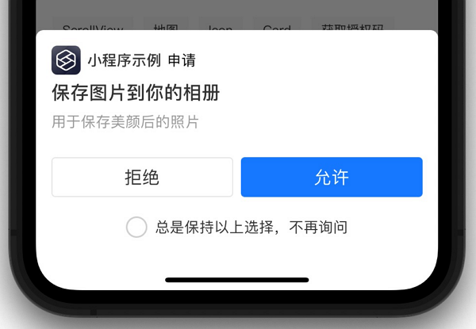

## 全局配置
- app.json 是小程序的全局配置，用于配置小程序的页面列表、默认窗口标题、导航栏背景色等。详情可查看 [小程序应用配置介绍](https://opendocs.alipay.com/mini/framework/app)。 
- app.acss 定义了全局样式，作用于当前小程序的所有页面。
- app.js 用于注册小程序应用，可配置小程序的生命周期，声明全局数据，调用丰富的 API，如获取用户授权及获取用户信息 API 等，更多 API 信息可查看 [小程序 API 概览](https://opendocs.alipay.com/mini/api) 。

### app.json 应用配置
- entryPagePath: 指定小程序的默认启动路径（首页）。如果不填，将默认为 pages 列表的第一项。不支持带页面路径参数。注意：此特性从基础库 2.7.20，IDE 3.1.2 开始支持。若强依赖此特性，建议设置最低基础库版本号为 2.7.20。否则，在低版本的基础库，会因为无法识别正确的首页而导致渲染出 返回首页 图标。
- pages: app.json 中的 pages 为数组属性，数组中每一项都是字符串，用于指定小程序的页面。在小程序中新增或删除页面，都需要对 pages 数组进行修改。pages 数组的每一项代表对应页面的路径信息，其中，第一项代表小程序的首页。页面路径不需要写任何后缀，框架会自动去加载同名的 .json、.js、.axml、.acss 文件。
- usingComponents: 在 app.json 中声明的自定义组件将会认为成全局自定义组件，在小程序各页面或自定义组件中可以直接使用无需额外声明。注意：IDE3.1.2 及以上开始支持。该功能声明的组件将要被所有页面和组件依赖，可能会影响性能，且会占用主包大小，建议开启 app.lazyCodeLoading。
  ```json
    {
        "usingComponents": {
            "com1": "/components/com1/index",
            "com2": "./components/com2/index"
        }
    }
  ```
- window: 用于设置小程序的状态栏、导航条、标题、窗口背景色等。
  - allowsBounceVertical: 是否允许向下拉拽。默认 YES, 支持 YES / NO
  - pullRefresh: 是否允许下拉刷新，默认 false。说明：1.下拉刷新生效的前提是 allowsBounceVertical 值为 YES。2.window 全局配置后全局生效，但是如果单个页面配置了该参数，以页面的配置为准。
  - responsive: rpx 单位是否宽度自适应 ，默认 true，当设置为 false 时，2 rpx 将恒等于 1 px，不再根据屏幕宽度进行自适应，注意，此时 750 rpx 将不再等于 100% 宽度。
  - showTitleLoading: 是否进入时显示导航栏的 loading。默认 NO，支持 YES / NO。
  - transparentTitle: 导航栏透明设置。默认 none，支持 always 一直透明 / auto 滑动自适应 / none 不透明。
  - titlePenetrate: 是否允许导航栏点击穿透。默认 NO，支持 YES / NO。
  
  ```json
  {
    "window": {
      "defaultTitle": "支付宝接口功能演示"
    }
  }
  ```
- tabBar: 如果开发的小程序是一个多 tab 应用（客户端窗口的底部栏可以切换页面），那么可以通过 tabBar 配置项指定 tab 栏的表现，以及 tab 切换时显示的对应页面。代码中，开发者可通过 my.setTabBarItem 动态设置 tabBar 中指定 item 的内容。
- networkTimeout: 各类网络请求的超时时间，单位均为毫秒。
- lazyCodeLoading: 小程序应用的启动过程中，除了下载阶段以外，默认会执行所有代码（包括当前页面未使用到的所有页面、自定义组件），会对启动耗时有一定影响。基础库 2.7.0 及以上 ，支持配置以下 lazyCodeLoading 参数，仅执行当前页面所必须的页面脚本和自定义组件脚本，其他脚本则不会被执行。注意： 由于开启该配置后，当前页面未使用到的代码将不会被执行，可能对某些依赖默认脚本执行先后顺序的逻辑产生影响。
  ```json
  {
    "lazyCodeLoading": "requiredComponents"
  }
  ```
- permission: 小程序接口权限相关设置。字段类型为 Object。
  ```json
  {
    "permission": {
        "scope.album": { // 相册（访问）相关权限声明，相关 API：my.chooseImage、my.chooseVideo（sourceType 包含 album）。
            "desc": "读取照片用于提供美颜服务" // 小程序获取权限时展示的接口用途说明。
        },
        "scope.camera" : { // 相机相关权限声明，相关 API：my.chooseImage、my.chooseVideo（sourceType 包含 camera）。
            "desc" : "访问你的摄像头，用于扫描二维码"
        },
        "scope.record" : { // 	麦克风相关权限声明，相关 API：my.getRecorderManager。
            "desc" : "访问你的麦克风，用于识别歌曲"
        },
        "scope.userLocation": { // 位置相关权限声明，相关 API：my.getLocation。
            "desc": "你的位置信息将用于匹配您的服务城市"
        },
        "scope.writePhotosAlbum" : { // 相册（保存）相关权限声明，相关 API：my.saveImage、my.saveImageToPhotosAlbum、my.saveVideoToPhotosAlbum。
            "desc" : "用于保存美颜后的照片"
        }
    }
  }
  ```
  
- behavior: 用于改变小程序若干运行行为。
  - shareAppMessage: 
    - 可选值：appendQuery。使用小程序默认分享功能时（即不显式设置 Page.onShareAppMessage），当设置此字段后，会使客户端生成的用于分享的 scheme 带上当前用户打开的页面所携带的 query 参数。
  - decodeQuery:
    - 可选值：disable。小程序在解析全局参数、页面参数时默认会对键/值做 encodeURIComponent。当设置为 disable 后，则不再对键/值做encodeURIComponent。
  
  ```json
  {
    "behavior": {
        "shareAppMessage": "appendQuery", // 通过此配置，可选择默认分享功能是否带上 query 参数。
        "decodeQuery": "disable" // 设置为disable后，基础库不再对全局/页面参数的键/值做 encodeURIComponent
    }
  }
  ```

### app.js 注册小程序
App(object: Object): App() 用于注册小程序，接受一个 Object 作为属性，用来配置小程序的生命周期等。App() 必须在 app.js 中调用，必须调用且只能调用一次。

#### object 属性说明
- onLaunch(): 生命周期回调：监听小程序初始化，当小程序初始化完成时触发，全局只触发一次。参数也可以使用 `my.getLaunchOptionsSync` 获取。
  - 小程序首次启动时，onLaunch 方法可获取 query、path 等属性值。 
  - 小程序处于后台时，如果从 scheme、扫二维码打开，需要在 onShow 方法中获取 query、path 等属性值。
  - 不要在 onLaunch() 里调用 getCurrentPages 方法，因为此时 page 还未生成。
  ```js
    App({
        onLaunch(options) {
            // 第一次打开
            console.log(options.query);
            // {number:1}
            console.log(options.path);
            // x/y/z
        },
        onShow(options) {
            // 从后台被 scheme 重新打开
            console.log(options.query);
            // {number:1}
            console.log(options.path);
            // x/y/z
        },
    });
  ```
- onShow(): 生命周期回调：监听小程序显示，当小程序启动，或从后台进入前台显示时触发。也可以使用 `my.onAppShow` 绑定监听。
  - 不要在 onShow() 中进行 my.redirectTo 或 my.navigateTo 等操作页面栈的行为。
- onHide(): 生命周期回调：监听小程序隐藏，当当前页面被隐藏时(从前台进入后台时)触发，例如跳转、按下设备 Home 键离开。也可以使用 `my.onAppHide` 绑定监听。
- onError(): 监听小程序错误，当小程序发生 js 错误时触发。也可以使用 my.onError 绑定监听。
- onShareAppMessage(): 全局分享配置，调用分享时触发，如：点击页面菜单右上角的 分享 按钮时。
- onUnhandledRejection(): 监听 unhandledrejection 事件，当 Promise 被 reject 且没有 reject 处理器时，会触发 onUnhandledRejection 事件。也可以使用 my.onUnhandledRejection 绑定监听。
- onPageNotFound(): 监听页面不存在，小程序要打开的页面不存在时触发。也可以使用 my.onPageNotFound 绑定监听。不支持处理 路由 API 失败场景。

#### 前台/后台定义：
- 一般情况下，小程序用户点击右上角关闭，或者按下设备 Home 键离开支付宝时，小程序并不会直接销毁，而是进入后台。
- 当用户再次进入支付宝或再次打开小程序时，小程序会从后台进入前台。
- 只有当小程序进入后台 5 分钟后，或占用系统资源过高，才会被真正销毁。
- 小程序是否销毁、是否进入后台，也与小程序自身业务逻辑、当前内存资源占用有关。

#### globalData 全局数据
App() 中可以设置全局数据 globalData。示例代码：
```js
// app.js
App({
  globalData: 1,
});
```

开发者可以添加任意的函数或数据变量到 Object 参数中，用 this 可以访问。也可在 app.js 引入其他的公共方法，将方法挂载到 app.js 下。示例代码：
```js
// app.js
import { getUserInfo } from '/utils/getOpenUserInfo';
App({
  globalData: 1,
  onLaunch() {},
  onShow() {
    this.login(); // 通过this访问
  },
  // 自定义函数
  login() {
    console.log('自定义函数');
  },
  getUserInfo,
});
```
小程序页面调用：
```js
const app = getApp();
Page({
  onLoad() {
    app.getUserInfo();
    app.login(); // log输出 '自定义函数'
    console.log(app.globalData)
  },
});
```

## 小程序页面
Page 代表应用的一个页面，负责页面展示和交互。每个页面对应一个子目录，一般有多少个页面，就有多少个子目录。它也是一个构造函数，用来生成页面实例。每个小程序页面一般包含四个文件。
- [pageName].js：页面逻辑。
- [pageName].axml：页面结构。
- [pageName].json：页面配置。
- [pageName].acss：页面样式（可选）。

页面初始化时，提供数据。
```js
Page({
  data: {
    title: 'Alipay',
    array: [{ user: 'li' }, { user: 'zhao' }],
  },
});
```
根据以上提供的数据，渲染页面内容。
```html
<view>{{title}}</view>
<view>{{array[0].user}}</view>
```
定义交互行为时，需要指定响应函数。
```html
<view onTap="handleTap">click me</view>
```
以上代码指定用户点击按钮时，调用 handleTap 方法。
```js
Page({
  handleTap() {
    console.log('yo! view tap!');
  },
});
```
页面重新渲染，需要在页面脚本里面调用 `this.setData` 方法。
```html
<view>{{text}}</view>
<button onTap="changeText">Change normal data</button>
```
以上代码指定用户点击按钮时，调用 changeText 方法。
```js
Page({
  data: {
    text: 'init data',
  },
  changeText() {
    this.setData({
      text: 'changed data',
    });
  },
});
```
上面代码中，changeText 方法里面调用 `this.setData` 方法，会导致页面重新渲染。

## 生命周期

### 页面生命周期
参考：[页面生命周期](https://opendocs.alipay.com/mini/framework/page-detail)
```js
// pages/index/index.js
Page({
  data: {
    title: 'Alipay',
  },
  onLoad(query) {
    // 页面加载
  },
  onShow() {
    // 页面显示
  },
  onReady() {
    // 页面加载完成
  },
  onHide() {
    // 页面隐藏
  },
  onUnload() {
    // 页面被关闭
  },
  onTitleClick() {
    // 标题被点击
  },
  onPullDownRefresh() {
    // 页面被下拉
  },
  onReachBottom() {
    // 页面被拉到底部
  },
  onShareAppMessage() {
    // 返回自定义分享信息
  },
  // 事件处理函数对象
  events: {
    onBack() {
      console.log('onBack');
    },
  },
  // 自定义事件处理函数
  viewTap() {
    this.setData({
      text: 'Set data for update.',
    });
  },
  // 自定义事件处理函数
  go() {
    // 带参数的跳转，从 page/ui/index 的 onLoad 函数的 query 中读取 type
    my.navigateTo({ url: '/page/ui/index?type=mini' });
  },
  // 自定义数据对象
  customData: {
    name: 'alipay',
  },
});
```

### 组件生命周期
参考：[组件生命周期](https://opendocs.alipay.com/mini/framework/component-lifecycle?pathHash=9b628e01)


|     函数名	 |     参数	   |     说明|
|---------------|------------|---------|
|     onInit	|     -	     |     组件创建时触发。|     
|     deriveDataFromProps	 |     nextProps	|     组件创建时和更新前触发。|     
|     didMount	|     -	     |     组件创建完毕时触发。|     
|     didUpdate	| (prevProps,prevData)|     组件更新完毕时触发。|     
|     didUnmount|     -	      |     组件删除时触发。|     
|     onError	|     Error	  |     组件 JS 代码抛出错误时触发。|     

```js
Component({
  onInit() {
    // 当开启component2时，会触发onInit
    // 在组件创建时发起request请求。
    // my.request(...);
  },
  didMount() {
    // 当未开启component2时，不会触发onInit
    // 在组件创建完毕时发起request请求。
    if (!my.canIUse('component2')) {
      // my.request(...);
    // 已支持component2，在onInit阶段已发起request请求，didMount不再发起同一个request请求
    } else {
    
    }
  }
})
```


