# 算法
# 算法要素(写在最上边)

1. 严谨性判断，不允许任何报错
2. 任何递归程序，先写出口
3. 任何一种算法，都没有优劣之分，只有是否适合的场景

# 算法基础知识

## o(1), o(n), O(n^2), o(logn), o(nlogn) 复杂度

##### 在描述算法复杂度时,经常用到o(1), o(n), o(logn), o(nlogn)来表示对应算法的时间复杂度, 这里进行归纳一下它们代表的含义:

- 这是算法的时空复杂度的表示。不仅仅用于表示时间复杂度，也用于表示空间复杂度。 
- O后面的括号中有一个函数，指明某个算法的耗时/耗空间与数据增长量之间的关系。其中的n代表输入数据的量。 
- 比如时间复杂度为O(n)，就代表数据量增大几倍，耗时也增大几倍。比如常见的遍历算法。 
- 再比如时间复杂度O(n^2)，就代表数据量增大n倍时，耗时增大n的平方倍，这是比线性更高的时间复杂度。比如冒泡排序，就是典型的O(n^2)的算法，对n个数排序，需要扫描n×n次。 
- 再比如O(logn)，当数据增大n倍时，耗时增大logn倍（这里的log是以2为底的，比如，当数据增大256倍时，耗时只增大8倍，是比线性还要低的时间复杂度）。二分查找就是O(logn)的算法，每找一次排除一半的可能，256个数据中查找只要找8次就可以找到目标。 
- O(nlogn)同理，就是n乘以logn，当数据增大256倍时，耗时增大256*8=2048倍。这个复杂度高于线性低于平方。归并排序就是O(nlogn)的时间复杂度。 
- O(1)就是最低的时空复杂度了，也就是耗时/耗空间与输入数据大小无关，无论输入数据增大多少倍，耗时/耗空间都不变。 哈希算法就是典型的O(1)时间复杂度，无论数据规模多大，都可以在一次计算后找到目标（不考虑冲突的话）冲突的话很麻烦的，指向的value会做二次hash到另外一快存储区域

##### 总之：

- 在平均情况下，快速排序最快；
- 在最好情况下，插入排序和起泡排序最快；
- 在最坏情况下，堆排序和归并排序最快。

# 数据结构

- 可以容纳数据的结构被称为数据结构，算法是用来对数据结构进行处理的方法
- 数据结构是静态的，算法是动态的

## 线性数据结构(一位数据结构)

- 线性数据结构强调存储与顺序

### 线性数据结构的遍历

将一个集合中的每一个元素进行获取并查看

### 数组(内置)

- 例：数组 a = [1,2,3,4,5,6,7,8,9]; 
  - a[1]，方括号表示存储地址的偏移
    - 操作系统知识：通过偏移查询数据性能最好
  - 数组增加数据时如果长度不够，则会在底层向操作系统申请内存新创建一个长度更长的数组，把原来数组的数组复制过来，再在最后添加一个数据，所以是耗性能的 
- 数组特性: 
  - 存储在物理空间上是连续的
  - 底层的数组是定长的，长度是不可变的
  - 数组的变量，指向数组第一个元素的位置
- 数组的优点：
  - 查询性能好，指定查询某个位置
- 数组的缺点：
  - 因为空间必须得是连续的，所以如果数组比较大，当系统的空间碎片较多的时候，容易存不下
    - 空间碎片：变量声明是按顺序的，部分变量销毁后生成的小的空闲的空间
  - 因为数组的长度是固定的，所以数组的内容难以被添加和删除
    - 删除和添加是需要移动数组其他内容的位置的，是消耗性能的
- 内容固定时 var a = [1,2,3,4,5,6,7,8,9]; 性能是可以的，很高
- 内容不固定时，先声明数组长度性能是最高的，var arr = new Array(10)

### 链表

- 如果要传递一个链表，必须传递链表的根节点 
- 每一个节点，都认为自己是根节点，因为只有下一个引用，而找不到上一个引用
- 常提的链表都是单向链表，单向链表能完成所有双向链表能完成的事
- 链表的生成：

```javascript
function Node(value) {
	this.value = value;
  this.next = null;
}
```

- 链表的特点： 
  - 空间上是不连续的
  - 每存放一个值，都要多开销一个引用空间
- 链表的优点： 
  - 只要内存足够大，就能存的下，不用担心空间碎片问题(在连续排列的数据中，每删除一个数据就会留下一个坑位，当数据特别多，删除的数据留下的坑位就被成为空间碎片)
  - 链表的添加和删除非常容易，只需改变引用即可
- 链表的缺点 
  - 查询速度慢(指查询某个位置)
  - 链表每一个节点都需要创建一个指向next的引用，浪费一些空间，当节点内数据越多的时候，这部分开销的内存影响越小
- 链表的遍历 
  - 循环遍历，for循环，while循环
    - 性能更好，但是常用于遍历数组，因为数组是知道长度的
  - 递归遍历，内部调用自身，记得留出口
    - 经常使用，往往能大量节省开发时间和开发效率，任何递归程序先写出口

```javascript
// 1. 严谨性判断，不允许任何报错
// 2. 任何递归程序，先写出口
// 3. 任何一种算法，都没有优劣之分，只有是否适合的场景
// 线性数据结构的遍历
var arr = [1,2,3,4,5,6,7,8];
function bianArr(arr) {
  if (arr == null) return;
  for (var i = 0 ; i < arr.length ; i ++) { // 数组的遍历
    console.log(arr[i]);
  }
}
bianArr(arr);
function Node(value) {
  this.value = value;
  this.next = null;
}
var node1 = new Node(1);
var node2 = new Node(2);
var node3 = new Node(3);
var node4 = new Node(4);
var node5 = new Node(5);
node1.next = node2;
node2.next = node3;
node3.next = node4;
node4.next = node5;
function bianLink(root) { // 链表的递归遍历
  if (root == null) return;
  console.log(root.value);
  bianLink(root.next);
}
bianLink(node1);
```

- 链表的逆置
  - 让最后一个节点指向倒数第二个节点，让倒数第二个节点指向null，然后进行递归逆置

```javascript
// 1. 严谨性判断，不允许任何报错
// 2. 任何递归程序，先写出口
// 3. 任何一种算法，都没有优劣之分，只有是否适合的场景
// 对链表进行逆序，让最后一个指向倒数第二个，依次更改，突破点在于先找到最后一个节点
function Node(value) {
  this.value = value
  this.next = null
}
const node1 = new Node(1)
const node2 = new Node(2)
const node3 = new Node(3)
const node4 = new Node(4)
const node5 = new Node(5)
node1.next = node2
node2.next = node3
node3.next = node4
node4.next = node5
function nizhi (root) {
    if (root.next.next === null) { // 找到最后一个节点
        root.next.next = root; // 最后一个节点指向倒数第二个节点
        return root.next; // 返回最后一个节点
    } else {
        const result = nizhi(root.next); // 进入递归，堆栈，先进后出
        root.next.next = root; // 下一个节点指向当前节点
        root.next = null; // 当前节点指向null
        return result;
    }
}
function bianLink(root) {
    if (root === null) return;
    console.log(root.value);
    bianLink(root.next)
}
bianLink(node1);
const newRoot = nizhi(node1);
bianLink(newRoot);
bianLink(node5);
```

- 双向链表
  - 双指向的链表，即包含下一个引用，也包含上一个引用，但是双向链表所有能实现的功能单向链表都能实现
  - 优点：无论给出哪个节点，都可以对整个链表进行遍历
  - 缺点：多耗费一个引用的空间，而且构建双向链表比较复杂，所以很少使用双向链表

```javascript
// 1. 严谨性判断，不允许任何报错
// 2. 任何递归程序，先写出口
// 3. 任何一种算法，都没有优劣之分，只有是否适合的场景
function Node(value) {
    this.value = value;
    this.next = null;
    this.prev = null;
}

const node1 = new Node(1)
const node2 = new Node(2)
const node3 = new Node(3)
const node4 = new Node(4)
const node5 = new Node(5)
node1.next = node2
node2.prev = node1
node2.next = node3
node3.prev = node2
node3.next = node4
node4.prev = node3
node4.next = node5
node5.prev = node4
```

## 冒泡排序

最慢的排序算法之一，但是是最容易实现的排序算法

1. 排序的本质是比较和交换，先比较看是否需要交换，先把数值的最大值或最小值放在一端，数据值就像气泡一样从数组的一端漂浮到另一端
2. for循环内嵌套for循环，外循环遍历数组每一项，内循环比较元素，如需交换调用函数即可

```javascript
// 1. 严谨性判断，不允许任何报错
// 2. 任何递归程序，先写出口
// 3. 任何一种算法，都没有优劣之分，只有是否适合的场景
// 越有序性能越好
const arr = [3,5,6,1,2,8,9,7,4]
const contrast = (a, b) => { // 比较数字的大小
    if (!isNaN(Number(a)) && !isNaN(Number(b))) return a > b;
}
const interchange = (arr, a, b) => { // 位置进行交换
    if (!Array.isArray(arr) || !arr[a] || !arr[b]) return;
    const c = arr[a];
    arr[a] = arr[b];
    arr[b] = c;
}
const sort = (arr) => {
    if (!arr || !Array.isArray(arr) || arr.length === 0) return;
    for (let i = 0; i < arr.length; i++) {
        for (let j = 0; j < arr.length - 1 - i; j++) {
            if (contrast(arr[j], arr[j + 1])) interchange(arr, j, j + 1)
        }
    }
    return arr;
}
const newArr = sort(arr)
console.log(newArr)
```

## 选择排序

1. 内层循环，每一圈选出一个最大或最小值，放在最后面
2. 选择排序从数组的开头开始，将第一个元素和其他元素进行比较。检查完所有元素后，最小的元素会被放在第一或者最后一个位置，然后算法会从第二个或者倒数第二个位置继续。这个过程一直进行，进行到倒数第二个位置时，完成排序

```javascript
// 1. 严谨性判断，不允许任何报错
// 2. 任何递归程序，先写出口
// 3. 任何一种算法，都没有优劣之分，只有是否适合的场景
// 选择排序，内层循环，每一圈选出一个最大放在最后面
// 性能适中
const arr = [3,5,6,1,2,8,9,7,4]
const contrast = (a, b) => { // 比较数字的大小
    if (!isNaN(Number(a)) && !isNaN(Number(b))) return a > b;
}
const interchange = (arr, a, b) => { // 位置进行交换
    if (!Array.isArray(arr) || !arr[a] || !arr[b]) return;
    const c = arr[a];
    arr[a] = arr[b];
    arr[b] = c;
}
const sort = (arr) => {
    if (!arr || !Array.isArray(arr) || arr.length === 0) return;
    for (let i = 0; i < arr.length; i++) {
        let maxIndex = 0;
        for (let j = 0; j < arr.length - i; j++) {
            if (!contrast(arr[maxIndex], arr[j])) maxIndex = j;
        }
        interchange(arr, maxIndex, arr.length - 1 - i)
    }
    return arr;
}
const newArr = sort(arr)
console.log(newArr)
```

## 快速排序

-  处理大数据集最快的算法之一，分而治之，通过递归的方法将数据依次分解为包含较小元素和较大元素的不同子序列，不断重复这个步骤直到所有数据都是有序的。 
-  首先要在列表中选择一个基准值，数据排序围绕基准值进行，列表中小于基准值的元素移到数组底部，大于基准值的元素移到数组顶部。 
-  快速排序算法： 
   1. 选择一个基准元素，将列表分隔成两个子序列；
   2. 对列表重新排序，将所有小于基准值的元素放在基准值的前面，所有大于基准值的元素放在基准值的后面；
   3. 分别对较小元素的子序列和较大元素的子序列重复步骤1和2。
-  标准快速排序算法： 
   1. 传入一个数组，一个初始比对元素索引，一个最后一个元素索引；
   2. 在函数中将初始元素索引赋值给left，将最后一个元索引赋值给right；
   3. 当left小于right时，如果数组left值小于初始元素索引的值，并且left < right时，让left++，如果数组right的值大于初始比对元素索引的值，并且left > right时，让right--；
   4. 当遇见left对应的值大于初始元素索引的值，right的值小于初始元素索引的值，让left和right对应的值交换位置；
   5. 当left = right时，让初始比对值和right - 1的值进行交换，当left != right时，让初始比对值和right的值进行交换；
   6. 递归传入数组，初始比对元素索引，left；
   7. 递归传入数组，交换后的初始比对值，最后一元素索引。
-  标准快速排序就是先选择一个基准值，在挨个与基准值比较，找到比基准值小的和比基准值大的交换位置，让比基准值小的放一边，比基准值大的放另一边，然后把基准值放在中间，再对两边进行递归比较 

```javascript
// 1. 严谨性判断，不允许任何报错
// 2. 任何递归程序，先写出口
// 3. 任何一种算法，都没有优劣之分，只有是否适合的场景
// 快速排序，越换乱性能越好
// 两两比较，小的在左边，大的在右边
// 左闭右开区间，左边能取到，右边取不到
const arr = [3, 5, 6, 1, 2, 8, 9, 7, 4]
// 标准快排
const interchange = (arr, a, b) => { // 位置进行交换
    if (!Array.isArray(arr) || !arr[a] || !arr[b]) return;
    const c = arr[a];
    arr[a] = arr[b];
    arr[b] = c;
}
const quickSort = (arr, begin, end) => {
    if (begin >= end -1 || !arr || !Array.isArray(arr) || arr.length === 0) return;
    let left = begin;
    let right = end;
    do {
        do left++; while (left < right && arr[left] < arr[begin]); // 左指针递增，当大于等于右指针或左指针所指数据大于等于开始指针数据时停止
        do right--; while (right > left && arr[right] > arr[begin]) // 右指针递减，当小于等于左指针或右指针所指数据小于等于开始指针数据时停止
        if (left < right) interchange(arr, left, right) // 如果左右指针并未交错，则代表左指针所指数据大于等于begin所指数据，右指针所指数据小于等于begin所指数据，所以交换左右指针所指数据
    } while (left < right)
    const swapPoint = left === right ? right - 1 : right; // 当左指针大于等于右指针时，根据左闭右开原则获取中间位置，此时中间位置左边数据都比begin所指数据小，右边数据都比begin所指数据大
    interchange(arr, begin, swapPoint); // 交换begin位置所指数据和中间位置所指数据
    quickSort(arr, begin, swapPoint);
    quickSort(arr, swapPoint + 1, end)
}
quickSort(arr, 0, arr.length);
console.log(arr)
```

## 栈和队列

- 栈，先入后出，后入先出，比如摞盘子，只能通过栈顶访问
- 队列，先入先出，像个管道，一头进一头出
- 可以使用数组的 push、pop 和 shift 方法模拟栈和队列
  - push 是放入
  - pop 是取出后放入的，类似栈
  - shift 是取出先放入的，类似队列

## 二维数据结构

### 二维数组结构

- 数组里的每一项也都是数组，由行和列构成的数据表格，可以按行或者按列访问

```javascript
// 1. 严谨性判断，不允许任何报错
// 2. 任何递归程序，先写出口
// 3. 任何一种算法，都没有优劣之分，只有是否适合的场景
const arr = new Array(4);
for (let i = 0 ; i < arr.length ; i ++) {
    arr[i] = new Array(8);
}
const arr2 =- [[1,6], [2,3], [4,5]]
```

### 二维拓补结构(图，散列数学)

只关注关系，是否有联系，不关注位置和距离，一个顶点既可以有一条边，也可以有多条边与它相连，通常将图的边称为邻接表或者邻接表数组，以此顶点为索引，可以高效访问与这个顶点相连的所有顶点的列表

- 图是边和顶点的集合
- 类似于村庄之间相连的道路，每两个村庄之间都由某条道路相连，每个村庄都可以看做一个顶点，它们之间是有关系的，也就是成为一种数据结构
- 但是图也分为有序图和无序图(无向图)，有序图是单向的路径，能去不能回，也就是存有单向的引用，无序图是双向的路径，能来能回，互相存有对方的引用
- 顶点内存有的引用放在数组里，可以称为连通的邻居

```javascript
// 1. 严谨性判断，不允许任何报错
// 2. 任何递归程序，先写出口
// 3. 任何一种算法，都没有优劣之分，只有是否适合的场景
function Node(value) {
    this.value = value;
    this.neighbor = [];
}
const a = new Node("a");
const b = new Node("b");
const c = new Node("c");
const d = new Node("d");
const e = new Node("e");
const f = new Node("f");
a.neighbor.push(b);
a.neighbor.push(c);
a.neighbor.push(f);
b.neighbor.push(a);
b.neighbor.push(d);
b.neighbor.push(e);
c.neighbor.push(a);
d.neighbor.push(b);
e.neighbor.push(b);
```

#### 树形结构

计算机的树，都是倒着长的，根节点，子节点，叶子结点，树的度，树的深度
非线性数据结构，以分层的方式存储数据，用来存储有层级关系的数据，如文件系统中的文件，还被用来存储有序列表
**有向无环图：树的学名，是图的一种**

- 树形结构只有一个根节点，**并且没有回路**，单向引用
- **根节点是树的根，只有一个**
- 子节点是某个节点下面的节点，类似于树枝
- 叶子节点是下边没有其他节点了，就是树叶
- 度：一棵树有最多叉的节点有多少个叉就代表这棵树的度为多少
- 深度：一棵树有几层，也就是从根节点到最下边的叶子节点有几层，就代表树的深度为几，节点到最下边的叶子节点有几层，就代表该节点的深度为几，如下图 F 节点的深度为 3
- 高度：指结点所在的最长路径的叶子结点到自己的层数，如下图根节点 A 的高度为 4，B 的高度为 3

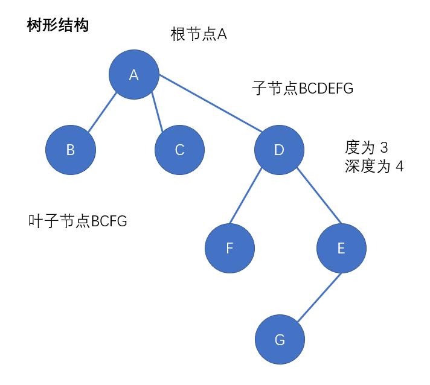

##### 二叉树

树的度最多为2的树形结构，一般父节点的两个子节点分别称为左节点和右节点
在二叉树中，每个节点都认为自己是根节点

##### 子树

二叉树中，每一个节点或叶子节点，都是一颗子树的根节点，两个节点也被称为左子树和右子树
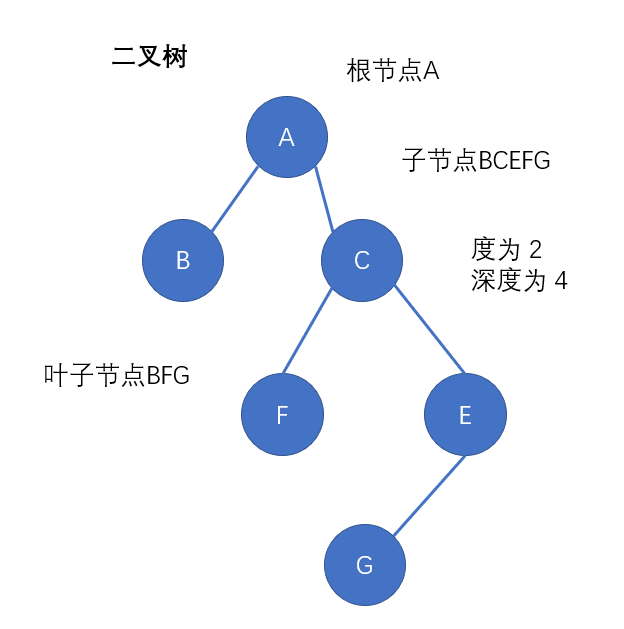

##### 满二叉树（完美二叉树）

1. 特殊的完全二叉树
2. 所有的叶子节点都在最底层
3. 每个非叶子节点都有两个子节点
4. 定义：一个二叉树，如果每一个层的结点数都达到最大值，则这个二叉树就是满二叉树，也就是如果一个二叉树的层数为K，且结点总数是(2^k) -1 ，则它就是满二叉树

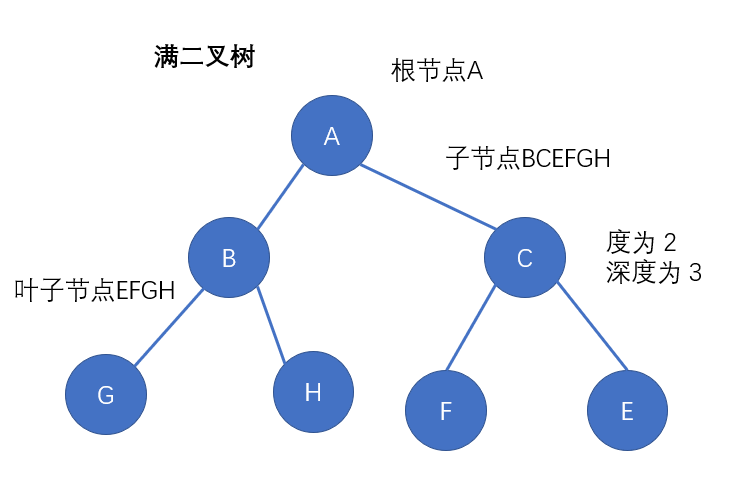
##### 完全二叉树（国际定义理解的不好）

完全二叉树是效率很高的数据结构

1.  国内定义： 
    1. 叶子节点都在最后一层或倒数第二层
    2. 叶子节点都向左聚拢，最后一层的叶子节点均需在最左边
    3. 若设二叉树的深度为h，除第 h 层外，其它各层 (1～h-1) 的结点数都达到最大个数，第 h 层所有的结点都连续集中在最左边，这就是完全二叉树
2.  国际定义： 
    1. 叶子节点都在最后一层或倒数第二层
    2. 如果有叶子节点，就必然有两个叶子节点(两个子节点一个有两个叶子节点一个没有叶子节点也符合，但如果另一个子节点有且只有一个叶子节点，则不符合)

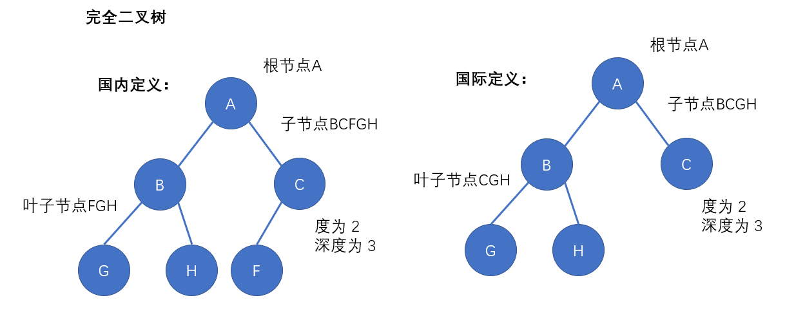

##### 二叉树的遍历

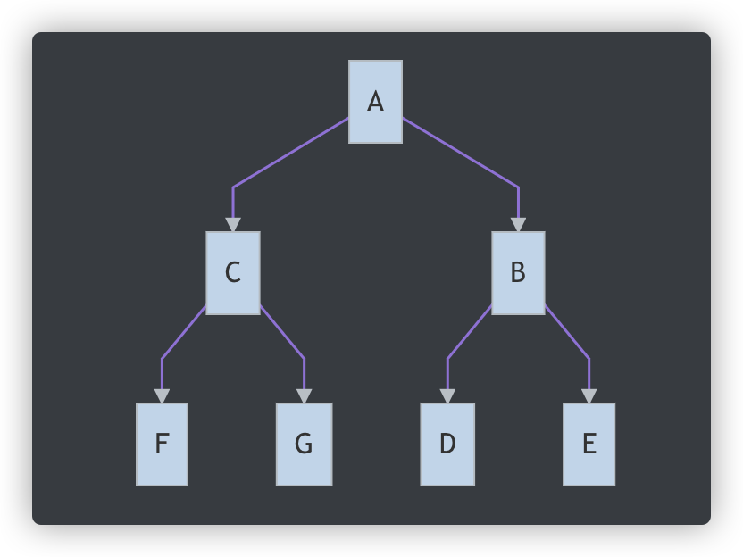

-  前序遍历(先根次序遍历)：ACFGBDE
   - 先打印当前的节点，再打印左边的子树，再打印右边的子树;  

```javascript
// 1. 严谨性判断，不允许任何报错
// 2. 任何递归程序，先写出口
// 3. 任何一种算法，都没有优劣之分，只有是否适合的场景
class BinaryTreeFactory {
  constructor(value) {
    this._value = value;
    this._left = null;
    this._right = null;
  }
  get value() { return this._value }
  get left() { return this._left }
  get right() { return this._right }
  set left(val) { this._left = val; }
  set right(val) { this._right = val; }
}
const A = new BinaryTreeFactory('A');
const B = new BinaryTreeFactory('B');
const C = new BinaryTreeFactory('C');
const D = new BinaryTreeFactory('D');
const E = new BinaryTreeFactory('E');
const F = new BinaryTreeFactory('F');
const G = new BinaryTreeFactory('G');
A.left = C;
A.right = B;
B.left = D;
B.right = E;
C.left = F;
C.right = G;
const traversal = (node) => {
  if(node === null) { return }
  console.log(node.value);
  traversal(node.left);
  traversal(node.right);
}
traversal(A)
```

-  中序遍历(中根次序遍历)：FCGADBE
   - 先打印左边的子树，再打印当前的节点，再打印右边的子树，类似将所有节点从左往右依次投影到一条线上  

```javascript
const traversal = (node) => {
if(node === null) { return }
traversal(node.left);
console.log(node.value);
traversal(node.right);
}
traversal(A)
```

-  后序遍历: FGCDEBA
   - 先打印左边的子树，再打印右边的子树，再打印当前的节点 

```javascript
const traversal = (node) => {
if(node === null) { return }
traversal(node.left);
traversal(node.right);
console.log(node.value);
}
traversal(A)
```

-  从哪个顺序打印就看什么时候打印自身，有中序结果和前序或后序结果的其中一个就可以进行反推二叉树 
-  根据已知前序中序还原二叉树：
   - 根据前序第一个确定根节点，然后找到中序中的根节点确定左子树的所有节点和右子树的所有节点，再在前序里找到所有左子树和右子树的节点，然后递归查找 

```javascript
// 1. 严谨性判断，不允许任何报错
// 2. 任何递归程序，先写出口
// 3. 任何一种算法，都没有优劣之分，只有是否适合的场景
// 前序遍历：ACFGBDE
// 中序遍历：FCGADBE
// A CFG BDE
// FCG A DBE
class BinaryTreeFactory {
    constructor(value) {
        this._value = value;
        this._left = null;
        this._right = null;
    }
    get value() { return this._value }
    get left() { return this._left }
    get right() { return this._right }
    set left(val) { this._left = val; }
    set right(val) { this._right = val; }
}
const DLR = ['A', 'C', 'F', 'G', 'B', 'D', 'E'];
const LDR = ['F', 'C', 'G', 'A', 'D', 'B', 'E'];
const restore = (DLR, LDR) => {
    if (!DLR || !LDR || DLR.length === 0 || LDR.length === 0 || DLR.length !== LDR.length) return null;
    const root = new BinaryTreeFactory(DLR[0]); // 获取根节点
    const index = LDR.indexOf(root.value);
    const DLRLeft = DLR.slice(1, index + 1); // 获取左子树前序打印结果
    const DLRRight = DLR.slice(index + 1, DLR.length); // 获取右子树前序打印结果
    const LDRLeft = LDR.slice(0, index); // 获取左子树中序打印结果
    const LDRRight = LDR.slice(index + 1, LDR.length) // 获取右子树中序打印结果
    root.left = restore(DLRLeft, LDRLeft);
    root.right = restore(DLRRight, LDRRight);
    return root;
}
const root = restore(DLR, LDR);
console.log(root);
```

-  根据已知中序后序还原二叉树：
   - 根据后序最后一个确定根节点，然后找到中序中的根节点确定左子树的所有节点和右子树的所有节点，再在后序里找到所有左子树和右子树的节点，然后递归查找  

```javascript
// 1. 严谨性判断，不允许任何报错
// 2. 任何递归程序，先写出口
// 3. 任何一种算法，都没有优劣之分，只有是否适合的场景
// 中序遍历：FCGADBE
// 后续遍历：FGCDEBA
// FCG A DBE
// FGC DEB A
const LDR = ['F', 'C', 'G', 'A', 'D', 'B', 'E'];
const STR = ['F', 'G', 'C', 'D', 'E', 'B', 'A'];
const restore = (LDR, STR) => {
    if (!LDR || !STR || LDR.length === 0 || STR.length === 0 || LDR.length !== STR.length) return null;
    const root = new BinaryTreeFactory(STR[STR.length - 1]); // 获取根节点
    const index = LDR.indexOf(root.value); 
    const LDRLeft = LDR.slice(0, index);  // 获取左子树中序打印结果
    const LDRRight = LDR.slice(index + 1, LDR.length); // 获取右子树中序打印结果
    const STRLeft = STR.slice(0, index); // 获取左子树后序打印结果
    const STRRight = STR.slice(index, STR.length - 1) // 获取右子树后序打印结果
    root.left = restore(LDRLeft, STRLeft);
    root.right = restore(LDRRight, STRRight);
    return root;
}
const root = restore(LDR, STR);
console.log(root);
```

##### 二叉树的搜索

树的搜索，图的搜索，爬虫的逻辑，搜索引擎的爬虫算法

###### 深度优先搜索

- 更适合探索未知，能查多少查多少
  - 先比对根节点，根节点不是开始查左子树，从左往右把左子树查完再查根节点下的右子树(从左往右)
  - 对于二叉树来说，深度优先搜索和前序遍历的顺序是一样的

```javascript
// 1. 严谨性判断，不允许任何报错
// 2. 任何递归程序，先写出口
// 3. 任何一种算法，都没有优劣之分，只有是否适合的场景
class BinaryTreeFactory {
    constructor(value) {
        this._value = value;
        this._left = null;
        this._right = null;
    }
    get value() { return this._value }
    get left() { return this._left }
    get right() { return this._right }
    set left(val) { this._left = val; }
    set right(val) { this._right = val; }
}
const A = new BinaryTreeFactory('A');
const B = new BinaryTreeFactory('B');
const C = new BinaryTreeFactory('C');
const D = new BinaryTreeFactory('D');
const E = new BinaryTreeFactory('E');
const F = new BinaryTreeFactory('F');
const G = new BinaryTreeFactory('G');
A.left = C;
A.right = B;
B.left = D;
B.right = E;
C.left = F;
C.right = G;
// 判断某个对象是否在二叉树中
const deepSearch = (root, target) => {
    if (!root) return false;
    if (root === target) return true;
    const left = deepSearch(root.left, target);
    const right = deepSearch(root.right, target);
    return left || right;
}
console.log(deepSearch(A, F))
```

###### 广度优先搜索

- 更适合探索局域，知道大概在某一块
  - 一层一层的搜索，比对完根节点开始比对左子树和右子树，然后再比对左子树右子树下边的左子树右子树

```javascript
// 1. 严谨性判断，不允许任何报错
// 2. 任何递归程序，先写出口
// 3. 任何一种算法，都没有优劣之分，只有是否适合的场景
// 判断某个对象是否在二叉树中
const scopeSearch = (rootList, target) => {
    if (!rootList || !Array.isArray(rootList) || rootList.length === 0) return false;
    const childList = [];
    // for (let i = rootList.length; i--;) { // 乱序搜
    //     console.log(rootList[i].value);
    //     if (rootList[i] && rootList[i] === target) return true;
    //     childList.push(rootList[i].left);
    //     childList.push(rootList[i].right);
    // }
    for (let i = 0; i < rootList.length; i++) { // 从左往右搜
        console.log(rootList[i].value);
        if (rootList[i] && rootList[i] === target) return true;
        childList.push(rootList[i].left);
        childList.push(rootList[i].right);
    }
    return scopeSearch(childList, target);
}
console.log(scopeSearch([A], E))
```

##### 二叉树的比较

- 遇到二叉树的比较问题时，先必须要确定左右两棵子树交换位置，即左右互换算不算同一颗二叉树。如果是笔试的话，默认互换后不是同一棵树，如果有特殊说明左右互换还是同一棵树，就按说明处理。面试的时候最好问一下面试官 
- 左右互换不是同一颗二叉树：先看看二叉树是不是同一棵，再进行严谨性判断，然后比较数值，接着递归比较  

```javascript
// 1. 严谨性判断，不允许任何报错
// 2. 任何递归程序，先写出口
// 3. 任何一种算法，都没有优劣之分，只有是否适合的场景
class BinaryTreeFactory {
    constructor(value) {
        this._value = value;
        this._left = null;
        this._right = null;
    }
    get value() { return this._value }
    get left() { return this._left }
    get right() { return this._right }
    set left(val) { this._left = val; }
    set right(val) { this._right = val; }
}
const A1 = new BinaryTreeFactory('A');
const B1 = new BinaryTreeFactory('B');
const C1 = new BinaryTreeFactory('C');
const D1 = new BinaryTreeFactory('D');
const E1 = new BinaryTreeFactory('E');
const F1 = new BinaryTreeFactory('F');
const G1 = new BinaryTreeFactory('G');
A1.left = C1;
A1.right = B1;
B1.left = D1;
B1.right = E1;
C1.left = F1;
C1.right = G1;
const A2 = new BinaryTreeFactory('A');
const B2 = new BinaryTreeFactory('B');
const C2 = new BinaryTreeFactory('C');
const D2 = new BinaryTreeFactory('D');
const E2 = new BinaryTreeFactory('E');
const F2 = new BinaryTreeFactory('F');
const G2 = new BinaryTreeFactory('G');
A2.left = C2;
A2.right = B2;
B2.left = D2;
B2.right = E2;
C2.left = F2;
C2.right = G2;
// 比较两个二叉树是否有差异，左右子树交换则不一致的情况下，一直递归比较，没有 false，就是 true（left && right）
const diff = (node1, node2) => {
    if (node1 === node2) return true; // 是同一个颗树
    if (!node1 && node2 || node1 && !node2 || !node1 && !node2 && node1 !== node2 || node1 && node2 && node1.value !== node2.value) return false;
    return diff(node1.left, node2.left) && diff(node1.right, node2.right);
}
console.log(diff(A1, A2))
```

3.  左右互换是同一棵二叉树：判断两棵子树是否相等  

```javascript
const diff = (node1, node2) => {
    if (node1 === node2) return true; // 是同一个颗树
    if (!node1 && node2 || node1 && !node2 || !node1 && !node2 && node1 !== node2 || node1 && node2 && node1.value !== node2.value) return false;
    return diff(node1.left, node2.left) && diff(node1.right, node2.right) || diff(node1.right, node2.left) && diff(node1.left, node2.right);
}
console.log(diff(A1, A2))
```

##### 二叉树的diff算法

比较二叉树的改变，是否进行了增删改，如果有就记录下来

```javascript
// 1. 严谨性判断，不允许任何报错
// 2. 任何递归程序，先写出口
// 3. 任何一种算法，都没有优劣之分，只有是否适合的场景
class BinaryTreeFactory {
    constructor(value) {
        this._value = value;
        this._left = null;
        this._right = null;
    }
    get value() { return this._value }
    get left() { return this._left }
    get right() { return this._right }
    set left(val) { this._left = val; }
    set right(val) { this._right = val; }
}
const A1 = new BinaryTreeFactory('A');
const B1 = new BinaryTreeFactory('B');
const C1 = new BinaryTreeFactory('C');
const D1 = new BinaryTreeFactory('D');
const E1 = new BinaryTreeFactory('E');
const F1 = new BinaryTreeFactory('F');
const G1 = new BinaryTreeFactory('G');
A1.left = C1;
A1.right = B1;
B1.left = D1;
B1.right = E1;
C1.left = F1;
C1.right = G1;
const A2 = new BinaryTreeFactory('A');
const B2 = new BinaryTreeFactory('S');
const C2 = new BinaryTreeFactory('C');
const D2 = new BinaryTreeFactory('D');
const E2 = new BinaryTreeFactory('J');
const F2 = new BinaryTreeFactory('F');
const G2 = new BinaryTreeFactory('G');
const H2 = new BinaryTreeFactory('H');
A2.left = C2;
A2.right = B2;
B2.left = D2;
B2.right = E2;
C2.left = null;
C2.right = G2;
D2.left = H2;
// 二叉树的 diff 算法，需要知道新增了什么、修改了什么、删除了什么，dom 的 diff 算法是同一思想
// { type: 增/删/改, origin: 原来的, now: 现在的 }
const diffTree = (node1, node2, diffList) => {
    switch (true) {
        case node1 === node2:
            return diffList;
        case !node1 && !!node2: // 第一个 ! 先转换为布尔，第二个 ! 做判断
            diffList.push({ type: '新增', origin: null, now: node2});
            break;
        case node1 && node2 && node1.value !== node2.value:
            diffList.push({ type: '修改', origin: node1, now: node2});
            diffTree(node1.left, node2.left, diffList);
            diffTree(node1.right, node2.right, diffList);
            break;
        case node1 && !node2:
            diffList.push({ type: '删除', origin: node1, now: null});
            break;
        default:
            diffTree(node1.left, node2.left, diffList);
            diffTree(node1.right, node2.right, diffList);
            break;
    }
}
const diffList = [];
diffTree(A1, A2, diffList);
console.log(diffList)
```

#### 图的数据结构表示方法

用数据结构表示一张图可以用点集合和边集合生成一个二维数组来表示：[ [ ... ], [ ... ], [ ... ] ]
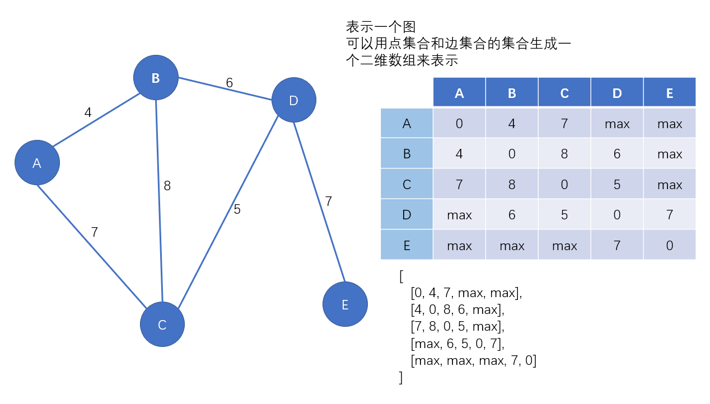

#### 最小生成树

树形结构是有向无环图，以最小的代价连接所有的节点，生成最小的树，更能节省空间和效能，也就是查找一个顶点到另一个顶点的最短路径
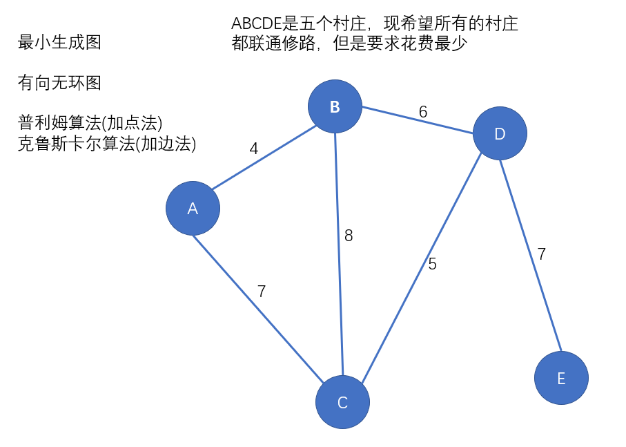

##### 普利姆算法(加点法)

1. 任选一个顶点作为起点
2. 找到以当前选中点为起点路径最短的边
3. 如果这个边的另一端没有被连通，则连接
4. 如果这个边的另一端也已经被连接起来了，则看倒数第二短的边
5. 重复2-4直到所有的点都连通为止

```javascript
// 1. 严谨性判断，不允许任何报错
// 2. 任何递归程序，先写出口
// 3. 任何一种算法，都没有优劣之分，只有是否适合的场景
// A、B、C、D、E 是五个村庄，现希望所有的村庄都联通修路，但是要求花费最少
const max = 1000000;
const pointSet = []; // 点集合
const distance = [ // 点与点之间的距离（边的数据）集合
   [0, 4, 7, max, max],
   [4, 0, 8, 6, max],
   [7, 8, 0, 5, max],
   [max, 6, 5, 0, 7],
   [max, max, max, 7, 0]
];
class Node {
   constructor(value) {
       this.value = value;
       this.neighbor = []; // 当前点能与哪个点相连
   }
}
const A = new Node('A');
const B = new Node('B');
const C = new Node('C');
const D = new Node('D');
const E = new Node('E');
pointSet.push(A);
pointSet.push(B);
pointSet.push(C);
pointSet.push(D);
pointSet.push(E);
const getIndex = (str) => { // 获取点在点与点之间距离集合中的下标
    for(let i = 0; i < pointSet.length; i ++) {
        if(pointSet[i].value === str) {
            return i;
        }
    }
    return -1
}
// 传入顶点的集合，边的数据集合，当前已经连接的顶点的集合
// 根据当前已有的节点进行判断，获取到距离最短的点
const getMinDisNode = (pointSet, distance, nowPointSet) => {
    let fromNode = null;   // 线段的起点
    let minDisNode = null; // 线段的终点
    let minDis = max;      // 线段的长度，起始为最大值
    for(let i = 0; i < nowPointSet.length; i++) {
        const nowPointIndex = getIndex(nowPointSet[i].value); // 获取当前顶点的索引
        for(let j = 0; j < distance[nowPointIndex].length; j ++) {
            const thisNode = pointSet[j]; // thisNode表示distance中的点，但这个点不是对象，是数据集合
            // 这个点不能是已经接入的点，点之间的距离是最短距离
            if(nowPointSet.indexOf(thisNode) < 0 && distance[nowPointIndex][j] < minDis) {
                fromNode = nowPointSet[i];
                minDisNode = thisNode;
                minDis = distance[nowPointIndex][j];
            }
        }
    }
    fromNode.neighbor.push(minDisNode);
    minDisNode.neighbor.push(fromNode);
    return minDisNode;
}
const prim = (pointSet, distance, start) => {
    const nowPointSet = [];
    nowPointSet.push(start);
    //获取最小代价的边
    while(true) {
        const minDisNode = getMinDisNode(pointSet, distance, nowPointSet);
        nowPointSet.push(minDisNode);
        if(nowPointSet.length === pointSet.length) {
            break;
        }
    }
}
prim(pointSet, distance, pointSet[2]);
console.log(pointSet);
```

##### 克鲁斯卡尔算法(加边法)

1. 选择最短的边进行连接
2. 要保证连接的两端至少有一个点是新的点
3. 或者 这个边是将两个部落连接到一起(部落：已经连接的一部分顶点； 部落连接：将散落的部落连接在一块形成大部落)
4. 重复1-3直到所有的点都连接到一起

```javascript
// 1. 严谨性判断，不允许任何报错
// 2. 任何递归程序，先写出口
// 3. 任何一种算法，都没有优劣之分，只有是否适合的场景
const max = 1000000;
const pointSet = [];
const distance = [
    [0, 4, 7, max, max],
    [4, 0, 8, 6, max],
    [7, 8, 0, 5, max],
    [max, 6, 5, 0, 7],
    [max, max, max, 7, 0]
];
class Node {
    constructor(value) {
        this.value = value;
        this.neighbor = [];
    }
}
const a = new Node('A');
const b = new Node('B');
const c = new Node('C');
const d = new Node('D');
const e = new Node('E');
pointSet.push(a);
pointSet.push(b);
pointSet.push(c);
pointSet.push(d);
pointSet.push(e);
const canLink = (resultList, tempBegin, tempEnd) => {
    let beginIn = null;
    let endIn = null;
    for(let i = 0; i < resultList.length; i ++) {
        if(resultList[i].indexOf(tempBegin) > -1) {
            beginIn = resultList[i];
        }
        if(resultList[i].indexOf(tempEnd) > -1) {
            endIn = resultList[i];
        }
    }
    if (beginIn !== null && endIn !== null && beginIn === endIn) {
        return false;
    }
    return true;
}
const Link = (resultList, tempBegin, tempEnd) => {
    let beginIn = null;
    let endIn = null;
    for(let i = 0; i < resultList.length; i ++) {
        if(resultList[i].indexOf(tempBegin) > -1) {
            beginIn = resultList[i];
        }
        if(resultList[i].indexOf(tempEnd) > -1) {
            endIn = resultList[i];
        }
    }
    if(beginIn === null && endIn === null) { //两个点都是新的点，都不在任何部落里，可以连接，产生新的部落
        const newArr = [];
        newArr.push(tempBegin);
        newArr.push(tempEnd);
        resultList.push(newArr);
    } else if(beginIn !== null && endIn === null) { // end有部落，begin没有，end扩张
        beginIn.push(tempEnd);
    } else if(beginIn === null && endIn !== null) { // begin有部落，end没有，begin扩张
        endIn.push(tempBegin);
    } else if(beginIn !== null && endIn !== null && beginIn !== endIn){ // 两个不同的部落，进行合并
        const allIn = beginIn.concat(endIn);
        let needRemove = resultList.indexOf(endIn);
        resultList.splice(needRemove, 1);
        needRemove = resultList.indexOf(beginIn);
        resultList.splice(needRemove, 1);
        resultList.push(allIn);

    }
    tempBegin.neighbor.push(tempEnd);
    tempEnd.neighbor.push(tempBegin);
}
const kruskall = (pointSet, distance) => {
    const resultList = []; // 二维数组，此数组代表有多少个部落
    while (true) {
        let minDis = max;
        let begin = null;
        let end = null;
        for (let i = 0; i < distance.length; i++) {
            for (let j = 0; j < distance[i].length; j++) {
                let tempBegin = pointSet[i];
                let tempEnd = pointSet[j];
                if(i != j && distance[i][j] < minDis && canLink(resultList, tempBegin, tempEnd)) { // 去掉自己到自己的距离，因为都为0
                    minDis = distance[i][j];
                    begin = tempBegin;
                    end = tempEnd;
                }
            }
        }
        Link(resultList, begin, end);
        if(resultList.length === 1 && resultList[0].length === pointSet.length) { // 只存在一个部落
            break;
        }
    }
}
kruskall(pointSet, distance);
console.log(pointSet);
```

#### 二叉搜索树

也叫**二叉排序树**
有排序的效果，左子树的节点都比当前节点小，右子树的节点都比当前节点大
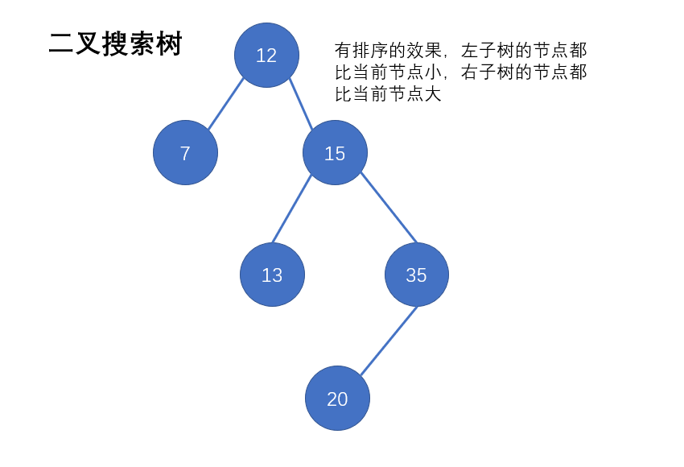

```javascript
// 1. 严谨性判断，不允许任何报错
// 2. 任何递归程序，先写出口
// 3. 任何一种算法，都没有优劣之分，只有是否适合的场景
const arr = [];
for (let i = 0 ; i < 1000 ; i ++) {
    arr[i] = Math.floor(Math.random() * 10000);
}
class Node {
    constructor(value) {
        this.value = value;
        this.left = null;
        this.right = null;
    }
}
// 向搜索树中添加节点
const addNode = (root, num) => {
    if (!root) return;
    if (root.value === num) return;
    if (root.value < num) { // 目标值比当前节点大
        if (!root.right) root.right = new Node(num); // 如果右侧为空，则创建节点
        else addNode(root.right, num); // 如果右侧不为空，则向右侧进行递归
    } else { // 目标值比当前节点小
        if (!root.left) root.left = new Node(num);
        else addNode(root.left, num);
    }
}
// 构建搜索树
const buildSearchTree = (arr) => {
    if (!Array.isArray(arr) || arr.length === 0) return null;
    const root = new Node(arr[0]);
    for (let i = 1 ; i < arr.length ; i ++) {
        addNode(root, arr[i]);
    }
    return root;
}
const root = buildSearchTree(arr);
console.log(root);
// 使用二叉搜索树
const searchByTree = (root, target) => {
    if (!root || !target) return false;
    if (root.value === target) return true;
    if (root.value < target) return searchByTree(root.right, target); // 如果目标比当前结果大，搜索右子树
    return searchByTree(root.left, target); // 如果目标比当前结果小，搜索左子树
}
console.log(searchByTree(root, 1567))
```

#### 二叉平衡树

1. 根节点的左子树与右子树的高度差不能超过1
   - 判断是否是平衡二叉树
   - 首先要获取二叉树每个节点的左右子树的深度
   - 然后再看每个节点的左右子树深度差是否大于1
2. 这颗二叉树的每个子树都符合第一条

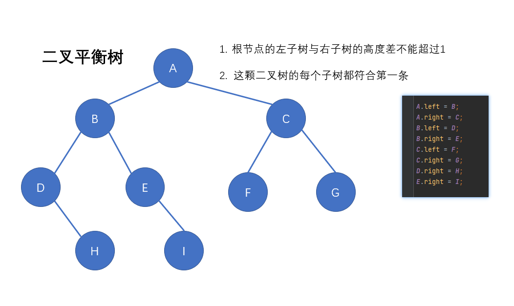

```javascript
// 1. 严谨性判断，不允许任何报错
// 2. 任何递归程序，先写出口
// 3. 任何一种算法，都没有优劣之分，只有是否适合的场景
class BinaryTreeFactory {
    constructor(value) {
        this._value = value;
        this._left = null;
        this._right = null;
    }
    get value() { return this._value }
    get left() { return this._left }
    get right() { return this._right }
    set left(val) { this._left = val; }
    set right(val) { this._right = val; }
}
const A = new BinaryTreeFactory('A');
const B = new BinaryTreeFactory('B');
const C = new BinaryTreeFactory('C');
const D = new BinaryTreeFactory('D');
const E = new BinaryTreeFactory('E');
const F = new BinaryTreeFactory('F');
const G = new BinaryTreeFactory('G');
const H = new BinaryTreeFactory('H');
const I = new BinaryTreeFactory('I');
A.left = B;
A.right = C;
B.left = D;
// B.right = E;
C.left = F;
C.right = G;
D.right = H;
E.right = I;
// 判断是否是平衡二叉树
// 首先要获取二叉树每个节点的左右子树的深度
// 然后再看每个节点的左右子树深度差是否大于1
// 获取一个节点的深度
const getDeep = (root) => {
    if (!root) return 0;
    const leftDeep = getDeep(root.left);
    const rightDeep = getDeep(root.right);
    // 返回左右子树最深的深度加上自身的层数
    return Math.max(leftDeep, rightDeep) + 1;
}
const isBalanceTree = (root) => {
    if (!root) return true;
    const leftDeep = getDeep(root.left);
    const rightDeep = getDeep(root.right);
    // 比较左右子树和和左右节点的子树深度是否相差大于1
    return Math.abs(leftDeep - rightDeep) > 1 ? false : isBalanceTree(root.left) && isBalanceTree(root.right)
}
console.log(isBalanceTree(B))
```

#### 二叉树的左右单旋

某一节点不平衡
如果左边浅，右边深，进行左单旋；右边浅，左边深，进行右单旋

- 旋转节点：不平衡的节点为旋转节点（单旋前A）
- 新根：旋转之后称为根节点的节点（单旋前C）
- 变化分支：父级节点发生变化的那个分支
- 不变分支：父级节点不变的那个分支

**左单旋时：**

- 旋转节点：当前不平衡的节点
- 新根：右子树的根节点
- 变化分支：旋转节点的右子树的左子树，单旋后为旋转节点的右子树
- 不变分支：旋转节点的右子树的右子树

**右单旋时：**

- 旋转节点：当前不平衡的节点
- 新根：左子树的根节点
- 变化分支：旋转节点的左子树的右子树，单旋后为旋转节点的左子树
- 不变分支：旋转节点的左子树的左子树

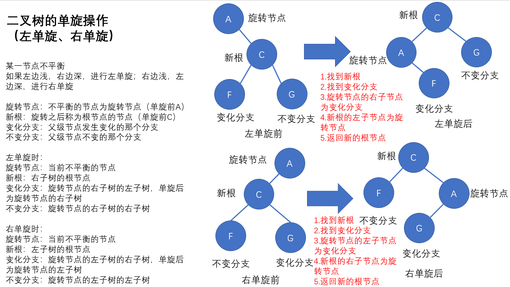

```javascript
// 1. 严谨性判断，不允许任何报错
// 2. 任何递归程序，先写出口
// 3. 任何一种算法，都没有优劣之分，只有是否适合的场景
class Node {
    constructor(value) {
        this.value = value;
        this.left = null;
        this.right = null;
    }
}
const A = new Node('A');
const C = new Node('C');
const F = new Node('F');
const G = new Node('G');
A.right = C;
C.left = F;
C.right = G;
// const root = {
//     value: 'A',
//     left: null,
//     right: {
//         value: 'C',
//         left: {
//             value: 'F',
//             left: null,
//             right: null
//         },
//         right: {
//             value: 'G',
//             left: null,
//             right: null
//         }
//     }
// }

// 获取一棵树的深度
const getDeep = (root) => {
    if (!root) return 0;
    const leftDeep = getDeep(root.left);
    const rightDeep = getDeep(root.right);
    return Math.max(leftDeep, rightDeep) + 1;
}
// 判断是否是平衡二叉树
const isBalance = (root) => {
    if (root == null) return true;
    const leftDeep = getDeep(root.left);
    const rightDeep = getDeep(root.right);
    if (Math.abs(leftDeep - rightDeep) > 1) { // 不平衡
        return false;
    } else {
        return isBalance(root.left) && isBalance(root.right);
    }
}
// 左单旋
const leftRotate = (root) => {
    // 找到新根
    const newRoot = root.right;
    // 找到变化分支
    const changeTree = root.right.left;
    // 当前旋转节点的右孩子为变化分支
    root.right = changeTree;
    // 新根的左孩子为旋转节点
    newRoot.left = root;
    // 返回新的根节点
    return newRoot;
}
// 右单旋
const rightRotate = (root) => {
    // 找到新根
    const newRoot = root.left;
    // 找到变化分支
    const changeTree = root.left.right;
    // 当前旋转节点的左孩子为变化分支
    root.left = changeTree;
    // 新根的右孩子为旋转节点
    newRoot.right = root;
    // 返回新的根节点
    return newRoot;
}
// 将不平衡二叉树进行左右单旋转为平衡二叉树
const change = (root) => { // 返回平衡之后的根节点
    if (isBalance(root)) return root;
    if (root.left != null) root.left = change(root.left);
    if (root.right != null) root.right = change(root.right);
    const leftDeep = getDeep(root.left);
    const rightDeep = getDeep(root.right);
    if (Math.abs(leftDeep - rightDeep) < 2) {
        return true;
    } else if (leftDeep > rightDeep) { // 不平衡，左边深，需要右旋
        return rightRotate(root);
    } else { // 不平衡，右边深，需要左旋
        return leftRotate(root);
    }
}
console.log(isBalance(A));
const newRoot = change(A);
console.log(isBalance(newRoot));
console.log(newRoot);
```

#### 二叉树的双旋

##### 右左双旋与左右双旋

左右单旋不能解决的问题：

- 变化分支为唯一最深分支时，左右单旋不能处理
- 此时应该先进行反旋，然后再单旋，称为双旋
- 右左双旋
  - 如要对某个节点进行左单旋时
  - 如果变化分支是唯一的最深分支，那么我们要对新根先进行右单旋，然后再进行左单旋
  - 这样的旋转叫做右左双旋
- 左右双旋
  - 如要对某个节点进行右单旋时
  - 如果变化分支是唯一的最深分支，那么我们要对新根先进行左单旋，然后再进行右单旋
  - 这样的旋转叫做左右双旋

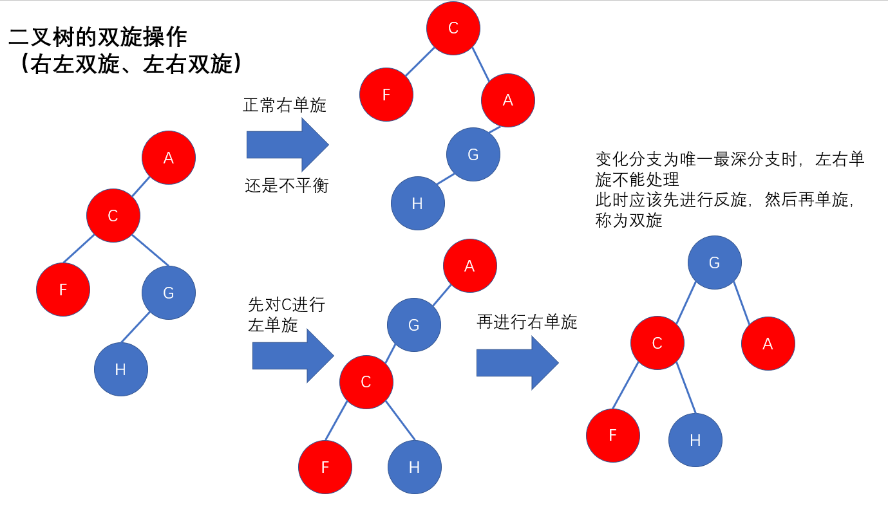

```javascript
// 1. 严谨性判断，不允许任何报错
// 2. 任何递归程序，先写出口
// 3. 任何一种算法，都没有优劣之分，只有是否适合的场景
class Node{
    constructor(value) {
        this._value = value;
        this._left = null;
        this._right = null;
    }
    get value() { return this._value }
    get left() { return this._left }
    get right() { return this._right }
    set left(val) { this._left = val; }
    set right(val) { this._right = val; }
}
const A = new Node('A');
const C = new Node('C');
const F = new Node('F');
const G = new Node('G');
const H = new Node('H');
A.left = C;
C.left = F;
F.left = G;
G.left = H;

// const root = {
//     value: 'A',
//     left: {
//         value: 'C',
//         left: {
//             value: 'F',
//             left: {
//                  value: 'G',
//                  left: {
//                      value: 'H',
//                      left: null,
//                      right: null
//                  },
//                 right: null
//             },
//             right: null
//         },
//         right: null
//     },
//     right: null
// }

// 获取一棵树的深度
const getDeep = (root) => {
    if (!root) return 0;
    const leftDeep = getDeep(root.left);
    const rightDeep = getDeep(root.right);
    return Math.max(leftDeep, rightDeep) + 1;
}
// 判断是否是平衡二叉树
const isBalance = (root) => {
    if (root == null) return true;
    const leftDeep = getDeep(root.left);
    const rightDeep = getDeep(root.right);
    if (Math.abs(leftDeep - rightDeep) > 1) { // 不平衡
        return false;
    } else {
        return isBalance(root.left) && isBalance(root.right);
    }
}
// 左单旋
const leftRotate = (root) => {
    // 找到新根
    const newRoot = root.right;
    // 找到变化分支
    const changeTree = root.right.left;
    // 当前旋转节点的右孩子为变化分支
    root.right = changeTree;
    // 新根的左孩子为旋转节点
    newRoot.left = root;
    // 返回新的根节点
    return newRoot;
}
// 右单旋
const rightRotate = (root) => {
    // 找到新根
    const newRoot = root.left;
    // 找到变化分支
    const changeTree = root.left.right;
    // 当前旋转节点的左孩子为变化分支
    root.left = changeTree;
    // 新根的右孩子为旋转节点
    newRoot.right = root;
    // 返回新的根节点
    return newRoot;
}
const change = (root) => { // 返回平衡之后的根节点
    if (isBalance(root)) return root;
    if (root.left !== null) root.left = change(root.left);
    if (root.right !== null) root.right = change(root.right);
    const leftDeep = getDeep(root.left);
    const rightDeep = getDeep(root.right);
    if (Math.abs(leftDeep - rightDeep) < 2) {
        return root;
    } else if (leftDeep > rightDeep) { // 不平衡，左边深，需要右旋
        const changeTreeDeep = getDeep(root.left.right);
        const noChangeTreeDeep = getDeep(root.left.left);
        if (changeTreeDeep > noChangeTreeDeep) {
            root.left = leftRotate(root.left);
        }
        return rightRotate(root);
    } else { // 不平衡，右边深，需要左旋
        const changeTreeDeep = getDeep(root.right.left);
        const noChangeTreeDeep = getDeep(root.right.right);
        if (changeTreeDeep > noChangeTreeDeep) {
            root.right = rightRotate(root.right);
        }
        return leftRotate(root);
    }
    return root;
}

// 添加节点信息
const addNode = (root, num) => {
    if (!root) return;
    if (root.value === num) return;
    if (root.value < num) { // 目标值比当前节点大
        if (!root.right) root.right = new Node(num); // 如果右侧为空，则创建节点
        else addNode(root.right, num); // 如果右侧不为空，则向右侧进行递归
    } else { // 目标值比当前节点小
        if (!root.left) root.left = new Node(num);
        else addNode(root.left, num);
    }
}

// 构建搜索树
const buildSearchTree = (arr) => {
    if (!Array.isArray(arr) || arr.length === 0) return null;
    const root = new Node(arr[0]);
    for (let i = 1 ; i < arr.length ; i ++) {
        addNode(root, arr[i]);
    }
    return root;
}

let num2 = 0;
// 根据树搜索节点
const searchByTree = (root, target) => {
    if (!root) return false;
    num2 += 1;
    if (root.value === target) return true;
    if (root.value > target) return searchByTree(root.left, target);
    else return searchByTree(root.right, target);
}
const arr = [];
for (let i = 0 ; i < 10000 ; i ++) {
    arr.push(Math.floor(Math.random() * 10000));
}

// const root = buildSearchTree(arr);
// // console.log(searchByTree(root, 1000));
// // console.log(num2);
//
// const newRoot = change(root);
// // num2 = 0;
// // console.log(searchByTree(newRoot, 1000));
// // console.log(num2);
// console.log(isBalance(newRoot));

console.log(isBalance(A));
const newRoot = change(A);
console.log(isBalance(newRoot));
console.log(newRoot);
```

##### 左左双旋与右右双旋

左右单旋不能解决的问题：

- 变化分支的高度比旋转节点的另一侧高度差超过2，那么单旋之后依旧不平衡
- 此时应该先进行单旋，然后再单旋，称为双旋

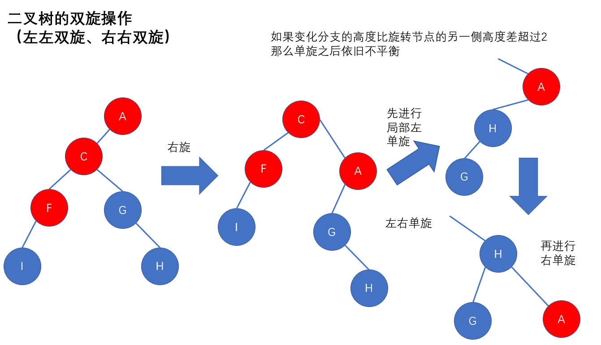

```javascript
// 1. 严谨性判断，不允许任何报错
// 2. 任何递归程序，先写出口
// 3. 任何一种算法，都没有优劣之分，只有是否适合的场景
const change = (root) => { // 返回平衡之后的根节点
    if (isBalance(root)) return root;
    if (root.left !== null) root.left = change(root.left);
    if (root.right !== null) root.right = change(root.right);
    const leftDeep = getDeep(root.left);
    const rightDeep = getDeep(root.right);
    if (Math.abs(leftDeep - rightDeep) < 2) {
        return root;
    } else if (leftDeep > rightDeep) { // 不平衡，左边深，需要右旋
        const changeTreeDeep = getDeep(root.left.right);
        const noChangeTreeDeep = getDeep(root.left.left);
        if (changeTreeDeep > noChangeTreeDeep) {
            root.left = leftRotate(root.left);
        }
        let newRoot = rightRotate(root);
        newRoot.right = change(newRoot.right); // 判断是否需要右右双旋
        newRoot = change(newRoot);
        return newRoot;
    } else { // 不平衡，右边深，需要左旋
        const changeTreeDeep = getDeep(root.right.left);
        const noChangeTreeDeep = getDeep(root.right.right);
        if (changeTreeDeep > noChangeTreeDeep) {
            root.right = rightRotate(root.right);
        }
        let newRoot = leftRotate(root);
        newRoot.left = change(newRoot.left); // 判断是否需要左左双旋
        newRoot = change(newRoot);
        return newRoot;
    }
    return root;
}
```

#### 红黑树的由来

叉越多，层数越少，但是叉越多，树的结构就越复杂，数学家算出树最多有4个叉最优，于是有了234树，红黑树就是234树发展来的

> - 二叉平衡排序树的性能是极致的吗？
>   - 答：不是
> - 如果我们想提升二叉平衡树的性能该如何做？
>   - 减少层级
> - 影响二叉平衡排序树的性能点在哪儿？
>   - 在与二叉平衡排序树只能有两个叉，导致在节点铺满的时候也会有很多层
>   - 希望可以一个节点存多个数，可以提升空间的性能
> - 如何才能让查找的效率尽可能的高？
>   - 树的层级越少，查找效率越高
> - 怎么样才能让二叉平衡排序树的层数变得更少？
>   - 如果不是二叉，层数会更少

##### 234树

- 我们希望有一棵树，最多有四个叉（度为4）
- 234树子节点永远在最后一层
- 234树永远是平衡的（每一个路径高度都相同）
- 分支变多了，层数变少了
- 节点中存的树变多了，节点变少了
- 因为分支多了，复杂度也高了

希望对234树进行简化，希望能简化成二叉树，但依旧保留多叉，依旧单节点中存放多个值，于是有了红黑树

##### 红黑树

- 红黑树是一棵二叉搜索树
- 在每个节点上增加了一个储存位来表示节点的颜色
- 节点是红色或黑色
  - 红色：代表一个虚拟节点，组合节点
  - 黑色：代表一个实际节点
- 根节点是黑色
- 每个叶子节点都是黑色的
- 每个红色节点的两个子节点都是黑色
  - 从每个叶子节点到根节点的所有路径上不能有两个连续的红色节点
- 从任一节点到其每个叶子节点的所有路径都包含相同数目的黑色节点

#### 树的深度优先搜索（不止二叉树）

- 一颗子树一颗子树的找
- 找到最底再从第二个子树开始找

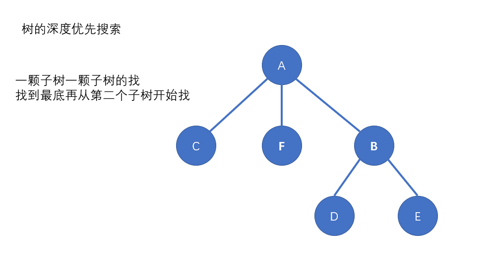

```javascript
// 1. 严谨性判断，不允许任何报错
// 2. 任何递归程序，先写出口
// 3. 任何一种算法，都没有优劣之分，只有是否适合的场景
class BinaryTreeFactory {
    constructor(value) {
        this._value = value;
        this._children = [];
    }
    get value() { return this._value }
    get children() { return this._children }
    set addChild(child) { this._children.push(child)}
}
const A = new BinaryTreeFactory('A');
const B = new BinaryTreeFactory('B');
const C = new BinaryTreeFactory('C');
const D = new BinaryTreeFactory('D');
const E = new BinaryTreeFactory('E');
const F = new BinaryTreeFactory('F');
A.addChild = C;
A.addChild = F;
A.addChild = B;
B.addChild = D;
B.addChild = E;
// const root = {
//     value: 'A',
//     children = [
//     { value: 'C', children: [] },
//     { value: 'F', children: [] },
//     { value: 'B', children: [{ value: 'D', children: []}, { value: 'E', children: []}]}
//     ]
// }
const deepSearch = (root, target) => {
    if (!root) return false;
    if (root.value === target) return true;
    if (Array.isArray(root.children) && root.children.length > 0) {
        for (let i = 0; i < root.children.length; i++) {
            if (deepSearch(root.children[i], target)) return true;
        }
        return false;
    } else return false;
}
console.log(deepSearch(A, 'F'))
```

#### 树的广度优先搜索（不止二叉树）

- 一层一层的找
- 找完第一层再从第二层开始找

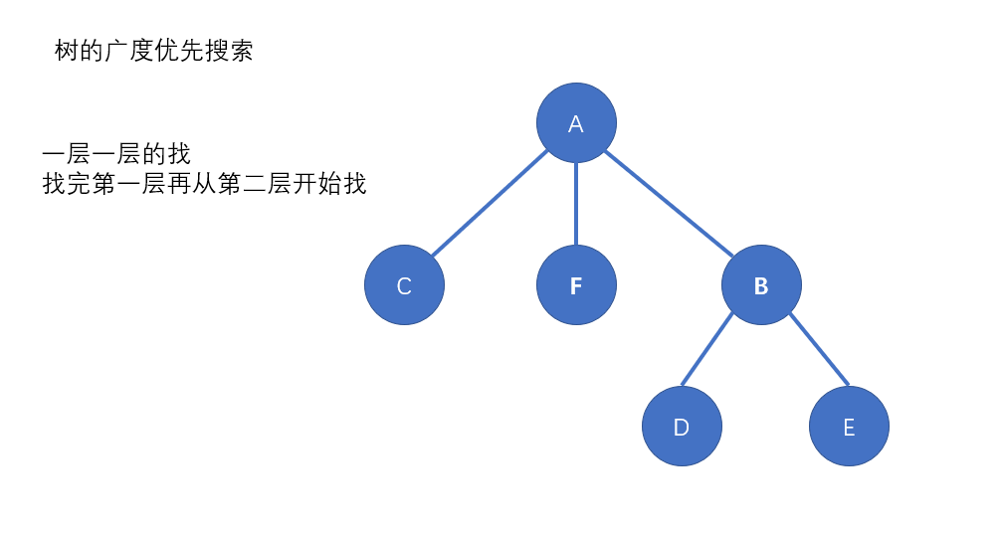

```javascript
// 1. 严谨性判断，不允许任何报错
// 2. 任何递归程序，先写出口
// 3. 任何一种算法，都没有优劣之分，只有是否适合的场景
class BinaryTreeFactory {
    constructor(value) {
        this._value = value;
        this._children = [];
    }
    get value() { return this._value }
    get children() { return this._children }
    set addChild(child) { this._children.push(child)}
}
const A = new BinaryTreeFactory('A');
const B = new BinaryTreeFactory('B');
const C = new BinaryTreeFactory('C');
const D = new BinaryTreeFactory('D');
const E = new BinaryTreeFactory('E');
const F = new BinaryTreeFactory('F');
A.addChild = C;
A.addChild = F;
A.addChild = B;
B.addChild = D;
B.addChild = E;
// const root = {
//     value: 'A',
//     children = [
//     { value: 'C', children: [] },
//     { value: 'F', children: [] },
//     { value: 'B', children: [{ value: 'D', children: []}, { value: 'E', children: []}]}
//     ]
// }

// 队列
const bfs = (root, target) => {
    if (!root) return false;
    if (root.value === target) return true;
    const queue = [];
    if (Array.isArray(root.children) && root.children.length > 0) {
        queue.push(...root.children)
        for (let i = 0; i < queue.length; i++) {
            console.log(queue[i].value)
            if (queue[i].value === target) return true;
            if (Array.isArray(queue[i].children) && queue[i].children.length > 0) queue.push(...queue[i].children);
        }
        return false;
    } else return false;
}
console.log(bfs(A, 'X'))

// 递归
// const bfs = (roots, target) => {
//     if (!Array.isArray(roots) || roots.length === 0) return false;
//     const children = [];
//     for (let i = 0 ; i < roots.length ; i ++) {
//         console.log(roots[i].value);
//         if (roots[i].value === target) return true;
//         else children.push(...roots[i].children);
//     }
//     return bfs(children, target);
// }
//
// console.log(bfs([A], "S"));
```

#### 图的深度和广度优先搜索

找过的节点不再重复去找
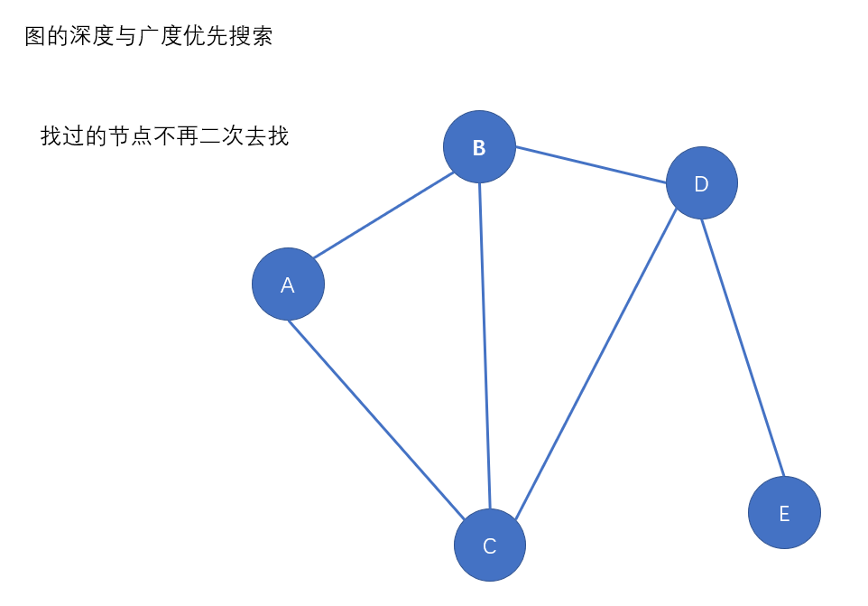

##### 深度优先搜索

```javascript
// 1. 严谨性判断，不允许任何报错
// 2. 任何递归程序，先写出口
// 3. 任何一种算法，都没有优劣之分，只有是否适合的场景
class BinaryTreeFactory {
    constructor(value) {
        this._value = value;
        this._neighbor = [];
    }
    get value() { return this._value }
    get neighbor() { return this._neighbor }
    set addNeighbor(neighbor) { this._neighbor.push(neighbor)}
}

const A = new BinaryTreeFactory('A');
const B = new BinaryTreeFactory('B');
const C = new BinaryTreeFactory('C');
const D = new BinaryTreeFactory('D');
const E = new BinaryTreeFactory('E');

A.addNeighbor = B;
A.addNeighbor = C;
B.addNeighbor = A;
B.addNeighbor = C;
B.addNeighbor = D;
C.addNeighbor = A;
C.addNeighbor = B;
C.addNeighbor = D;
D.addNeighbor = B;
D.addNeighbor = C;
D.addNeighbor = E;
E.addNeighbor = D;

// [
//     [B, C], [A, C, D], [A, B, D], [B, C, E], [D]
// ]

const deepSearch = (root, target, already) => {
    if (!root || already.includes(root)) return false;
    console.log(root.value)
    already.push(root)
    if (root.value === target) return true;
    if (Array.isArray(root.neighbor) && root.neighbor.length > 0) {
        for (let i = 0; i < root.neighbor.length; i++) {
            if (deepSearch(root.neighbor[i], target, already)) return true;
        }
        return false;
    } else return false;
}

console.log(deepSearch(A, 'X', []))
```

##### 广度优先搜索

```javascript
// 1. 严谨性判断，不允许任何报错
// 2. 任何递归程序，先写出口
// 3. 任何一种算法，都没有优劣之分，只有是否适合的场景
class BinaryTreeFactory {
    constructor(value) {
        this._value = value;
        this._neighbor = [];
    }
    get value() { return this._value }
    get neighbor() { return this._neighbor }
    set addNeighbor(neighbor) { this._neighbor.push(neighbor)}
}

const A = new BinaryTreeFactory('A');
const B = new BinaryTreeFactory('B');
const C = new BinaryTreeFactory('C');
const D = new BinaryTreeFactory('D');
const E = new BinaryTreeFactory('E');
const F = new BinaryTreeFactory('F');

A.addNeighbor = B;
A.addNeighbor = C;
B.addNeighbor = A;
B.addNeighbor = C;
B.addNeighbor = D;
C.addNeighbor = A;
C.addNeighbor = B;
C.addNeighbor = D;
D.addNeighbor = B;
D.addNeighbor = C;
D.addNeighbor = E;
E.addNeighbor = D;


// [
//     [B, C], [A, C, D], [A, B, D], [B, C, E], [D]
// ]

// 队列
const bfs = (root, target, already) => {
    if (!root) return false;
    already.push(root);
    if (root.value === target) return true;
    const queue = [];
    if (Array.isArray(root.neighbor) && root.neighbor.length > 0) {
        queue.push(...root.neighbor.filter(item => !already.includes(item)));
        for (let i = 0; i < queue.length; i++) {
            already.push(queue[i]);
            console.log(queue[i].value)
            if (queue[i].value === target) return true;
            if (Array.isArray(queue[i].neighbor) && queue[i].neighbor.length > 0) queue.push(...queue[i].neighbor.filter(item => !already.includes(item) && !queue.includes(item)));
        }
        return false;
    } else return false;
}
console.log(bfs(A, 'E', []))

// 递归
// const bfs = (nodes, target, already) => {
//     if (!Array.isArray(nodes) || nodes.length === 0) return false;
//     const nextNodes = [];
//     for (let i = 0 ; i < nodes.length ; i ++) {
//         if (already.indexOf(nodes[i]) > -1) continue;
//         already.push(nodes[i]);
//         console.log(nodes[i].value);
//         if (nodes[i].value === target) return true;
//         else nextNodes.push(...nodes[i].neighbor);
//     }
//     return bfs(nextNodes, target, already);
// }
//
// console.log(bfs([A], "F", []));
```